# MermaidDotNet <!-- omit from toc -->


A .NET library to generate Mermaid diagrams code.


[](https://sonarcloud.io/summary/new_code?id=FoggyBalrog_MermaidDotNet)
[](https://sonarcloud.io/summary/new_code?id=FoggyBalrog_MermaidDotNet)

[](LICENSE)
[](https://www.nuget.org/packages/FoggyBalrog.MermaidDotNet)

> [!WARNING]  
> Still under development. Not ready for production.

- [Compatibility](#compatibility)
- [Quick Start](#quick-start)
  - [Flowchart](#flowchart)
  - [Sequence diagram](#sequence-diagram)
  - [Class diagram](#class-diagram)
  - [State diagram](#state-diagram)
  - [Entity relationship diagram](#entity-relationship-diagram)
  - [User journey diagram](#user-journey-diagram)
  - [Gantt diagram](#gantt-diagram)
  - [Git graph](#git-graph)
  - [Mind Map](#mind-map)
  - [Pie chart](#pie-chart)
  - [Quadrant chart](#quadrant-chart)
  - [Requirement diagram](#requirement-diagram)
  - [Timeline diagram](#timeline-diagram)
- [License](#license)
- [Credits](#credits)

## Compatibility

The library targets **.NET Standard 2.1**, that is notably compatible with .NET Core 3.0 and later, .NET 5.0 and later, and Mono 6.4 and later.

See details [on the package _frameworks_ tab on nuget.org](https://www.nuget.org/packages/FoggyBalrog.MermaidDotNet#supportedframeworks-body-tab) or [on Microsoft Learn](https://learn.microsoft.com/en-us/dotnet/standard/net-standard?tabs=net-standard-2-1#select-net-standard-version).

## Quick Start

The following code samples show how to create a simple Mermaid diagram of each implemented diagram type.

### Flowchart

```csharp
string diagram = Mermaid
    .Flowchart()
    .AddNode("N1", out var n1)
    .AddNode("N2", out var n2)
    .AddNode("N3", out var n3)
    .AddLink(n1, n2, "some text")
    .AddLink(n2, n3)
    .Build();
```

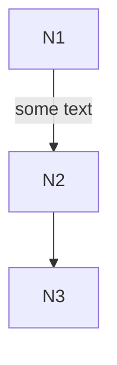

Read more at [docs/flowchart.md](./docs/flowchart.md).

### Sequence diagram

```csharp
string diagram = Mermaid
    .SequenceDiagram()
    .AddParticipant("Alice", out var a)
    .AddParticipant("Bob", out var b)
    .SendMessage(a, b, $"Hello {b.Name}!")
    .SendMessage(b, a, $"Hello {a.Name}!")
    .Build();
```

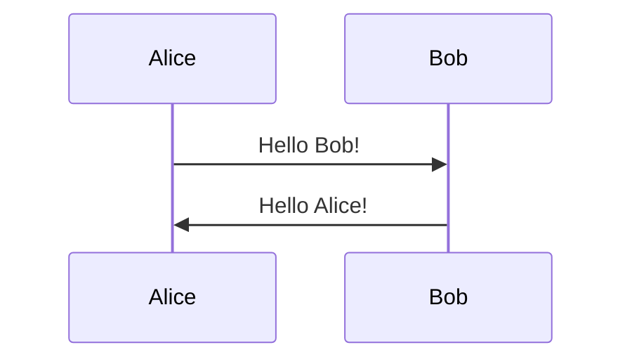

Read more at [docs/sequence-diagram.md](./docs/sequence-diagram.md).

### Class diagram

```csharp
var diagram = Mermaid
    .ClassDiagram()
    .AddClass("Animal", out var animal)
    .AddClass("Dog", out var dog)
    .AddProperty(animal, "int", "Age")
    .AddMethod(animal, null, "Breathe")
    .AddMethod(animal, "void", "Eat", parameters: 
    [
        ("Food", "food")
    ])
    .AddMethod(dog, "Sound", "Bark", parameters: 
    [
        ("int", "times"),
        ("int", "volume")
    ])
    .AddRelationship(animal, dog, RelationshipType.Inheritance, label: "A dog is an animal")
    .Build();
```

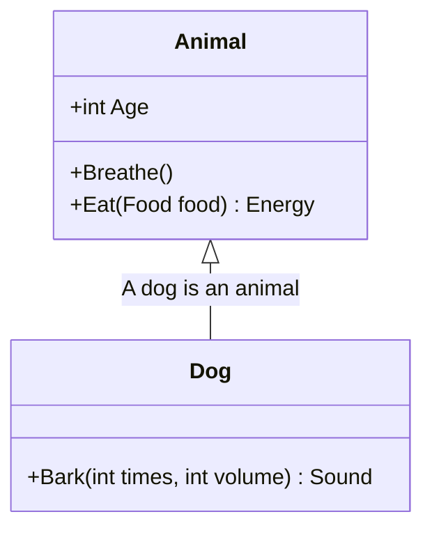

Read more at [docs/class-diagram.md](./docs/class-diagram.md).

### State diagram

```csharp
var diagram = Mermaid
    .StateDiagram()
    .AddState("State 1", out var s1)
    .AddState("State 2", out var s2)
    .AddTransitionFromStart(s1)
    .AddStateTransition(s1, s2)
    .AddTransitionToEnd(s2)
    .Build();
```

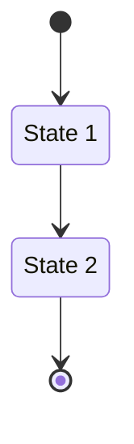

Read more at [docs/state-diagram.md](./docs/state-diagram.md).

### Entity relationship diagram

```csharp
string diagram = Mermaid
    .EntityRelationshipDiagram()
    .AddEntity("Customer", out var c)
    .AddEntity("Order", out var o)
    .AddEntity("Product", out var p)
    .AddRelationship(Cardinality.ExactlyOne, c, Cardinality.ZeroOrMore, o, "places")
    .AddRelationship(Cardinality.ExactlyOne, o, Cardinality.OneOrMore, p, "contains")
    .Build();
```

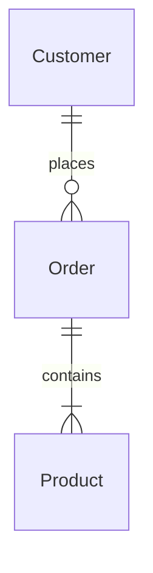

Read more at [docs/entity-relationship-diagram.md](./docs/entity-relationship-diagram.md).

### User journey diagram

```csharp
var diagram = Mermaid
    .UserJourneyDiagram()
    .AddTask("Task 1", 1, "Actor 1", "Actor 2")
    .AddTask("Task 2", 2)
    .AddSection("Section 1")
    .AddTask("Task 3", 3)
    .AddTask("Task 4", 4, "Actor 3")
    .AddSection("Section 2")
    .AddTask("Task 5", 5, "Actor 1", "Actor 3")
    .AddTask("Task 6", 6, "Actor 2")
    .Build();
```

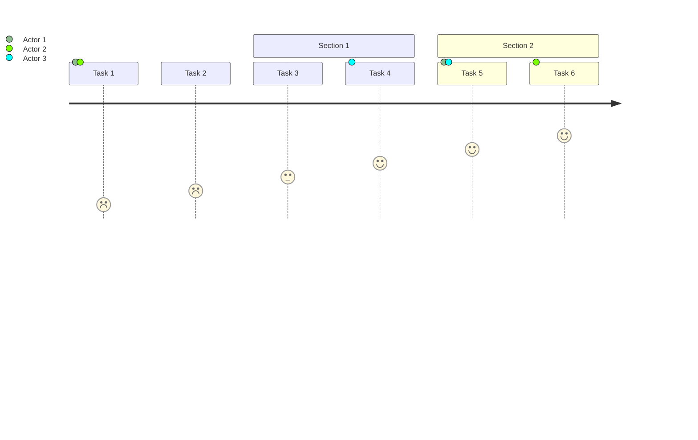

Read more at [docs/user-journey-diagram.md](./docs/user-journey-diagram.md).

### Gantt diagram

```csharp
string diagram = Mermaid
    .GanttDiagram()
    .AddTask("Foo", Date("2024-05-01"), Date("2024-05-05"), out _)
    .AddTask("Bar", Date("2024-05-08"), Date("2024-05-12"), out _)
    .Build();
```

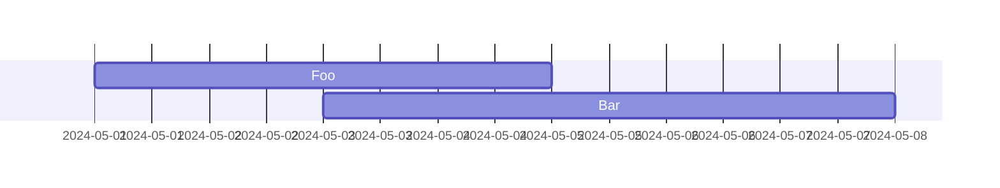

Read more at [docs/gantt-diagram.md](./docs/gantt-diagram.md).

### Git graph

```csharp
string graph = Mermaid
    .GitGraph()
    .Commit()
    .Branch("dev", out Branch dev)
    .Commit()
    .Checkout(dev)
    .Commit()
    .Commit()
    .CheckoutMain()
    .Commit()
    .Merge(dev)
    .Commit()
    .Build();
```

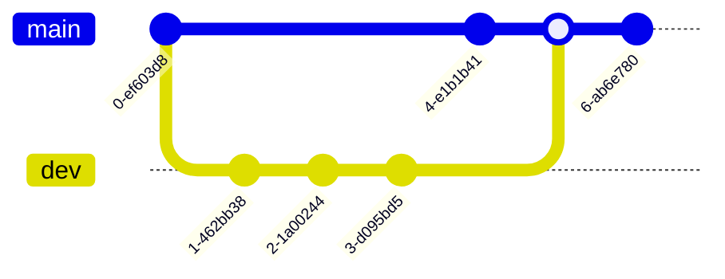

Read more at [docs/git-graph.md](./docs/git-graph.md).

### Mind Map

```csharp
var mindMap = Mermaid
    .MindMap("Root")
    .AddNode("Node 1", out var node1)
    .AddNode("Node 2", out var node2, node1)
    .AddNode("Node 3", out var node3, node1)
    .AddNode("Node 4", out var node4, node2)
    .AddNode("Node 5", out var node5, node2)
    .AddNode("Node 6", out var node6, node3)
    .AddNode("Node 7", out var node7, node3)
    .Build();
```

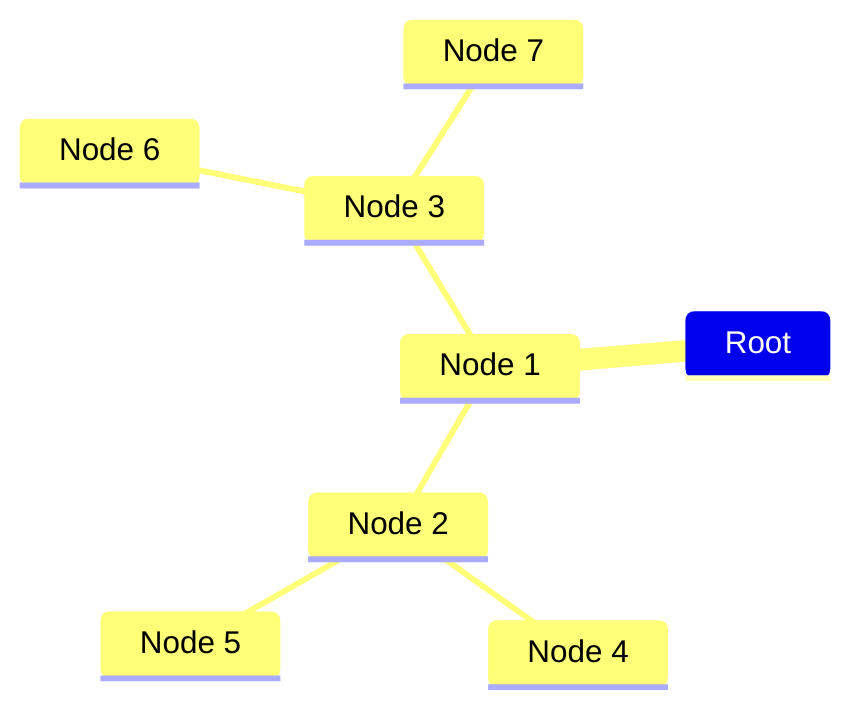

Read more at [docs/mind-map.md](./docs/mind-map.md).

### Pie chart

```csharp
var pieChart = Mermaid
    .PieChart()
    .AddDataSet("Label1", 42.7)
    .AddDataSet("Label2", 57.3)
    .Build();
```

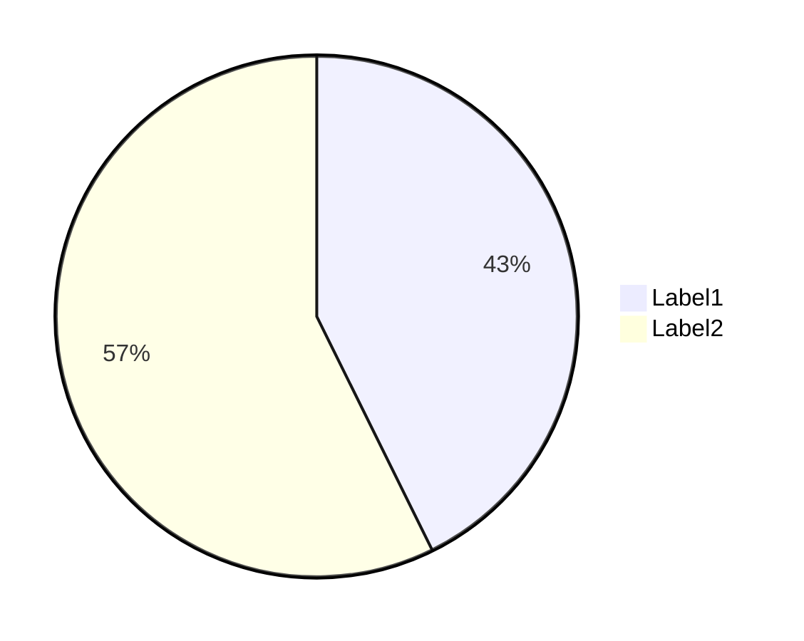

Read more at [docs/pie-chart.md](./docs/pie-chart.md).

### Quadrant chart

```csharp
var quadrantChart = Mermaid
    .QuadrantChart()
    .AddPoint("A", 0.1, 0.2)
    .AddPoint("B", 0.3, 0.4)
    .Build();
```

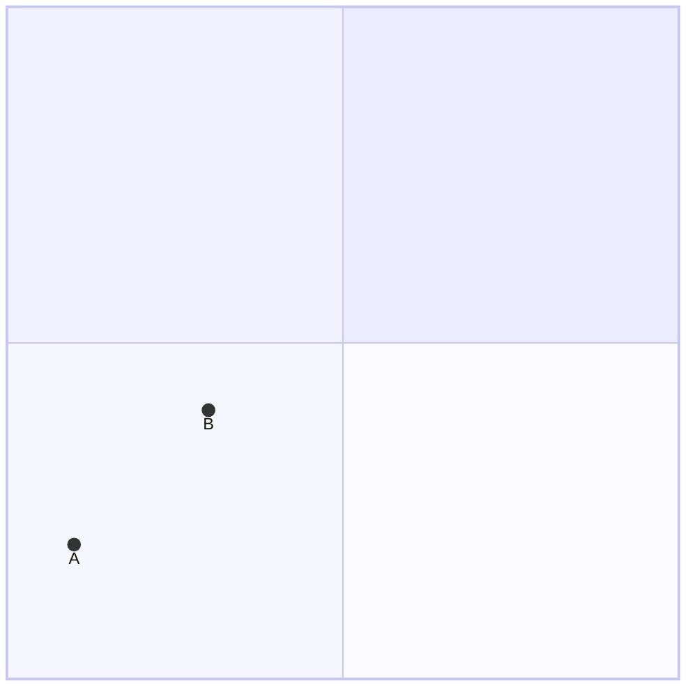

Read more at [docs/quadrant-chart.md](./docs/quadrant-chart.md).

### Requirement diagram

```csharp
string diagram = Mermaid
    .RequirementDiagram()
    .AddRequirement("Requirement 1", out var requirement1)
    .AddRequirement("Requirement 2", out var requirement2)
    .AddElement("Element 1", out var element1)
    .AddElement("Element 2", out var element2)
    .AddRelationship(element1, requirement1, RelationshipType.Satisfies)
    .AddRelationship(element2, requirement2, RelationshipType.Satisfies)
    .Build();
```

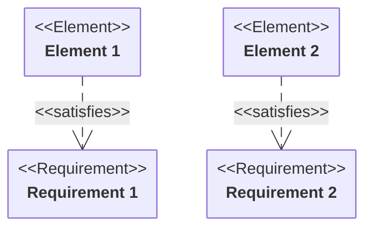

Read more at [docs/requirement-diagram.md](./docs/requirement-diagram.md).

### Timeline diagram

```csharp
string diagram = Mermaid
    .TimelineDiagram("Some title")
    .AddEvents("2021", "Event 1", "Event 2")
    .AddEvents("2022", "Event 3")
    .AddEvents("2023", "Event 4", "Event 5", "Event 6")
    .Build();
```

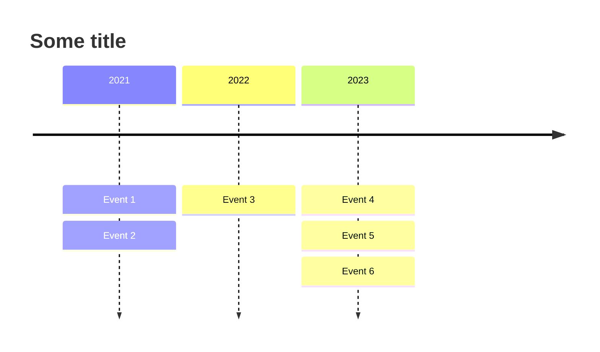

Read more at [docs/timeline-diagram.md](./docs/timeline-diagram.md).

## License

This project is licensed under the MIT License. See the [LICENSE](./LICENSE) file for details.

## Credits

Mermaid icon created by [Smashicons on Flaticon](https://www.flaticon.com/authors/smashicons).