# Class diagram<!-- omit from toc -->

*Official Mermaid documentation: [Class diagram](https://mermaid.js.org/syntax/classDiagram.html).*

- [Simple class diagram](#simple-class-diagram)
- [Title](#title)
- [Class label](#class-label)
- [Class annotation](#class-annotation)
- [Class properties](#class-properties)
- [Class methods](#class-methods)
- [Relationships](#relationships)
- [Relationship cardinalities](#relationship-cardinalities)
- [Relationship link style](#relationship-link-style)
- [Namespaces](#namespaces)
- [Direction](#direction)
- [Interaction](#interaction)
- [Notes](#notes)
- [Custom styling](#custom-styling)

## Simple class diagram

The following code sample shows how to create a simple Mermaid class diagram.

Use the `ClassDiagram` method of the `Mermaid` class to create a class diagram.

Add classes with the `AddClass` method, and add properties and methods with the `AddProperty` and `AddMethod` methods.

Add relationships with the `AddRelationship` method.

Generate the diagram mermaid code with the `Build` method.

```csharp
var diagram = Mermaid
    .ClassDiagram()
    .AddClass("Animal", out var animal)
    .AddClass("Dog", out var dog)
    .AddProperty(animal, "int", "Age")
    .AddMethod(animal, null, "Breathe")
    .AddMethod(animal, "Energy", "Eat", parameters: 
    [
        ("Food", "food")
    ])
    .AddMethod(dog, "Sound", "Bark", parameters: 
    [
        ("int", "times"),
        ("int", "volume")
    ])
    .AddRelationship(animal, dog, RelationshipType.Inheritance, label: "A dog is an animal")
    .Build();
```

The code above generates the following Mermaid code:

```text
classDiagram
    class Animal {
        +int Age
        +Breathe()
        +Eat(Food food) Energy
    }
    class Dog {
        +Bark(int times, int volume) Sound
    }
    Animal <|-- Dog : A dog is an animal
```

That renders as:

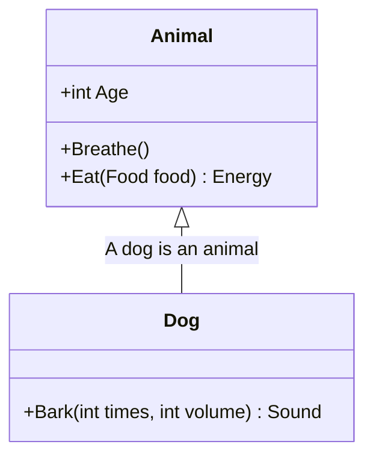

[⬆ Back to top](#class-diagram)

## Title

The title of the class diagram can be set by passing a `title` parameter to the `ClassDiagram` method.

Example:

```csharp
var diagram = Mermaid
    .ClassDiagram("My Title")
    .AddClass("Animal", out var animal)
    .Build();
```

The code above generates the following Mermaid code:

```text
---
title: My Title
---
classDiagram
    class Animal
```

That renders as:

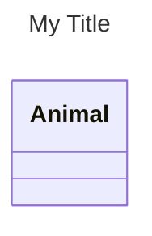

## Class label

Whitespaces and special characters are not allowed in class names. To set a label for a class, pass a `label` parameter to the `AddClass` method.

Example:

```csharp
var diagram = Mermaid
    .ClassDiagram()
    .AddClass("c1", out var c1, "Hello World!")
    .AddClass("c2", out var c2, "Hello World!")
    .AddProperty(c1, "int", "Age")
    .AddMethod(c1, null, "Breathe")
    .Build();
```

The code above generates the following Mermaid code:

```text
classDiagram
    class c1["Hello World!"] {
        +int Age
        +Breathe()
    }
    class c2["Hello World!"]
```

That renders as:

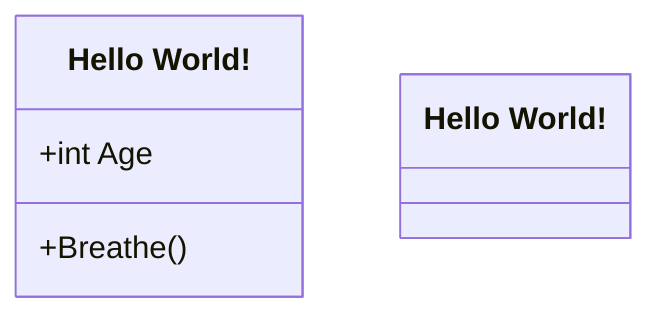

[⬆ Back to top](#class-diagram)

## Class annotation

To add an annotation to a class, pass an `annotation` parameter to the `AddClass` method.

Example:

```csharp
var diagram = Mermaid
    .ClassDiagram()
    .AddClass("c1", out var c1, annotation: "foo")
    .AddClass("c2", out var c2, annotation: "bar")
    .AddProperty(c1, "int", "Age")
    .AddMethod(c1, null, "Breathe")
    .Build();
```

The code above generates the following Mermaid code:

```text
classDiagram
    class c1 {
        <<foo>>
        +int Age
        +Breathe()
    }
    class c2 {
        <<bar>>
    }
```

That renders as:

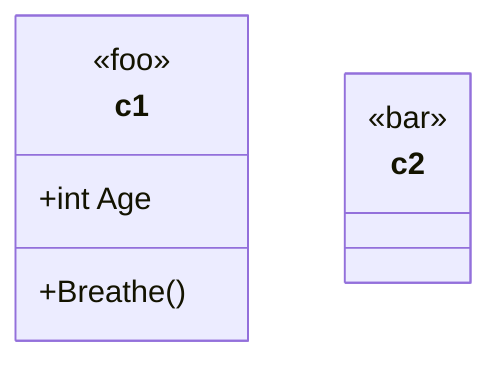

[⬆ Back to top](#class-diagram)

## Class properties

To add properties to a class, use the `AddProperty` method.

Example:

```csharp
var diagram = Mermaid
    .ClassDiagram()
    .AddClass("Animal", out var animal)
    .AddProperty(animal, "int", "Age")
    .Build();
```

The code above generates the following Mermaid code:

```text
classDiagram
    class Animal {
        +int Age
    }
```

That renders as:

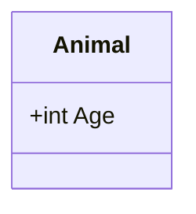

[⬆ Back to top](#class-diagram)

## Class methods

To add methods to a class, use the `AddMethod` method. Metods can optionally have visibility and parameters.

Example:

```csharp
var diagram = Mermaid
    .ClassDiagram()
    .AddClass("Animal", out var animal)
    .AddClass("Dog", out var dog)
    .AddProperty(animal, "int", "Age")
    .AddMethod(animal, null, "Breathe")
    .AddMethod(animal, "void", "Eat", Visibilities.Public | Visibilities.Abstract,
                [
        ("Food", "food")
    ])
    .AddMethod(dog, "Sound", "Bark", parameters: [
        ("int", "times"),
        ("int", "volume")
    ])
    .AddRelationship(animal, dog, RelationshipType.Inheritance, label: "A dog is an animal")
    .Build();
```

The code above generates the following Mermaid code:

```text
classDiagram
    class Animal {
        +int Age
        +Breathe()
        +Eat(Food food)* void
    }
    class Dog {
        +Bark(int times, int volume) Sound
    }
    Animal <|-- Dog : A dog is an animal
```

That renders as:

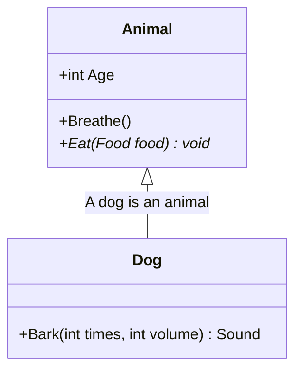

[⬆ Back to top](#class-diagram)

## Relationships

To add a relationship between two classes, use the `AddRelationship` method. A relationship can be one or two way, where each side can be of the following types:

- `Inheritance`
- `Composition`
- `Aggregation`
- `Association`
- `Unspecified`

Single-way example:

```csharp
var diagram = Mermaid
    .ClassDiagram()
    .AddClass("c1", out var c1)
    .AddClass("c2", out var c2)
    .AddRelationship(c1, c2, RelationshipType.Inheritance)
    .Build();
```

The code above generates the following Mermaid code:

```text
classDiagram
    c1 <|-- c2
```

That renders as:

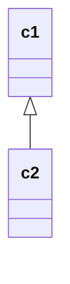

Two-way example:

```csharp
var diagram = Mermaid
    .ClassDiagram()
    .AddClass("c1", out var c1)
    .AddClass("c2", out var c2)
    .AddRelationship(c1, c2, RelationshipType.Inheritance, toRelationshipType: RelationshipType.Composition)
    .Build();
```

The code above generates the following Mermaid code:

```text
classDiagram
    c1 <|--* c2
```

That renders as:

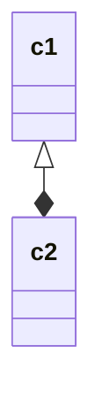

[⬆ Back to top](#class-diagram)

## Relationship cardinalities

To add cardinalities to a relationship, pass `fromCardinality` and/or `toCardinality` parameters to the `AddRelationship` method.

Example:

```csharp
var diagram = Mermaid
    .ClassDiagram()
    .AddClass("c1", out var c1)
    .AddClass("c2", out var c2)
    .AddClass("c3", out var c3)
    .AddClass("c4", out var c4)
    .AddRelationship(c1, c2, RelationshipType.Inheritance, fromCardinality: Cardinality.One)
    .AddRelationship(c3, c4, RelationshipType.Inheritance, toCardinality: Cardinality.Range("a", "b"))
    .Build();
```

The code above generates the following Mermaid code:

```text
classDiagram
    c1 "1" <|-- c2
    c3 <|--"a..b"  c4
```

That renders as:

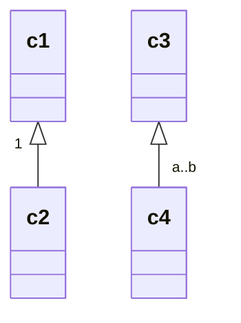

[⬆ Back to top](#class-diagram)

## Relationship link style

To set the style of the link between classes, pass a `linkStyle` parameter to the `AddRelationship` method.

It can be one of the following values:

- `Solid` (default)
- `Dashed`

Example:

```csharp
var diagram = Mermaid
    .ClassDiagram()
    .AddClass("c1", out var c1)
    .AddClass("c2", out var c2)
    .AddClass("c3", out var c3)
    .AddClass("c4", out var c4)
    .AddRelationship(c1, c2, RelationshipType.Inheritance, linkStyle: LinkStyle.Solid)
    .AddRelationship(c3, c4, RelationshipType.Inheritance, linkStyle: LinkStyle.Dashed)
    .Build();
```

The code above generates the following Mermaid code:

```text
classDiagram
    c1 <|-- c2
    c3 <|.. c4
```

That renders as:

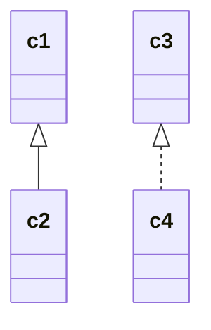

[⬆ Back to top](#class-diagram)

## Namespaces

Classes can be defined in a namespace. Use the `AddNamespace` method to add a namespace to the diagram, and define classes within it with the lambda method.

Example:

```csharp
var diagram = Mermaid
    .ClassDiagram()
    .AddClass("c1", out var c1)
    .AddClass("c2", out var c2)
    .AddNamespace("ns1", builder => builder
        .AddClass("c3", out var c3)
        .AddClass("c4", out var c4)
        .AddRelationship(c3, c4, RelationshipType.Inheritance))
    .AddClass("c5", out var c5)
    .AddNamespace("ns2", builder => builder
        .AddClass("c6", out var c6)
        .AddClass("c7", out var c7)
        .AddRelationship(c6, c7, RelationshipType.Inheritance)
        .AddRelationship(c1, c7, RelationshipType.Inheritance))
    .Build();
```

The code above generates the following Mermaid code:

```text
classDiagram
    class c2
    namespace ns1 {
        class c3
        class c4
    }
    class c5
    namespace ns2 {
        class c6
        class c7
    }
    c3 <|-- c4
    c6 <|-- c7
    c1 <|-- c7
```

That renders as:

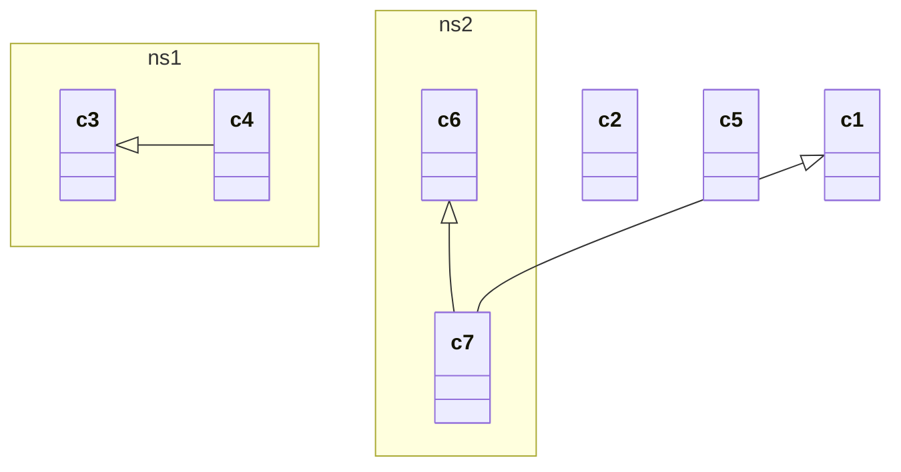

[⬆ Back to top](#class-diagram)

## Direction

The direction of the class diagram can be set by passing a `direction` parameter to the `ClassDiagram` method.

It can be one of the following values:

- `TopToBottom`
- `BottomToTop`
- `LeftToRight`
- `RightToLeft`

Example:

```csharp
var diagram = Mermaid
    .ClassDiagram("Bottom to Top", ClassDiagramDirection.BottomToTop)
    .AddClass("c1", out var d2c1)
    .AddClass("c2", out var d2c2)
    .AddRelationship(d2c1, d2c2, RelationshipType.Inheritance)
    .Build();
```

The code above generates the following Mermaid code:

```text
---
title: Bottom to Top
---
classDiagram
    direction BT
    c1 <|-- c2
```

That renders as:

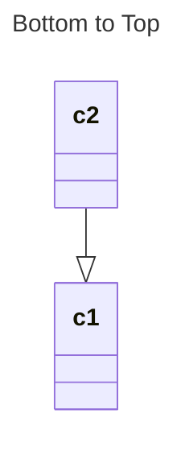

[⬆ Back to top](#class-diagram)

## Interaction

Classes can have an hyperlink or a javascript callback attached to them, by either using the `AddHyperlink` or `AddCallback` methods.

Example:

```csharp
var diagram = Mermaid
    .ClassDiagram()
    .AddClass("c1", out var c1)
    .AddClass("c2", out var c2)
    .AddClass("c3", out var c3)
    .AddClass("c4", out var c4)
    .AddCallback(c1, "callback")
    .AddCallback(c2, "callback", "tooltip")
    .AddHyperlink(c3, "https://example.com")
    .AddHyperlink(c4, "https://example.com", "tooltip")
    .AddRelationship(c1, c2, RelationshipType.Inheritance)
    .AddRelationship(c3, c4, RelationshipType.Inheritance)
    .Build();
```

The code above generates the following Mermaid code:

```text
classDiagram
    c1 <|-- c2
    c3 <|-- c4
    click c1 call callback()
    click c2 call callback() "tooltip"
    click c3 href "https://example.com"
    click c4 href "https://example.com" "tooltip"
```

That renders as:

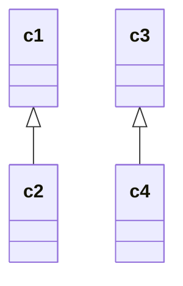

[⬆ Back to top](#class-diagram)

## Notes

Notes can be added to the diagram, eihter generally or to a specific class, by using the `AddNote` method.

Example:

```csharp
var diagram = Mermaid
    .ClassDiagram()
    .AddClass("c1", out var c1)
    .AddNote("General note")
    .AddNote("Specific note", c1)
    .Build();
```

The code above generates the following Mermaid code:

```text
classDiagram
    note "General note"
    note for c1 "Specific note"
    class c1
```

That renders as:

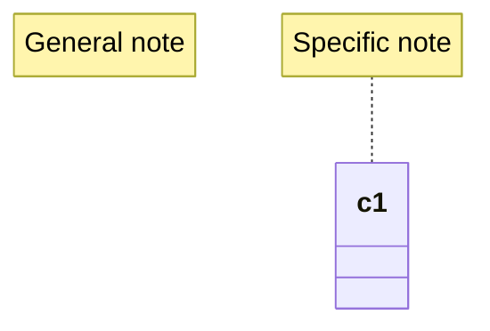

[⬆ Back to top](#class-diagram)

## Custom styling

Classes can be styled by using the `StyleWithRawCss` method, when using raw CSS, or the `StyleWithCssClass` method, when using a CSS class. CSS classes can be applied to multiple classes at once.

Example:

```csharp
var diagram = Mermaid
    .ClassDiagram()
    .AddClass("c1", out var c1)
    .AddClass("c2", out var c2)
    .AddClass("c3", out var c3)
    .StyleWithRawCss(c1, "fill:#f9f,stroke:#333,stroke-width:4px")
    .StyleWithCssClass("styleClass", c2, c3)
    .Build();
```

The code above generates the following Mermaid code:

```text
classDiagram
    class c1
    class c2
    class c3
    style c1 fill:#f9f,stroke:#333,stroke-width:4px
    cssClass "c2,c3" styleClass
```

That renders as:

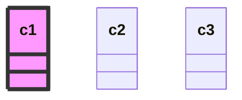

[⬆ Back to top](#class-diagram)
