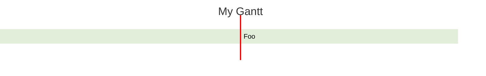

# Mermaid configuration

Mermaid diagrams can be configured, by passing a `MermaidConfig` object to any of the methods in the `Mermaid` class.

The `MermaidConfig` object from `FoggyBalrog.MermaidDotNet` implements the properties of the Mermaid configuration object from the Mermaid library, as found [in the Mermaid documentation](https://mermaid.js.org/config/setup/interfaces/mermaid.MermaidConfig.html), except for the configuration specific to experimental diagrams, that are not supported by this library.

The `MermaidConfig` object will be rendered in the frontmatter of the diagram file, as a YAML object under the `config` key.

Example:

```csharp
var config = new MermaidConfig
{
    Theme = Theme.Forest,
    Gantt = new GanttDiagramConfig
    {
        AxisFormat = "%d-%m",
        DisplayMode = DisplayMode.Compact,
        TickInterval = "1week",
        Weekday = Weekday.Monday
    }
};

string diagram = Mermaid
    .GanttDiagram(title: "My Gantt", config: config)
    .AddTask("Foo", Date("2024-05-01"), Date("2024-05-05"), out GanttTask _)
    .Build();
```

The code above generates the following Mermaid code:

```text
---
title: My Gantt
config:
  theme: forest
  gantt:
    axisFormat: '%d-%m'
    tickInterval: 1week
    displayMode: compact
    weekday: monday
---
gantt
    Foo: task1, 01-05-2024, 05-05-2024
```

That renders as:



## Theme variables

The `ThemeVariables` property of the `MermaidConfig` object is a dictionary that can be used to set theme variables for the diagram. The specific variables that can be set vary depending on the diagram type.
