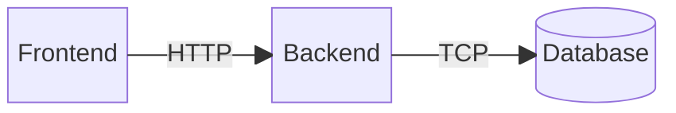
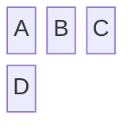
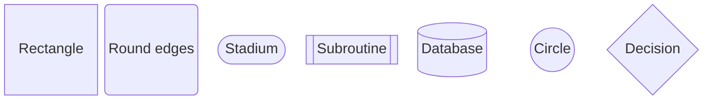
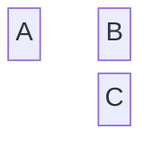
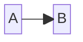
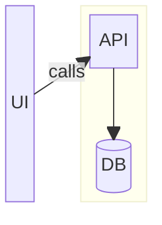
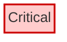

# Block diagram<!-- omit from toc -->

*Official Mermaid documentation: [Block diagram](https://mermaid.js.org/syntax/block.html).*  

> [!NOTE]
> All Mermaid diagrams can be configured, by passing a `MermaidConfig` object to any of the methods in the `Mermaid` class. Read more on [Mermaid configuration](~/configuration.md).

## Simple block diagram

The following code sample shows how to create a simple Mermaid block diagram.

Use the `BlockDiagram` method of the `Mermaid` class to create a block diagram.

Add blocks with the `AddBlock` method, add links with the `AddLink` method, and generate the Mermaid code with the `Build` method.

```csharp
var diagram = Mermaid
    .BlockDiagram()
    .AddBlock("Frontend", out var frontend)
    .AddSpace()
    .AddBlock("Backend", out var backend)
    .AddSpace()
    .AddBlock("Database", out var database, shape: BlockShape.Cylindrical)
    .AddLink(frontend, backend, "HTTP")
    .AddLink(backend, database, "TCP")
    .Build();
```

The code above generates the following Mermaid code:

```text
block
    b0["Frontend"]
    space
    b1["Backend"]
    space
    b2[("Database")]
    b0 --"HTTP"--> b1
    b1 --"TCP"--> b2
```

That renders as:



[⬆ Back to top](#block-diagram)

## Columns

Block diagrams can be laid out on a fixed number of columns. Pass a `columns` parameter to the `BlockDiagram` method.

Example:

```csharp
var diagram = Mermaid
    .BlockDiagram(columns: 3)
    .AddBlock("A", out _)
    .AddBlock("B", out _)
    .AddBlock("C", out _)
    .AddBlock("D", out _)
    .Build();
```

The code above generates the following Mermaid code:

```text
block
    columns 3
    b0["A"]
    b1["B"]
    b2["C"]
    b3["D"]
```

That renders as:



[⬆ Back to top](#block-diagram)

## Block shapes

Blocks can be rendered with different shapes by passing the `shape` parameter to `AddBlock`.

Example:

```csharp
var diagram = Mermaid
    .BlockDiagram()
    .AddBlock("Rectangle", out _, shape: BlockShape.Rectangle)
    .AddBlock("Round edges", out _, shape: BlockShape.RoundEdges)
    .AddBlock("Stadium", out _, shape: BlockShape.Stadium)
    .AddBlock("Subroutine", out _, shape: BlockShape.Subroutine)
    .AddBlock("Database", out _, shape: BlockShape.Cylindrical)
    .AddBlock("Circle", out _, shape: BlockShape.Circle)
    .AddBlock("Decision", out _, shape: BlockShape.Rhombus)
    .Build();
```

The code above generates the following Mermaid code:

```text
block
    b0["Rectangle"]
    b1("Round edges")
    b2(["Stadium"])
    b3[["Subroutine"]]
    b4[("Database")]
    b5(("Circle"))
    b6{"Decision"}
```

That renders as:



[⬆ Back to top](#block-diagram)

## Spaces

To add empty slots in the layout, use the `AddSpace` method, passing an optional `count` parameter to add multiple consecutive spaces.

Example:

```csharp
var diagram = Mermaid
    .BlockDiagram(columns: 3)
    .AddBlock("A", out _)
    .AddSpace()
    .AddBlock("B", out _)
    .AddSpace(2)
    .AddBlock("C", out _)
    .Build();
```

The code above generates the following Mermaid code:

```text
block
    columns 3
    b0["A"]
    space
    b1["B"]
    space:2
    b2["C"]
```

That renders as:



## Links

To connect blocks, use the `AddLink` method. Links can optionally display text.

Example:

```csharp
var diagram = Mermaid
    .BlockDiagram()
    .AddBlock("A", out var a)
    .AddSpace()
    .AddBlock("B", out var b)
    .AddLink(a, b)
    .Build();
```

The code above generates the following Mermaid code:

```text
block
    b0["A"]
    space
    b1["B"]
    b0 --> b1
```

That renders as:




[⬆ Back to top](#block-diagram)

## Composite blocks

Composite blocks can be created with the `AddCompositeBlock` method. The `buildAction` receives a new `BlockDiagramBuilder` used to declare the nested blocks and links.

Example:

```csharp
Block api;
Block db;

var diagram = Mermaid
    .BlockDiagram(columns: 3)
    .AddBlock("UI", out var ui)
    .AddSpace()
    .AddCompositeBlock(builder => builder
            .AddBlock("API", out api)
            .AddSpace()
            .AddBlock("DB", out db, shape: BlockShape.Cylindrical)
            .AddLink(api, db),
        columns: 1,
        width: 2)
    .AddLink(ui, api, "calls")
    .Build();
```

The code above generates the following Mermaid code:

```text
block
    columns 3
    b0["UI"]
    space
    block:composite0:2
        columns 1
        b1["API"]
        space
        b2[("DB")]
        b1 --> b2
    end
    b0 --"calls"--> b1
```

That renders as:



[⬆ Back to top](#block-diagram)

## Custom styling

To apply custom CSS styling to a block, use the `StyleBlock` method.

Example:

```csharp
var diagram = Mermaid
    .BlockDiagram()
    .AddBlock("Critical", out var critical)
    .StyleBlock(critical, "fill:#ffcccc,stroke:#cc0000,stroke-width:2px")
    .Build();
```

The code above generates the following Mermaid code:

```text
block
    b0["Critical"]
    style b0 fill:#ffcccc,stroke:#cc0000,stroke-width:2px
```

That renders as:



[⬆ Back to top](#block-diagram)
