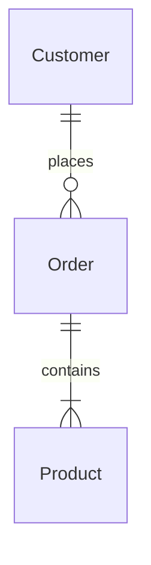
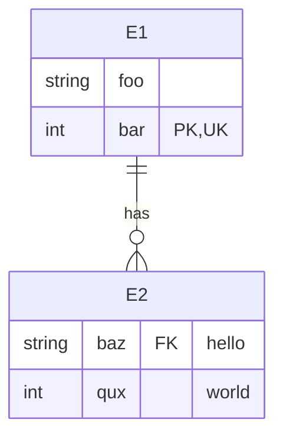
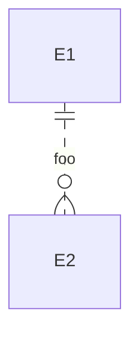

# Entity relationship diagram<!-- omit from toc -->

*Official Mermaid documentation: [Entity Relationship Diagram](https://mermaid.js.org/syntax/entityRelationshipDiagram.html).*

> [!NOTE]
> All Mermaid diagrams can be configured, by passing a `MermaidConfig` object to any of the methods in the `Mermaid` class. Read more on [Mermaid configuration](~/configuration.md).

## Simple diagram

The following code sample shows how to create a simple entity relationship diagram.

Use the `EntityRelationshipDiagram` proerty of the `Mermaid` class to start building an entity relationship diagram.

Add entities to the diagram using the `AddEntity` method.

Add relationships between entities using the `AddRelationship` method.

Generate the diagram mermaid code with the `Build` method.

Example:

```csharp
Mermaid
    .EntityRelationshipDiagram()
    .AddEntity("Customer", out var c)
    .AddEntity("Order", out var o)
    .AddEntity("Product", out var p)
    .AddRelationship(Cardinality.ExactlyOne, c, Cardinality.ZeroOrMore, o, "places")
    .AddRelationship(Cardinality.ExactlyOne, o, Cardinality.OneOrMore, p, "contains")
    .Build();
```

The code above generates the following Mermaid code:

```text
erDiagram
    Customer ||--o{ Order : "places"
    Order ||--|{ Product : "contains"
```

That renders as:



[⬆ Back to top](#entity-relationship-diagram)

## Cardinality

Cardinality must be defined for each end of a relationship and may be one of the following values:

- `ZeroOrOne`
- `ExactlyOne`
- `ZeroOrMore`
- `OneOrMore`

[⬆ Back to top](#entity-relationship-diagram)

## Attributes

Attributes may be added to entities, using the optional `attributes` parameter of the `AddEntity` method.

Attributes must at least ave a type and a name. Thay can additionally have keys and a comment.

Example:

```csharp
Mermaid
    .EntityRelationshipDiagram()
    .AddEntity("E1", out var e1, ("string", "foo"), ("int", "bar", EntityAttributeKeys.Primary | EntityAttributeKeys.Unique))
    .AddEntity("E2", out var e2, ("string", "baz", EntityAttributeKeys.Foreign, "hello"), ("int", "qux", "world"))
    .AddRelationship(Cardinality.ExactlyOne, e1, Cardinality.ZeroOrMore, e2, "has")
    .Build();
```

The code above generates the following Mermaid code:

```text
erDiagram
    E1 {
        string foo
        int bar PK, UK
    }
    E2 {
        string baz FK "hello"
        int qux "world"
    }
    E1 ||--o{ E2 : "has"
```

That renders as:



[⬆ Back to top](#entity-relationship-diagram)

## Identification

Relationships may be classified as either *identifying* (by default) or *non-identifying* and these are rendered with either solid or dashed lines respectively.

Use the optional `relationshipType` parameter of the `AddRelationship` method to specify the relationship type.

Example:

```csharp
Mermaid
    .EntityRelationshipDiagram()
    .AddEntity("E1", out var e1)
    .AddEntity("E2", out var e2)
    .AddRelationship(Cardinality.ExactlyOne, e1, Cardinality.ZeroOrMore, e2, "foo", RelationshipType.NonIdentifying)
    .Build();
```

The code above generates the following Mermaid code:

```text
erDiagram
    E1 ||..o{ E2 : "foo"
```

That renders as:



[⬆ Back to top](#entity-relationship-diagram)