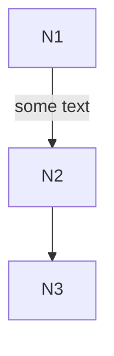
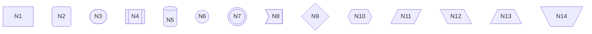
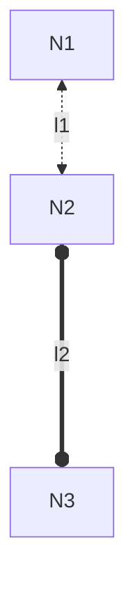
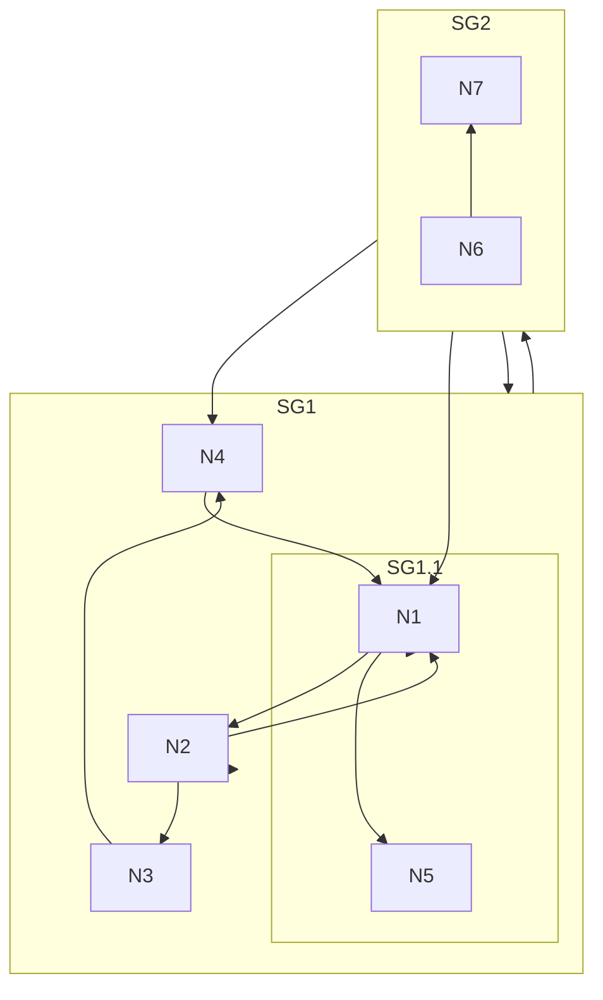
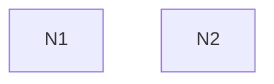
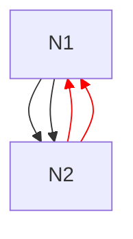
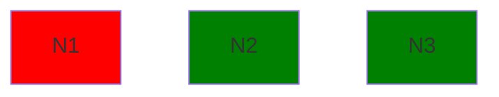
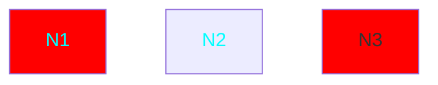

```mermaid
flowchart TB
    id1@{ shape: notch-rect, label: "N1" }
    id2@{ shape: hourglass, label: "N2" }
    id3@{ shape: bolt, label: "N3" }
    id4@{ shape: brace, label: "N4" }
    id5@{ shape: brace-r, label: "N5" }
    id6@{ shape: braces, label: "N6" }
    id7@{ shape: lean-r, label: "N7" }
    id8@{ shape: lean-l, label: "N8" }
    id9@{ shape: cyl, label: "N9" }
    id10@{ shape: diam, label: "N10" }
    id11@{ shape: delay, label: "N11" }
    id12@{ shape: h-cyl, label: "N12" }
    id13@{ shape: lin-cyl, label: "N13" }
    id14@{ shape: curv-trap, label: "N14" }
    id15@{ shape: div-rect, label: "N15" }
    id16@{ shape: doc, label: "N16" }
    id17@{ shape: rounded, label: "N17" }
    id18@{ shape: tri, label: "N18" }
    id19@{ shape: fork, label: "N19" }
    id20@{ shape: win-pane, label: "N20" }
    id21@{ shape: f-circ, label: "N21" }
    id22@{ shape: lin-doc, label: "N22" }
    id23@{ shape: lin-rect, label: "N23" }
    id24@{ shape: notch-pent, label: "N24" }
    id25@{ shape: flip-tri, label: "N25" }
    id26@{ shape: sl-rect, label: "N26" }
    id27@{ shape: trap-t, label: "N27" }
    id28@{ shape: docs, label: "N28" }
    id29@{ shape: st-rect, label: "N29" }
    id30@{ shape: odd, label: "N30" }
    id31@{ shape: flag, label: "N31" }
    id32@{ shape: hex, label: "N32" }
    id33@{ shape: trap-b, label: "N33" }
    id34@{ shape: rect, label: "N34" }
    id35@{ shape: circle, label: "N35" }
    id36@{ shape: sm-circ, label: "N36" }
    id37@{ shape: dbl-circ, label: "N37" }
    id38@{ shape: fr-circ, label: "N38" }
    id39@{ shape: bow-rect, label: "N39" }
    id40@{ shape: fr-rect, label: "N40" }
    id41@{ shape: cross-circ, label: "N41" }
    id42@{ shape: tag-doc, label: "N42" }
    id43@{ shape: tag-rect, label: "N43" }
    id44@{ shape: stadium, label: "N44" }
    id45@{ shape: text, label: "N45" }
```

# Flowchart<!-- omit from toc -->

*Official Mermaid documentation: [Flowchart](https://mermaid.js.org/syntax/flowchart.html).*

> [!NOTE]
> All Mermaid diagrams can be configured, by passing a `MermaidConfig` object to any of the methods in the `Mermaid` class. Read more on [Mermaid configuration](~/configuration.md).

## Simple flowchart

The following code sample shows how to create a simple Mermaid flowchart.

Use the `Flowchart` method of the `Mermaid` class to create a flowchart.

Add nodes with the `AddNode` method, and link them with the `AddLink` method.

Generate the diagram mermaid code with the `Build` method.

```csharp
string diagram = Mermaid
    .Flowchart()
    .AddNode("N1", out var n1)
    .AddNode("N2", out var n2)
    .AddNode("N3", out var n3)
    .AddLink(n1, n2, out var l1, "some text")
    .AddLink(n2, n3, out var l2)
    .Build();
```

The code above generates the following Mermaid code:

```text
flowchart TB
    id1["N1"]
    id2["N2"]
    id3["N3"]
    id1 -->|"some text"| id2
    id2 --> id3
```

That renders as:



[⬆ Back to top](#flowchart)

## Orientation

The orientation of the flowchart can be set by passing an `orientation` parameter to the `Flowchart` method. 

It can be one of the following values:

- `TopToBottom` (default)
- `BottomToTop`
- `LeftToRight`
- `RightToLeft`

```csharp
Mermaid.Flowchart(orientation: FlowchartOrientation.BottomToTop)
```

[⬆ Back to top](#flowchart)

## Node shape

The shape of the nodes can be set by passing a `shape` parameter to the `AddNode` method.

It can be one of the following values:

- `Rectangle` (default)
- `RoundEdges`
- `Stadium`
- `Subroutine`
- `Cylindrical`
- `Circle`
- `DoubleCircle`
- `Asymmetric`
- `Rhombus`
- `Hexagon`
- `Parallelogram`
- `ParallelogramAlt`
- `Trapezoid`
- `TrapezoidAlt`

Example:

```csharp
string diagram = Mermaid
    .Flowchart()
    .AddNode("N1", out _, NodeShape.Rectangle)
    .AddNode("N2", out _, NodeShape.RoundEdges)
    .AddNode("N3", out _, NodeShape.Stadium)
    .AddNode("N4", out _, NodeShape.Subroutine)
    .AddNode("N5", out _, NodeShape.Cylindrical)
    .AddNode("N6", out _, NodeShape.Circle)
    .AddNode("N7", out _, NodeShape.DoubleCircle)
    .AddNode("N8", out _, NodeShape.Asymmetric)
    .AddNode("N9", out _, NodeShape.Rhombus)
    .AddNode("N10", out _, NodeShape.Hexagon)
    .AddNode("N11", out _, NodeShape.Parallelogram)
    .AddNode("N12", out _, NodeShape.ParallelogramAlt)
    .AddNode("N13", out _, NodeShape.Trapezoid)
    .AddNode("N14", out _, NodeShape.TrapezoidAlt)
    .Build();
```

The code above generates the following Mermaid code:

```text
flowchart TB
    id1["N1"]
    id2("N2")
    id3(["N3"])
    id4[["N4"]]
    id5[("N5")]
    id6(("N6"))
    id7((("N7")))
    id8>"N8"]
    id9{"N9"}
    id10{{"N10"}}
    id11[/"N11"/]
    id12[\"N12"\]
    id13[/"N13"\]
    id14[\"N14"/]
```

That renders as:



[⬆ Back to top](#flowchart)

## Node expanded shapes

Nodes can have an expanded shape, by using the `AddnodeWithExpandedShape` method, tithe the `shape` parameter, that can be one of the following values:

- `NotchRect`
- `Hourglass`
- `Bolt`
- `Brace`
- `BraceR`
- `Braces`
- `LeanR`
- `LeanL`
- `Cyl`
- `Diam`
- `Delay`
- `HCyl`
- `LinCyl`
- `CurvTrap`
- `DivRect`
- `Doc`
- `Rounded`
- `Tri`
- `Fork`
- `WinPane`
- `FCirc`
- `LinDoc`
- `LinRect`
- `NotchPent`
- `FlipTri`
- `SlRect`
- `TrapT`
- `Docs`
- `StRect`
- `Odd`
- `Flag`
- `Hex`
- `TrapB`
- `Rect`
- `Circle`
- `SmCirc`
- `DblCirc`
- `FrCirc`
- `BowRect`
- `FrRect`
- `CrossCirc`
- `TagDoc`
- `TagRect`
- `Stadium`
- `Text`

Example:

```csharp
string diagram = Mermaid
    .Flowchart()
    .AddNodeWithExpandedShape("N1", out _, ExpandedNodeShape.NotchRect)
    .AddNodeWithExpandedShape("N2", out _, ExpandedNodeShape.Hourglass)
    .AddNodeWithExpandedShape("N3", out _, ExpandedNodeShape.Bolt)
    .AddNodeWithExpandedShape("N4", out _, ExpandedNodeShape.Brace)
    .AddNodeWithExpandedShape("N5", out _, ExpandedNodeShape.BraceR)
    .AddNodeWithExpandedShape("N6", out _, ExpandedNodeShape.Braces)
    .AddNodeWithExpandedShape("N7", out _, ExpandedNodeShape.LeanR)
    .AddNodeWithExpandedShape("N8", out _, ExpandedNodeShape.LeanL)
    .AddNodeWithExpandedShape("N9", out _, ExpandedNodeShape.Cyl)
    .AddNodeWithExpandedShape("N10", out _, ExpandedNodeShape.Diam)
    .AddNodeWithExpandedShape("N11", out _, ExpandedNodeShape.Delay)
    .AddNodeWithExpandedShape("N12", out _, ExpandedNodeShape.HCyl)
    .AddNodeWithExpandedShape("N13", out _, ExpandedNodeShape.LinCyl)
    .AddNodeWithExpandedShape("N14", out _, ExpandedNodeShape.CurvTrap)
    .AddNodeWithExpandedShape("N15", out _, ExpandedNodeShape.DivRect)
    .AddNodeWithExpandedShape("N16", out _, ExpandedNodeShape.Doc)
    .AddNodeWithExpandedShape("N17", out _, ExpandedNodeShape.Rounded)
    .AddNodeWithExpandedShape("N18", out _, ExpandedNodeShape.Tri)
    .AddNodeWithExpandedShape("N19", out _, ExpandedNodeShape.Fork)
    .AddNodeWithExpandedShape("N20", out _, ExpandedNodeShape.WinPane)
    .AddNodeWithExpandedShape("N21", out _, ExpandedNodeShape.FCirc)
    .AddNodeWithExpandedShape("N22", out _, ExpandedNodeShape.LinDoc)
    .AddNodeWithExpandedShape("N23", out _, ExpandedNodeShape.LinRect)
    .AddNodeWithExpandedShape("N24", out _, ExpandedNodeShape.NotchPent)
    .AddNodeWithExpandedShape("N25", out _, ExpandedNodeShape.FlipTri)
    .AddNodeWithExpandedShape("N26", out _, ExpandedNodeShape.SlRect)
    .AddNodeWithExpandedShape("N27", out _, ExpandedNodeShape.TrapT)
    .AddNodeWithExpandedShape("N28", out _, ExpandedNodeShape.Docs)
    .AddNodeWithExpandedShape("N29", out _, ExpandedNodeShape.StRect)
    .AddNodeWithExpandedShape("N30", out _, ExpandedNodeShape.Odd)
    .AddNodeWithExpandedShape("N31", out _, ExpandedNodeShape.Flag)
    .AddNodeWithExpandedShape("N32", out _, ExpandedNodeShape.Hex)
    .AddNodeWithExpandedShape("N33", out _, ExpandedNodeShape.TrapB)
    .AddNodeWithExpandedShape("N34", out _, ExpandedNodeShape.Rect)
    .AddNodeWithExpandedShape("N35", out _, ExpandedNodeShape.Circle)
    .AddNodeWithExpandedShape("N36", out _, ExpandedNodeShape.SmCirc)
    .AddNodeWithExpandedShape("N37", out _, ExpandedNodeShape.DblCirc)
    .AddNodeWithExpandedShape("N38", out _, ExpandedNodeShape.FrCirc)
    .AddNodeWithExpandedShape("N39", out _, ExpandedNodeShape.BowRect)
    .AddNodeWithExpandedShape("N40", out _, ExpandedNodeShape.FrRect)
    .AddNodeWithExpandedShape("N41", out _, ExpandedNodeShape.CrossCirc)
    .AddNodeWithExpandedShape("N42", out _, ExpandedNodeShape.TagDoc)
    .AddNodeWithExpandedShape("N43", out _, ExpandedNodeShape.TagRect)
    .AddNodeWithExpandedShape("N44", out _, ExpandedNodeShape.Stadium)
    .AddNodeWithExpandedShape("N45", out _, ExpandedNodeShape.Text)
    .Build();
```

The code above generates the following Mermaid code:

```text
flowchart TB
    id1@{ shape: notch-rect, label: "N1" }
    id2@{ shape: hourglass, label: "N2" }
    id3@{ shape: bolt, label: "N3" }
    id4@{ shape: brace, label: "N4" }
    id5@{ shape: brace-r, label: "N5" }
    id6@{ shape: braces, label: "N6" }
    id7@{ shape: lean-r, label: "N7" }
    id8@{ shape: lean-l, label: "N8" }
    id9@{ shape: cyl, label: "N9" }
    id10@{ shape: diam, label: "N10" }
    id11@{ shape: delay, label: "N11" }
    id12@{ shape: h-cyl, label: "N12" }
    id13@{ shape: lin-cyl, label: "N13" }
    id14@{ shape: curv-trap, label: "N14" }
    id15@{ shape: div-rect, label: "N15" }
    id16@{ shape: doc, label: "N16" }
    id17@{ shape: rounded, label: "N17" }
    id18@{ shape: tri, label: "N18" }
    id19@{ shape: fork, label: "N19" }
    id20@{ shape: win-pane, label: "N20" }
    id21@{ shape: f-circ, label: "N21" }
    id22@{ shape: lin-doc, label: "N22" }
    id23@{ shape: lin-rect, label: "N23" }
    id24@{ shape: notch-pent, label: "N24" }
    id25@{ shape: flip-tri, label: "N25" }
    id26@{ shape: sl-rect, label: "N26" }
    id27@{ shape: trap-t, label: "N27" }
    id28@{ shape: docs, label: "N28" }
    id29@{ shape: st-rect, label: "N29" }
    id30@{ shape: odd, label: "N30" }
    id31@{ shape: flag, label: "N31" }
    id32@{ shape: hex, label: "N32" }
    id33@{ shape: trap-b, label: "N33" }
    id34@{ shape: rect, label: "N34" }
    id35@{ shape: circle, label: "N35" }
    id36@{ shape: sm-circ, label: "N36" }
    id37@{ shape: dbl-circ, label: "N37" }
    id38@{ shape: fr-circ, label: "N38" }
    id39@{ shape: bow-rect, label: "N39" }
    id40@{ shape: fr-rect, label: "N40" }
    id41@{ shape: cross-circ, label: "N41" }
    id42@{ shape: tag-doc, label: "N42" }
    id43@{ shape: tag-rect, label: "N43" }
    id44@{ shape: stadium, label: "N44" }
    id45@{ shape: text, label: "N45" }
```

That renders as:



[⬆ Back to top](#flowchart)

## Links

Links between nodes can have a label, using the `text` parameter of the `AddLink` method.

Their line style and ending can be set by using the `lineStyle` and `ending` parameters.

They can be set as multidirectional by using the `multidirectional` parameter.

Thay can be added extra length by using the `extraLength` parameter.

The `lineStyle` parameter can be one of the following values:

- `Solid` (default)
- `Dotted`
- `Thick`
- `Invisible`

The `ending` parameter can be one of the following values:

- `Arrow` (default)
- `Circle`
- `Cross`
- `Open`

Example:

```csharp
string diagram = Mermaid
    .Flowchart()
    .AddNode("N1", out var n1)
    .AddNode("N2", out var n2)
    .AddNode("N3", out var n3)
    .AddLink(n1, n2, out var l1, "l1", LinkLineStyle.Dotted, LinkEnding.Arrow, true)
    .AddLink(n2, n3, out var l2, "l2", LinkLineStyle.Thick, LinkEnding.Circle, true, 2)
    .Build();
```

The code above generates the following Mermaid code:

```text
flowchart TB
    id1["N1"]
    id2["N2"]
    id3["N3"]
    id1 <-.->|"l1"| id2
    id2 o====o|"l2"| id3
```

That renders as:



[⬆ Back to top](#flowchart)

## Subgraphs

Subgraphs can be created by using the `AddSubgraph` method.

Example:

```csharp
string diagram = Mermaid
    .Flowchart()
    .AddNode("N1", out var n1)
    .AddNode("N2", out var n2)
    .AddNode("N3", out var n3)
    .AddNode("N4", out var n4)
    .AddNode("N5", out var n5)
    .AddLink(n1, n2, out var l1)
    .AddSubgraph("SG1", out var sg1, builder => builder
        .AddLink(n2, n3, out var l2)
        .AddLink(n3, n4, out var l3)
        .AddSubgraph("SG1.1", out var sg11, builder => builder
            .AddLink(n1, n5, out var l4))
    .AddLink(n4, n1, out var l5)
    .AddSubgraph("SG2", out var sg2, builder => builder
        .AddNode("N6", out var n6)
        .AddNode("N7", out var n7)
        .AddLink(n6, n7, out var l6), FlowchartOrientation.BottomToTop)
    .AddLink(n1, sg1, out var l7)
    .AddLink(sg2, n4, out var l8)
    .AddLink(sg1, sg2, out var l9)
    .AddLinkChain([n2, sg2], [n1, sg1], out l10)
    .Build();
```

The code above generates the following Mermaid code:

```text
flowchart TB
    id1["N1"]
    id2["N2"]
    id3["N3"]
    id4["N4"]
    id5["N5"]
    id1 --> id2
    subgraph sub7 [SG1]
    id2 --> id3
    id3 --> id4
    subgraph sub10 [SG1.1]
    id1 --> id5
    end
    end
    id4 --> id1
    subgraph sub15 [SG2]
    direction BT
    id16["N6"]
    id17["N7"]
    id16 --> id17
    end
    id1 --> sub7
    sub15 --> id4
    sub7 --> sub15
    id2 & sub15 --> id1 & sub7
```

That renders as:



[⬆ Back to top](#flowchart)

## Interaction

Nodes can have an hyperlink or a javascript callback attached to them, by either using the `AddHyperlink` or `AddCallback` methods.

Example:

```csharp
string diagram = Mermaid
    .Flowchart()
    .AddNode("N1", out var n1)
    .AddNode("N2", out var n2)
    .AddHyperlink(n1, "https://example.com", "tooltip 1", HyperlinkTarget.Blank)
    .AddCallback(n2, "callback", "tooltip 2")
    .Build();
```

The code above generates the following Mermaid code:

```text
flowchart TB
    id1["N1"]
    click id1 "https://example.com" "tooltip 1" _blank
    id2["N2"]
    click id2 callback "tooltip 2"
```

That renders as:



[⬆ Back to top](#flowchart)

## Styling

### Styling links

Links can be styled with CSS by using the `StyleLinks` method.

Example:

```csharp
string diagram = Mermaid
    .Flowchart()
    .AddNode("N1", out Node n1)
    .AddNode("N2", out Node n2)
    .AddLink(n1, n2, out Link l1)
    .AddLink(n2, n1, out Link l2)
    .AddLink(n1, n2, out Link l3)
    .AddLink(n2, n1, out Link l4)
    .StyleLinks("stroke: red;", l1, l3)
    .Build();
```

The code above generates the following Mermaid code:

```text
flowchart TB
    id1["N1"]
    id2["N2"]
    id1 --> id2
    id2 --> id1
    id1 --> id2
    id2 --> id1
    linkStyle 1,3 stroke: red;
```

That renders as:



[⬆ Back to top](#flowchart)

### Stytling curves

Set the `Flowchart.Curve` property of the `MermadConfig` object. See [Mermaid configuration](~/configuration.md) or [the official Mermaid documentation](https://mermaid.js.org/config/setup/interfaces/mermaid.MermaidConfig.html#flowchart) for more information.

[⬆ Back to top](#flowchart)

### Styling nodes

#### Raw CSS

Nodes can be styled with raw CSS by using the `StyleNodes` method.

Example:

```csharp
string diagram = Mermaid
    .Flowchart()
    .AddNode("N1", out Node n1)
    .AddNode("N2", out Node n2)
    .AddNode("N3", out Node n3)
    .StyleNodes("fill: red;", n1)
    .StyleNodes("fill: green;", n2, n3)
    .Build();
```

The code above generates the following Mermaid code:

```text
flowchart TB
    id1["N1"]
    id2["N2"]
    id3["N3"]
    style id1 fill: red;
    style id2 fill: green;
    style id3 fill: green;
```

That renders as:



[⬆ Back to top](#flowchart)

#### CSS classes

Nodes can be styled with CSS classes by using the `DefineCssClass` to define a CSS class and the `StyleNodes` method to apply it to nodes.

Example:

```csharp
string diagram = Mermaid
    .Flowchart()
    .AddNode("N1", out Node n1)
    .AddNode("N2", out Node n2)
    .AddNode("N3", out Node n3)
    .DefineCssClass("class1", "fill: red;", out CssClass class1)
    .DefineCssClass("class2", "color: cyan;", out CssClass class2)
    .StyleNodes(class1, n1, n3)
    .StyleNodes(class2, n1, n2)
    .Build();
```

The code above generates the following Mermaid code:

```text
flowchart TB
    id1[""N1""]
    id2[""N2""]
    id3[""N3""]
    classDef class1 fill: red;
    classDef class2 color: cyan;
    class id1,id3 class1
    class id1,id2 class2
```

That renders as:



If the CSS classes qre defined outside of the mermaid code (e.g. in a CSS file), use the `StyleNodesWithPredefinedCssClass` method instead. This will omit the `classDef` statements.

[⬆ Back to top](#flowchart)