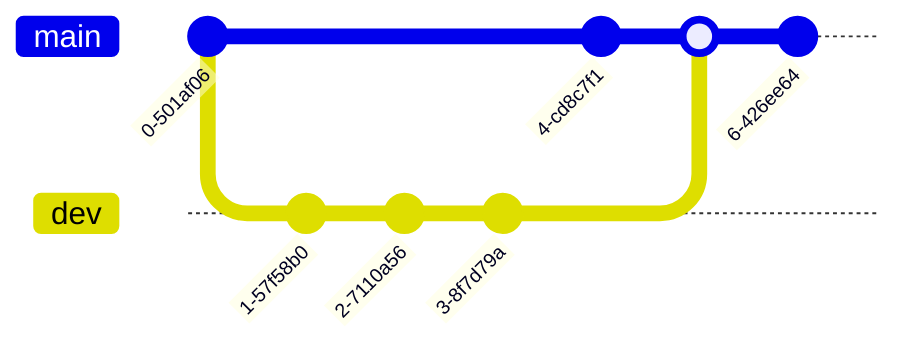
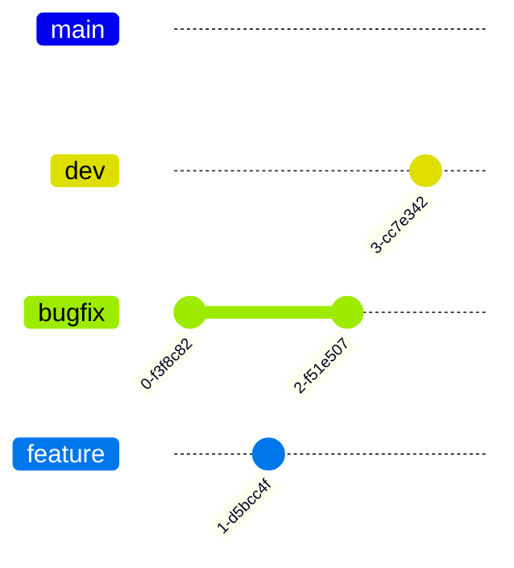
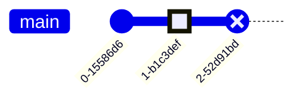
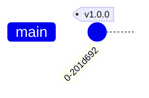
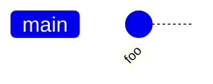
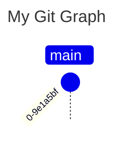

# Git Graph<!-- omit from toc -->

*Official Mermaid documentation: [Git Graphs](https://mermaid.js.org/syntax/gitgraph.html).*

> [!NOTE]
> All Mermaid diagrams can be configured, by passing a `MermaidConfig` object to any of the methods in the `Mermaid` class. Read more on [Mermaid configuration](~/configuration.md).

## Simple diagram

The following code sample shows how to create a simple Mermaid git graph.

Use the `GitGraph` method of the `Mermaid` class to create a git graph.

Add git commits with the `Commit` method, branches with the `Branch` method, merges with the `Merge` method, and checkouts with the `Checkout` method (or `CheckoutMain` to checkout the main branch).

Generate the diagram mermaid code with the `Build` method.

```csharp
string graph = Mermaid
    .GitGraph()
    .Commit()
    .Branch("dev", out Branch dev)
    .Commit()
    .Checkout(dev)
    .Commit()
    .Commit()
    .CheckoutMain()
    .Commit()
    .Merge(dev)
    .Commit()
    .Build();
```

The code above generates the following Mermaid code:

```text
gitGraph
    commit
    branch dev
    commit
    checkout dev
    commit
    commit
    checkout main
    commit
    merge dev
    commit
```

That renders as:



[⬆ Back to top](#git-graph)

## Branch ordering

By default, branches are ordered in the order they were created.

To change the order of branches, use the optional `order` parameter of the `Branch` method.

NB: the main branch order is always `0`.

```csharp
string graph = Mermaid
    .GitGraph()
    .Branch("dev", out Branch dev, order: 1)
    .Branch("feature", out Branch feature, order: 3)
    .Branch("bugfix", out Branch bugfix, order: 2)
    .Commit()
    .Checkout(feature)
    .Commit()
    .Checkout(bugfix)
    .Commit()
    .Checkout(dev)
    .Commit()
    .Build();
```

The code above generates the following Mermaid code:

```text
gitGraph
    branch dev order: 1
    branch feature order: 3
    branch bugfix order: 2
    commit
    checkout feature
    commit
    checkout bugfix
    commit
    checkout dev
    commit
```

That renders as:



[⬆ Back to top](#git-graph)

## Commit types

Commits can have different types. The type of a commit can be set by passing the `type` parameter to the `Commit` method.

The following commit types are available:

- `Normal` (default)
- `Highlight`
- `Reverse`

Example:

```csharp
string graph = Mermaid
    .GitGraph()
    .Commit(type: CommitType.Normal)
    .Commit(type: CommitType.Highlight)
    .Commit(type: CommitType.Reverse)
    .Build();
```

The code above generates the following Mermaid code:

```text
gitGraph
    commit
    commit type: HIGHLIGHT
    commit type: REVERSE
```

That renders as:



[⬆ Back to top](#git-graph)

## Commit tags

Commits can have tags. The tag of a commit can be set by passing the `tag` parameter to the `Commit` method.

Example:

```csharp
string graph = Mermaid
    .GitGraph()
    .Commit(tag: "v1.0.0")
    .Build();
```

The code above generates the following Mermaid code:

```text
gitGraph
    commit tag: "v1.0.0"
```

That renders as:



[⬆ Back to top](#git-graph)

## Commit id

Commits can have an id. The id of a commit can be set by passing the `id` parameter to the `Commit` method.

Example:

```csharp
string graph = Mermaid
    .GitGraph()
    .Commit(id: "foo")
    .Build();
```

The code above generates the following Mermaid code:

```text
gitGraph
    commit id: "foo"
```

That renders as:



[⬆ Back to top](#git-graph)

## Title

The title of the graph can be set by passing the `title` parameter to the `GitGraph` method.

Example:

```csharp
string graph = Mermaid
    .GitGraph(title: "My Git Graph")
    .Commit()
    .Build();
```

The code above generates the following Mermaid code:

```text
---
title: My Git Graph
---
gitGraph TB:
    commit
```

That renders as:



[⬆ Back to top](#git-graph)
