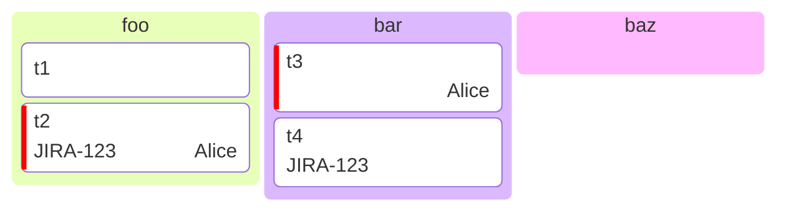

# Kanban Diagram<!-- omit from toc -->

*Official Mermaid documentation: [Kanban Diagram](https://mermaid.js.org/syntax/kanban.html).*

> [!NOTE]
> All Mermaid diagrams can be configured, by passing a `MermaidConfig` object to any of the methods in the `Mermaid` class. Read more on [Mermaid configuration](~/configuration.md).

## Simple kanban diagram

The following code sample shows how to create a simple Mermaid kanban diagram.

Use the `KanbanDiagram` method of the `Mermaid` class to create a kanban diagram. You ca provide an optional `title` argument.

Add columns with the `AddColumn` method. Use the optional second argument builder to add tasks to the columd with the `AddTask` method, than can take optional metadata.

Generate the diagram mermaid code with the `Build` method.

```csharp
string diagram = Mermaid
    .KanbanDiagram("some title")
    .AddColumn("foo", x => x
        .AddTask("t1")
        .AddTask("t2", assigned: "Alice", ticket: "JIRA-123", priority: Priority.VeryHigh))
    .AddColumn("bar", x => x
        .AddTask("t3", assigned: "Alice", priority: Priority.VeryHigh)
        .AddTask("t4", ticket: "JIRA-123"))
    .AddColumn("baz")
    .Build();
```

The code above generates the following Mermaid code:

```text
---
title: some title
---
kanban
    column0[foo]
        task00[t1]
        task01[t2]@{ assigned: 'Alice', ticket: JIRA-123, priority: 'Very High' }
    column1[bar]
        task10[t3]@{ assigned: 'Alice', priority: 'Very High' }
        task11[t4]@{ ticket: JIRA-123 }
    column2[baz]
```

That renders as:



[⬆ Back to top](#kanban-diagram)