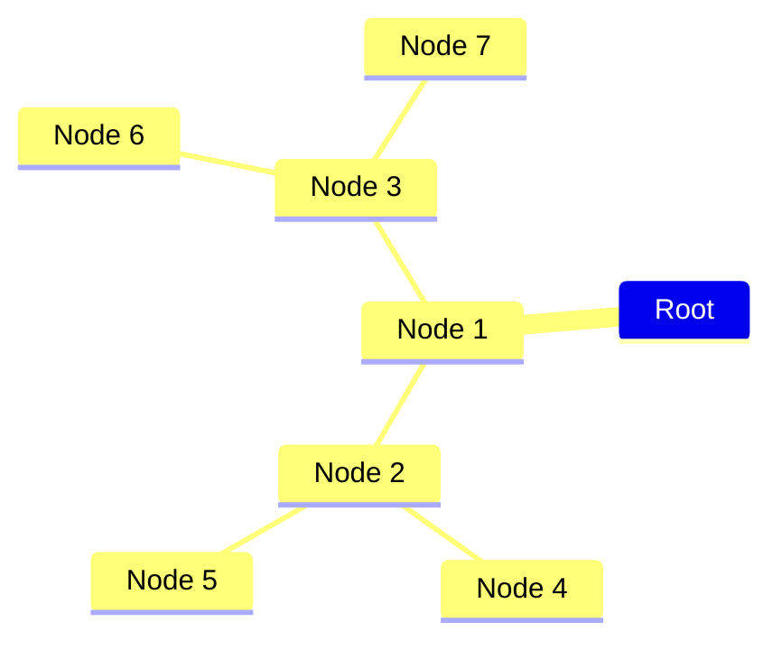
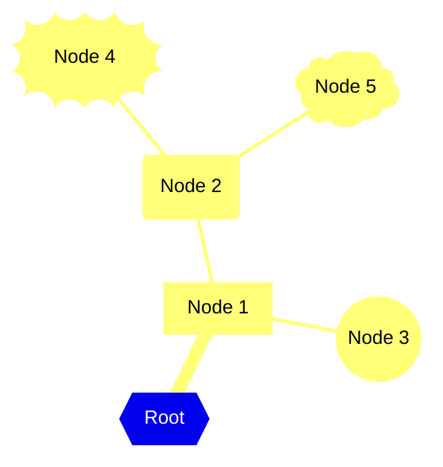
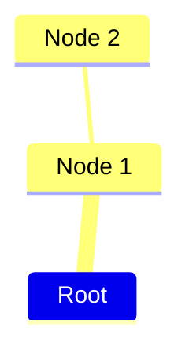
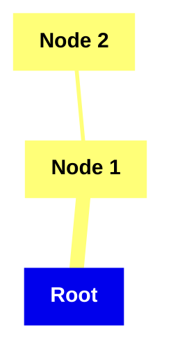

# Mind Map<!-- omit from toc -->

*Official Mermaid documentation: [Mindmaps](https://mermaid.js.org/syntax/mindmap.html).*

> [!NOTE]
> All Mermaid diagrams can be configured, by passing a `MermaidConfig` object to any of the methods in the `Mermaid` class. Read more on [Mermaid configuration](~/configuration.md).

## Simple diagram

The following code sample shows how to create a simple Mermaid mind map.

Use the `MindMap` method of the `Mermaid` class to create a mind map, passing the root node text as a parameter.

Add nodes with the `AddNode` method, with an optional `parent` node parameter.

Generate the diagram mermaid code with the `Build` method.

```csharp
var mindMap = Mermaid
    .MindMap("Root")
    .AddNode("Node 1", out var node1)
    .AddNode("Node 2", out var node2, node1)
    .AddNode("Node 3", out var node3, node1)
    .AddNode("Node 4", out var node4, node2)
    .AddNode("Node 5", out var node5, node2)
    .AddNode("Node 6", out var node6, node3)
    .AddNode("Node 7", out var node7, node3)
    .Build();
```

The code above generates the following Mermaid code:

```text
mindmap
    Root
        Node 1
            Node 2
                Node 4
                Node 5
            Node 3
                Node 6
                Node 7
```

That renders as:



[⬆ Back to top](#mind-map)

## Node shapes

Nodes can have different shapes. The shape of a node can be set by passing the `shape` parameter to the `AddNode` method, or the `MindMap` method for the root node.

It can be one of the following values:

- `Default`
- `Square`
- `RoundedSquare`
- `Circle`
- `Bang`
- `Cloud`
- `Hexagon`

Example:

```csharp
var mindMap = Mermaid
    .MindMap("Root", rootShape: NodeShape.Hexagon)
    .AddNode("Node 1", out var node1, shape: NodeShape.Square)
    .AddNode("Node 2", out var node2, shape: NodeShape.RoundedSquare, parent: node1)
    .AddNode("Node 3", out var node3, shape: NodeShape.Circle, parent: node1)
    .AddNode("Node 4", out var node4, shape: NodeShape.Bang, parent: node2)
    .AddNode("Node 5", out var node5, shape: NodeShape.Cloud, parent: node2)
    .Build();
```

The code above generates the following Mermaid code:

```text
mindmap
    id0{{Root}}
        id1[Node 1]
            id2(Node 2)
                id3))Node 4((
                id3)Node 5(
            id2((Node 3))
```

That renders as:



[⬆ Back to top](#mind-map)

## Styling

### Icons

Text icons can be added to nodes by passing the `icon` parameter to the `AddNode` method, or the `rootIcon` parameter to the `MindMap` method for the root node.

Example:

```csharp
string mindMap = Mermaid
    .MindMap("Root", rootIcon: "fa fa-home")
    .AddNode("Node 1", out Node node1, icon: "fa fa-book")
    .AddNode("Node 2", out Node _, icon: "fa fa-hat-wizard", parent: node1)
    .Build();
```

The code above generates the following Mermaid code:

```text
mindmap
    Root
    ::icon(fa fa-home)
        Node 1
        ::icon(fa fa-book)
            Node 2
            ::icon(fa fa-hat-wizard)
```

That renders as:



[⬆ Back to top](#mind-map)

### Classes

CSS classes can be added to nodes by passing the `classes` parameter to the `AddNode` method, or the `rootClasses` parameter to the `MindMap` method for the root node.

Example:

```csharp
string mindMap = Mermaid
    .MindMap("Root", rootClasses: ["class1", "class2"])
    .AddNode("Node 1", out Node node1, classes: ["class3", "class4"])
    .AddNode("Node 2", out Node _, classes: ["class5", "class6"], parent: node1)
    .Build();
```

The code above generates the following Mermaid code:

```text
mindmap
    Root
    ::: class1 class2
        Node 1
        ::: class3 class4
            Node 2
            ::: class5 class6
```

That renders as:


[⬆ Back to top](#mind-map)

### Markdown

Node text can be rendered as Markdown by passing the `isMarkdown` parameter to the `AddNode` method, or the `rootIsMarkdown` parameter to the `MindMap` method for the root node.

> [!NOTE]
> Mermaid does not support Markdown rendering for node with default shape.

Example:

```csharp
string mindMap = Mermaid
    .MindMap("**Root**", rootIsMarkdown: true, rootShape: NodeShape.Square)
    .AddNode("**Node 1**", out Node node1, isMarkdown: true, shape: NodeShape.Square)
    .AddNode("**Node 2**", out Node _, parent: node1, isMarkdown: true, shape: NodeShape.Square)
    .Build();
```

The code above generates the following Mermaid code:

```text
mindmap
    id0["`**Root**`"]
        id1["`**Node 1**`"]
            id2["`**Node 2**`"]
```

That renders as:



[⬆ Back to top](#mind-map)