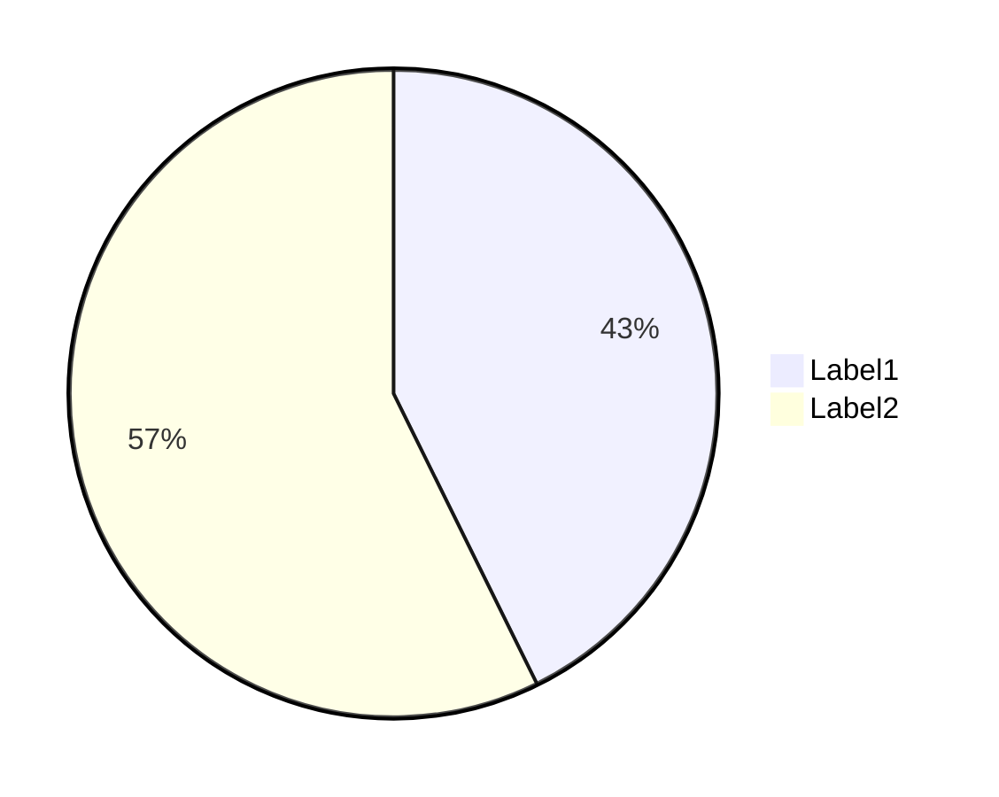
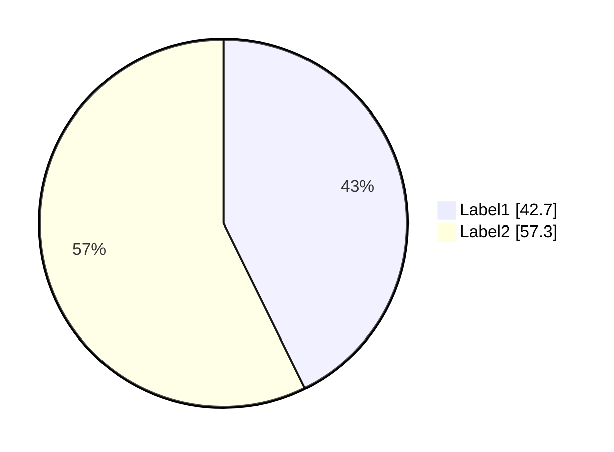
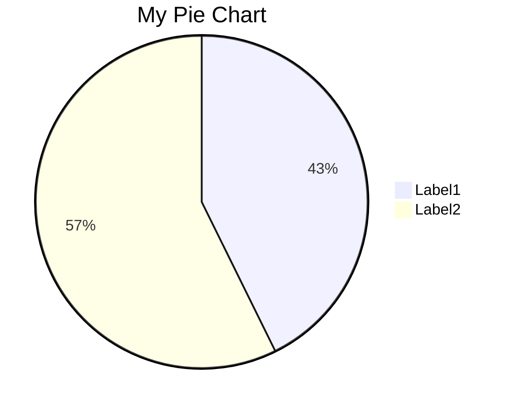

# Pie Chart<!-- omit from toc -->

*Official Mermaid documentation: [Pie Chart](https://mermaid.js.org/syntax/pie.html).*

> [!NOTE]
> All Mermaid diagrams can be configured, by passing a `MermaidConfig` object to any of the methods in the `Mermaid` class. Read more on [Mermaid configuration](~/configuration.md).

## Simple pie chart

The following code sample shows how to create a simple Mermaid pie chart.

Use the `PieChart` method of the `Mermaid` class to create a pie chart.

Add data sets with the `AddDataSet` method.

Generate the diagram mermaid code with the `Build` method.

```csharp
var pieChart = Mermaid
    .PieChart()
    .AddDataSet("Label1", 42.7)
    .AddDataSet("Label2", 57.3)
    .Build();
```

The code above generates the following Mermaid code:

```text
pie
    "Label1": 42.7
    "Label2": 57.3
```

That renders as:



[⬆ Back to top](#pie-chart)

## Display values on legend

The values can be displayed on the legend by setting the `displayValuesOnLegend` parameter of the `PieChart` method to `true`.

Example:

```csharp
var pieChart = Mermaid
    .PieChart(displayValuesOnLegend: true)
    .AddDataSet("Label1", 42.7)
    .AddDataSet("Label2", 57.3)
    .Build();
```

The code above generates the following Mermaid code:

```text
pie showData
    "Label1": 42.7
    "Label2": 57.3
```

That renders as:



[⬆ Back to top](#pie-chart)

## Title

The title of the pie chart can be set by setting the `title` parameter of the `PieChart` method.

Example:

```csharp
var pieChart = Mermaid
    .PieChart(title: "My Pie Chart")
    .AddDataSet("Label1", 42.7)
    .AddDataSet("Label2", 57.3)
    .Build();
```

The code above generates the following Mermaid code:

```text
---
title: My Pie Chart
---
pie
    "Label1": 42.7
    "Label2": 57.3
```

That renders as:



[⬆ Back to top](#pie-chart)