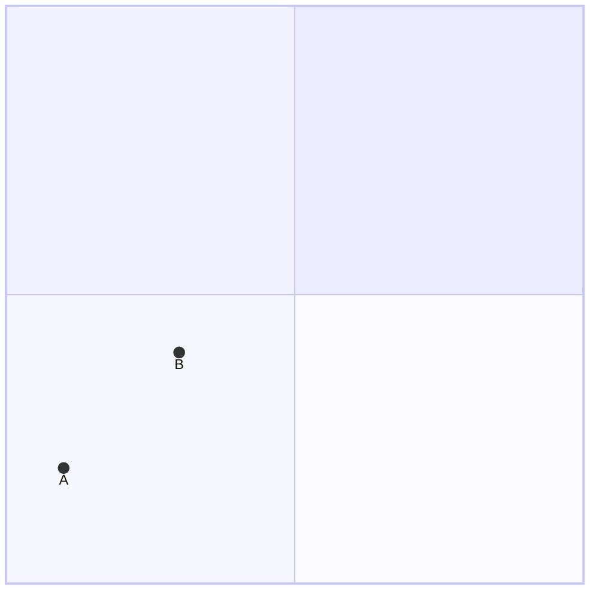
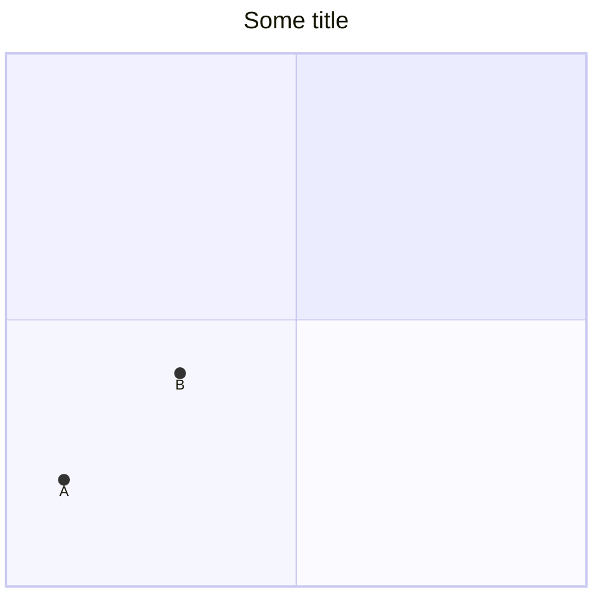
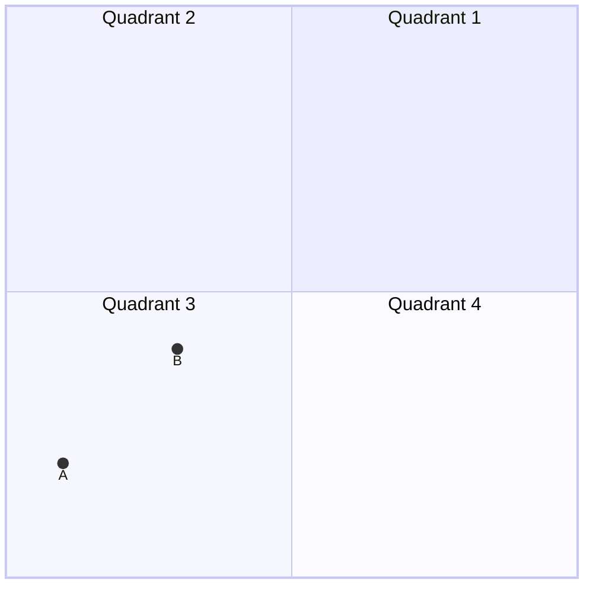
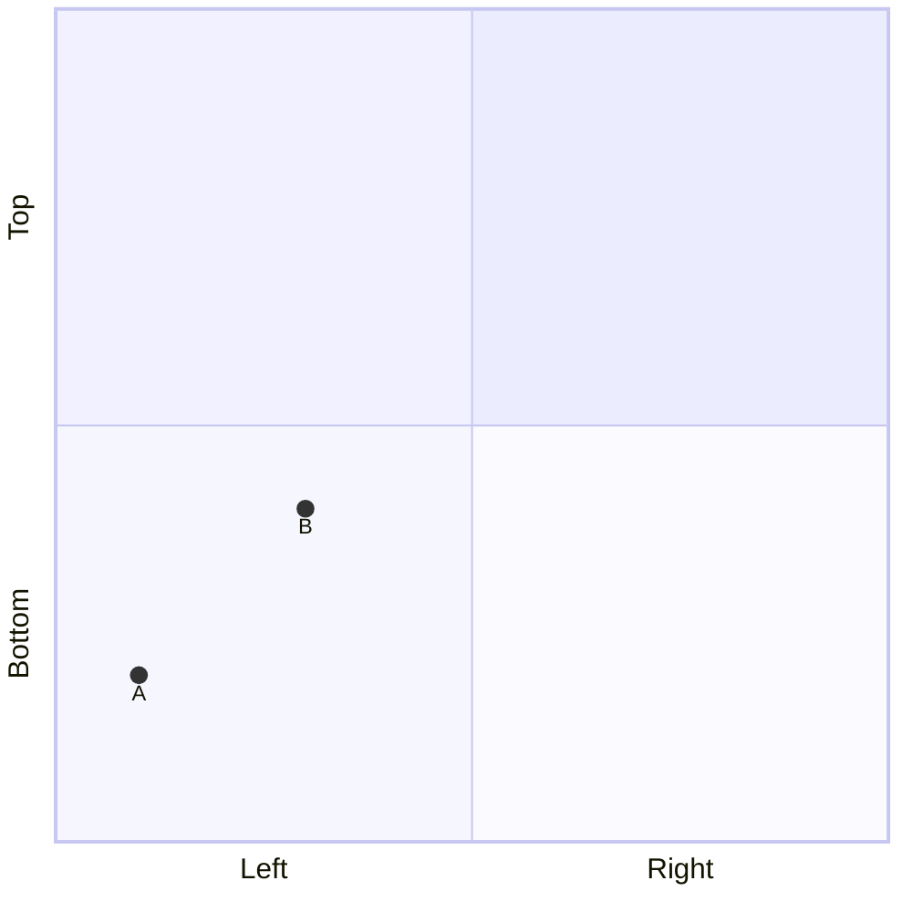

# Quadrant chart<!-- omit from toc -->

*Official Mermaid documentation: [Quadrant chart](https://mermaid.js.org/syntax/quadrantChart.html).*

> [!NOTE]
> All Mermaid diagrams can be configured, by passing a `MermaidConfig` object to any of the methods in the `Mermaid` class. Read more on [Mermaid configuration](~/configuration.md).

## Simple diagram

The following code sample shows how to create a simple Mermaid quadrant chart.

Use the `QuadrantChart` method of the `Mermaid` class to create a quadrant chart.

Add points with the `AddPoint` method. Coordinates must be between 0 and 1 included.

Generate the diagram mermaid code with the `Build` method.

```csharp
var quadrantChart = Mermaid
    .QuadrantChart()
    .AddPoint("A", 0.1, 0.2)
    .AddPoint("B", 0.3, 0.4)
    .Build();
```

The code above generates the following Mermaid code:

```text
quadrantChart
    A: [0.1, 0.2]
    B: [0.3, 0.4]
```

That renders as:



[⬆ Back to top](#quadrant-chart)

## Title

The title of the quadrant chart can be set by setting the `title` parameter of the `QuadrantChart` method.

Example:

```csharp
var quadrantChart = Mermaid
    .QuadrantChart(title: "Some title")
    .AddPoint("A", 0.1, 0.2)
    .AddPoint("B", 0.3, 0.4)
    .Build();
```

The code above generates the following Mermaid code:

```text
---
title: Some title
---
quadrantChart
    A: [0.1, 0.2]
    B: [0.3, 0.4]
```

That renders as:



[⬆ Back to top](#quadrant-chart)

## Quadrant labels

Quadrant labels can be set by setting the `quadrants` parameter of the `QuadrantChart` method.

Example:

```csharp
var quadrantChart = Mermaid
    .QuadrantChart(
        quadrant1: "Quadrant 1",
        quadrant2: "Quadrant 2",
        quadrant3: "Quadrant 3",
        quadrant4: "Quadrant 4")
    .AddPoint("A", 0.1, 0.2)
    .AddPoint("B", 0.3, 0.4)
    .Build();
```

The code above generates the following Mermaid code:

```text
quadrantChart
    quadrant-1 Quadrant 1
    quadrant-2 Quadrant 2
    quadrant-3 Quadrant 3
    quadrant-4 Quadrant 4
    A: [0.1, 0.2]
    B: [0.3, 0.4]
```

That renders as:



[⬆ Back to top](#quadrant-chart)

## Axis labels

Axis labels can be set by using the `SetXAxisLabel` and `SetYAxisLabel` methods. They can take one or two parameters. If only one parameter is provided, it will be used as the label positioned at the start of the axis. If two parameters are provided, the first will be used as the label positioned at the start of the axis, and the second will be used as the label positioned at the end of the axis.

Example:

```csharp
var quadrantChart = Mermaid
    .QuadrantChart()
    .SetXAxisLabel("Left", "Right")
    .SetYAxisLabel("Bottom", "Top")
    .AddPoint("A", 0.1, 0.2)
    .AddPoint("B", 0.3, 0.4)
    .Build();
```

The code above generates the following Mermaid code:

```text
quadrantChart
    x-axis Left --> Right
    y-axis Bottom --> Top
    A: [0.1, 0.2]
    B: [0.3, 0.4]
```

That renders as:



[⬆ Back to top](#quadrant-chart)
