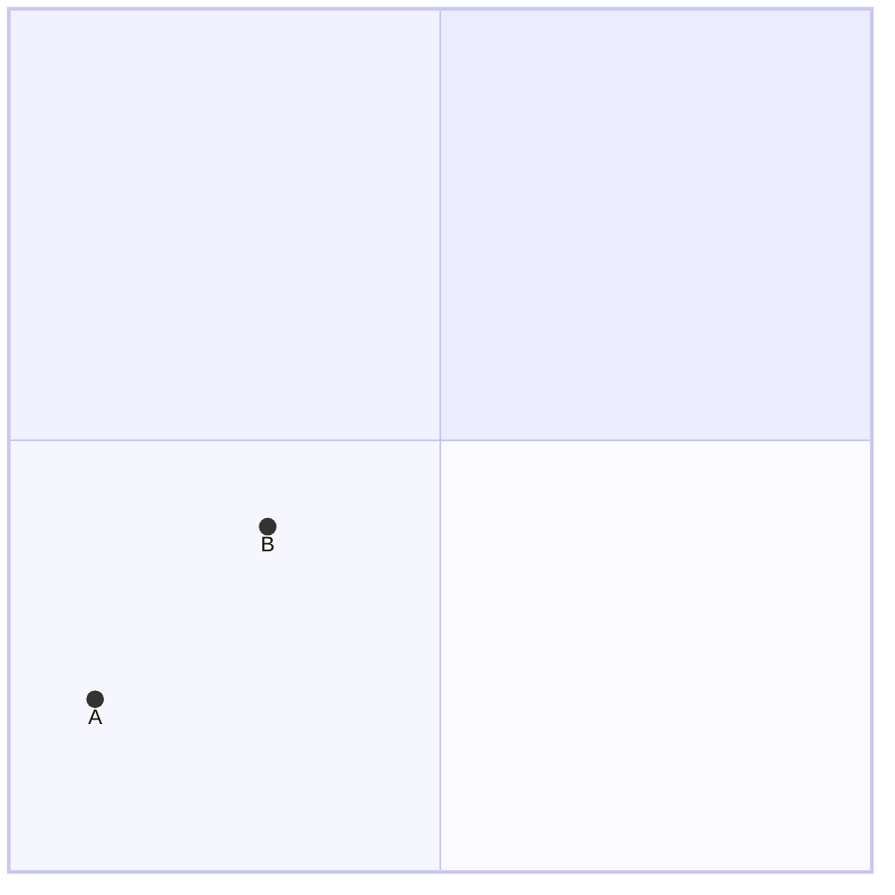
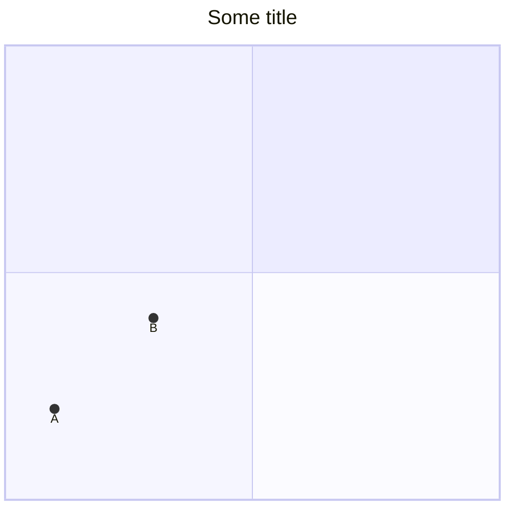
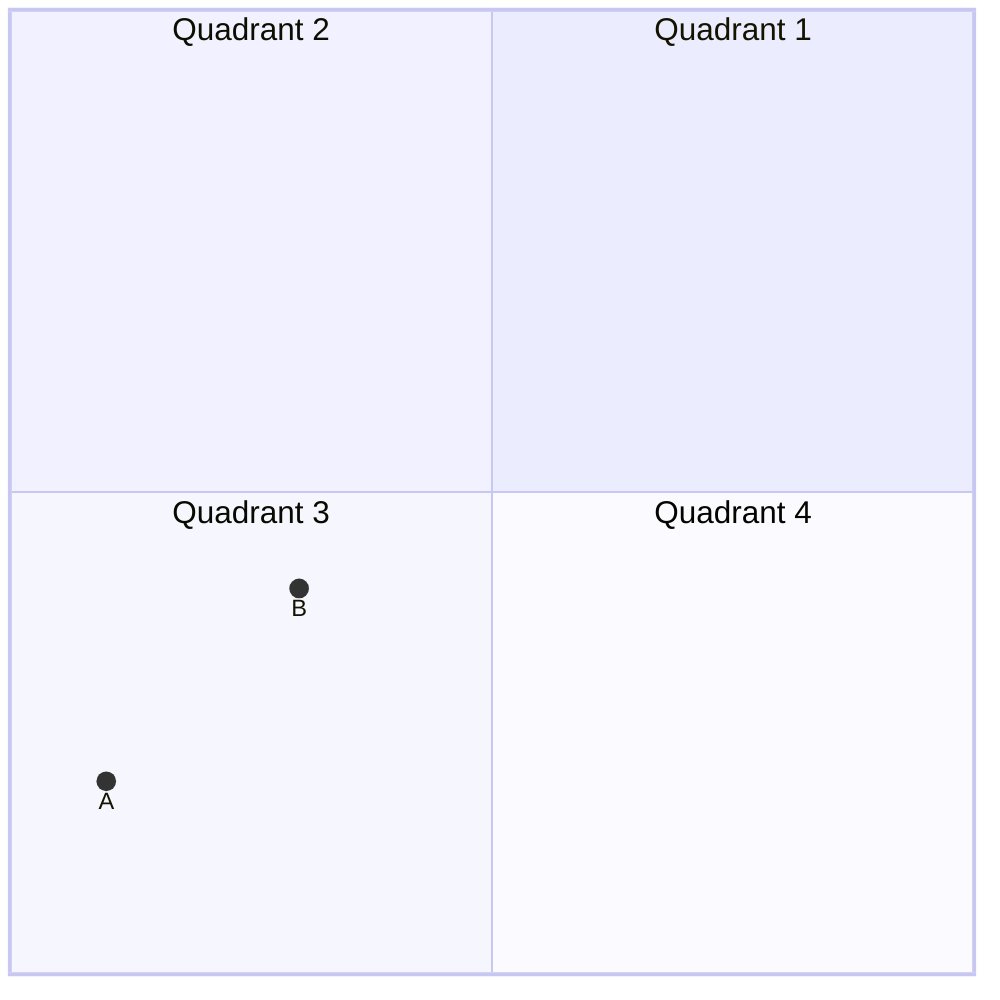
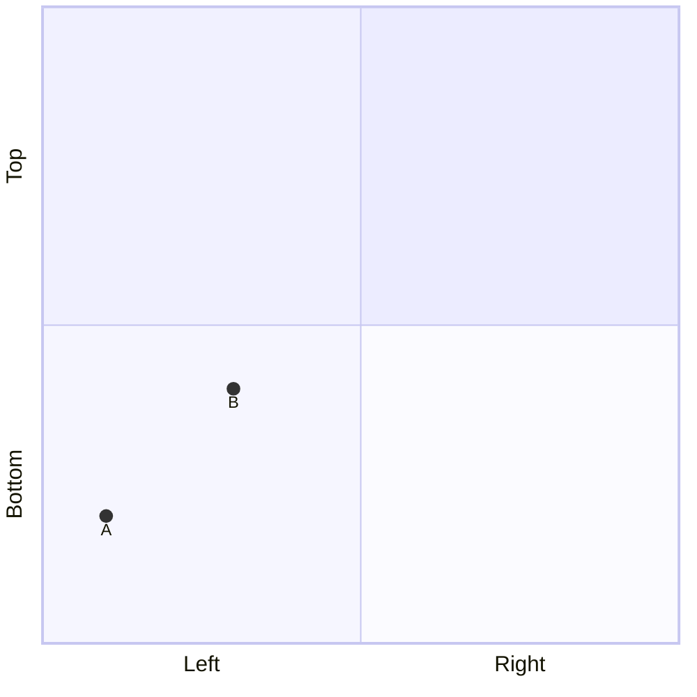
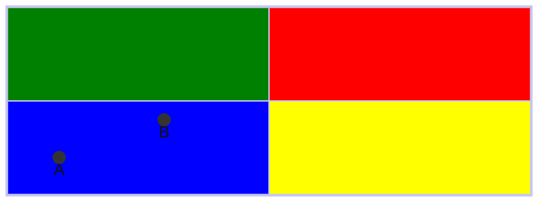
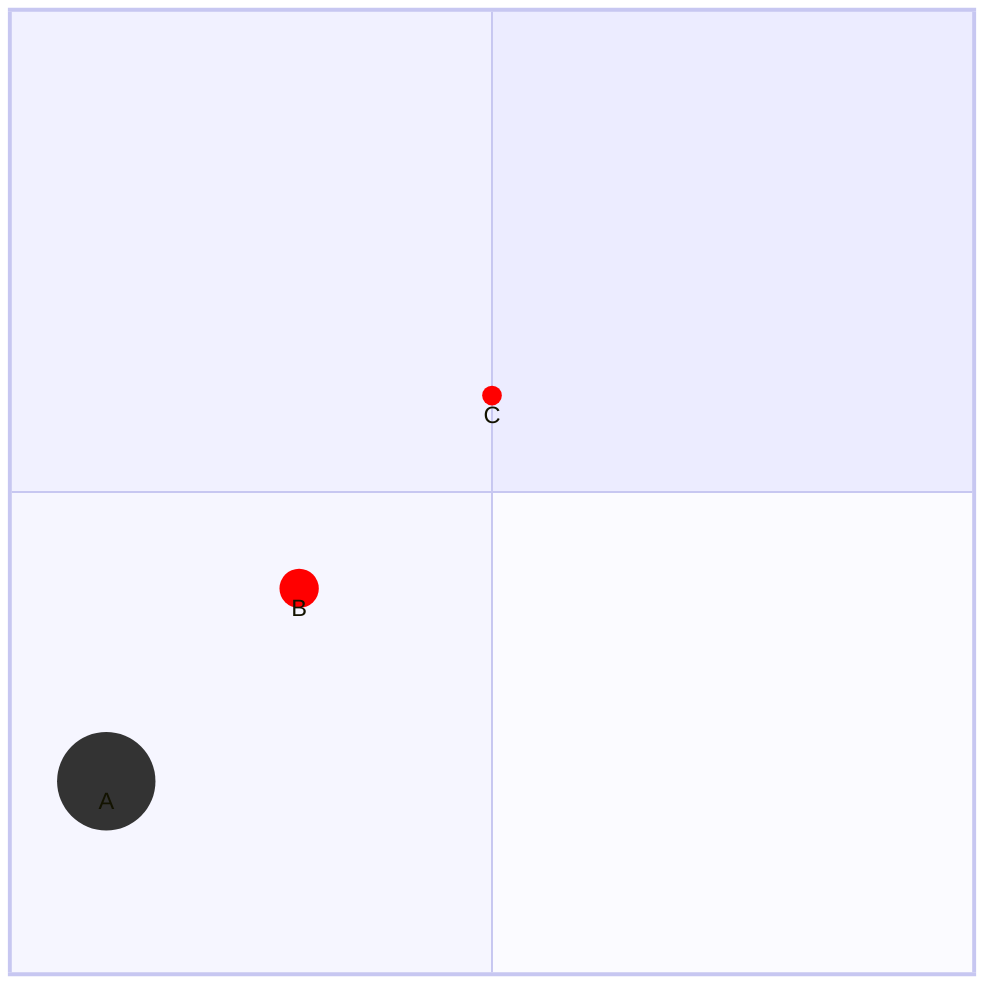

# Quadrant chart<!-- omit from toc -->

*Official Mermaid documentation: [Quadrant chart](https://mermaid.js.org/syntax/quadrantChart.html).*

## Simple diagram

The following code sample shows how to create a simple Mermaid quadrant chart.

Use the `QuadrantChart` method of the `Mermaid` class to create a quadrant chart.

Add points with the `AddPoint` method. Coordinates must be between 0 and 1 included.

Generate the diagram mermaid code with the `Build` method.

```csharp
var quadrantChart = Mermaid
    .QuadrantChart()
    .AddPoint("A", 0.1, 0.2)
    .AddPoint("B", 0.3, 0.4)
    .Build();
```

The code above generates the following Mermaid code:

```text
quadrantChart
    A: [0.1, 0.2]
    B: [0.3, 0.4]
```

That renders as:


```mermaid
quadrantChart
    A: [0.1, 0.2]
    B: [0.3, 0.4]
```

[⬆ Back to top](#quadrant-chart)

## Title

The title of the quadrant chart can be set by setting the `title` parameter of the `QuadrantChart` method.

Example:

```csharp
var quadrantChart = Mermaid
    .QuadrantChart(title: "Some title")
    .AddPoint("A", 0.1, 0.2)
    .AddPoint("B", 0.3, 0.4)
    .Build();
```

The code above generates the following Mermaid code:

```text
quadrantChart
    title Some title
    A: [0.1, 0.2]
    B: [0.3, 0.4]
```

That renders as:


```mermaid
quadrantChart
    title Some title
    A: [0.1, 0.2]
    B: [0.3, 0.4]
```

[⬆ Back to top](#quadrant-chart)

## Quadrant labels

Quadrant labels can be set by setting the `quadrants` parameter of the `QuadrantChart` method.

Example:

```csharp
var quadrantChart = Mermaid
    .QuadrantChart(
        quadrant1: "Quadrant 1",
        quadrant2: "Quadrant 2",
        quadrant3: "Quadrant 3",
        quadrant4: "Quadrant 4")
    .AddPoint("A", 0.1, 0.2)
    .AddPoint("B", 0.3, 0.4)
    .Build();
```

The code above generates the following Mermaid code:

```text
quadrantChart
    quadrant-1 Quadrant 1
    quadrant-2 Quadrant 2
    quadrant-3 Quadrant 3
    quadrant-4 Quadrant 4
    A: [0.1, 0.2]
    B: [0.3, 0.4]
```

That renders as:


```mermaid
quadrantChart
    quadrant-1 Quadrant 1
    quadrant-2 Quadrant 2
    quadrant-3 Quadrant 3
    quadrant-4 Quadrant 4
    A: [0.1, 0.2]
    B: [0.3, 0.4]
```

[⬆ Back to top](#quadrant-chart)

## Axis labels

Axis labels can be set by using the `SetXAxisLabel` and `SetYAxisLabel` methods. They can take one or two parameters. If only one parameter is provided, it will be used as the label positioned at the start of the axis. If two parameters are provided, the first will be used as the label positioned at the start of the axis, and the second will be used as the label positioned at the end of the axis.

Example:

```csharp
var quadrantChart = Mermaid
    .QuadrantChart()
    .SetXAxisLabel("Left", "Right")
    .SetYAxisLabel("Bottom", "Top")
    .AddPoint("A", 0.1, 0.2)
    .AddPoint("B", 0.3, 0.4)
    .Build();
```

The code above generates the following Mermaid code:

```text
quadrantChart
    x-axis Left --> Right
    y-axis Bottom --> Top
    A: [0.1, 0.2]
    B: [0.3, 0.4]
```

That renders as:


```mermaid
quadrantChart
    x-axis Left --> Right
    y-axis Bottom --> Top
    A: [0.1, 0.2]
    B: [0.3, 0.4]
```

[⬆ Back to top](#quadrant-chart)

## Styling

### Chart styling

Chart styling can be configured by passing a `StyleConfiguration` object to the `QuadrantChart` method.

All the properties that can be set are detailed in the [official Mermaid documentation](hhttps://mermaid.js.org/syntax/quadrantChart.html#chart-configurations).

Example:

```csharp
var config = new StyleConfiguration
{
    ChartConfigurations = new()
    {
        ChartWidth = 400,
        ChartHeight = 150
    },
    ThemeVariables = new()
    {
        Quadrant1Fill = "red",
        Quadrant2Fill = "green",
        Quadrant3Fill = "blue",
        Quadrant4Fill = "yellow"
    }
};

string quadrantChart = Mermaid
    .QuadrantChart(styleConfiguration: config)
    .AddPoint("A", 0.1, 0.2)
    .AddPoint("B", 0.3, 0.4)
    .Build();
```

The code above generates the following Mermaid code:

```text
%%{init: {"quadrantChart": {"chartWidth": 400, "chartHeight": 150}, "themeVariables": {"quadrant1Fill": "red", "quadrant2Fill": "green", "quadrant3Fill": "blue", "quadrant4Fill": "yellow"}}}%%
quadrantChart
    A: [0.1, 0.2]
    B: [0.3, 0.4]
```

That renders as:


```mermaid
%%{init: {"quadrantChart": {"chartWidth": 400, "chartHeight": 150}, "themeVariables": {"quadrant1Fill": "red", "quadrant2Fill": "green", "quadrant3Fill": "blue", "quadrant4Fill": "yellow"}}}%%
quadrantChart
    A: [0.1, 0.2]
    B: [0.3, 0.4]
```

**Note:** The above diagram can be rendered without taking into account the some of the style configurations, depending on the rendering engine used.

[⬆ Back to top](#quadrant-chart)

### Point styling

Point styling can be configured by passing CSS or style class to the `AddPoint` method.

Example:

```csharp
string quadrantChart = Mermaid
    .QuadrantChart()
    .DefineCssClass("foo", "color: #ff0000", out var foo)
    .AddPoint("A", 0.1, 0.2, "radius: 25")
    .AddPoint("B", 0.3, 0.4, "radius: 10", foo)
    .AddPoint("C", 0.5, 0.6, cssClass: foo)
    .Build();
```

The code above generates the following Mermaid code:

```text
quadrantChart
    A: [0.1, 0.2] radius: 25
    B:::foo: [0.3, 0.4] radius: 10
    C:::foo: [0.5, 0.6]
    classDef foo color: #ff0000
```

That renders as:


```mermaid
quadrantChart
    A: [0.1, 0.2] radius: 25
    B:::foo: [0.3, 0.4] radius: 10
    C:::foo: [0.5, 0.6]
    classDef foo color: #ff0000
```

[⬆ Back to top](#quadrant-chart)
