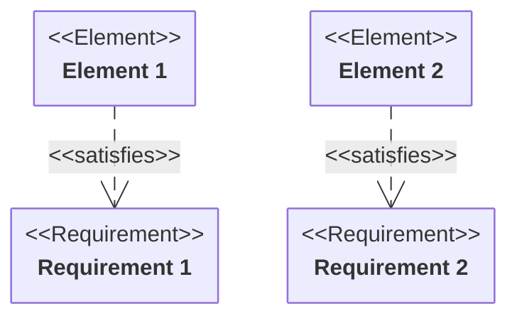
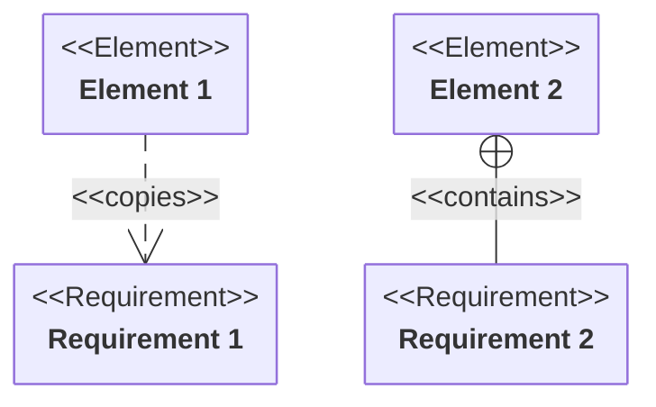
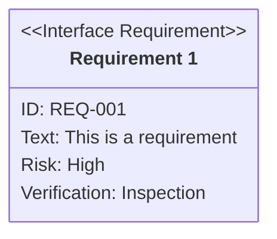
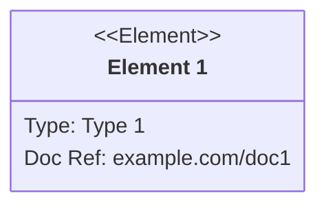

# Requirement diagram<!-- omit from toc -->

*Official Mermaid documentation: [Requirement diagram](https://mermaid.js.org/syntax/requirementDiagram.html).*

> [!NOTE]
> All Mermaid diagrams can be configured, by passing a `MermaidConfig` object to any of the methods in the `Mermaid` class. Read more on [Mermaid configuration](~/configuration.md).

## Simple diagram

The following code sample shows how to create a simple Mermaid requirement diagram.

Use the `RequirementDiagram` method of the `Mermaid` class to create a requirement diagram.

Add requirements with the `AddRequirement` method.

Add elements with the `AddElement` method.

Add relationships with the `AddRelationship` method.

Generate the diagram mermaid code with the `Build` method.

```csharp
string diagram = Mermaid
    .RequirementDiagram()
    .AddRequirement("Requirement 1", out var requirement1)
    .AddRequirement("Requirement 2", out var requirement2)
    .AddElement("Element 1", out var element1)
    .AddElement("Element 2", out var element2)
    .AddRelationship(element1, requirement1, RelationshipType.Satisfies)
    .AddRelationship(element2, requirement2, RelationshipType.Satisfies)
    .Build();
```

The code above generates the following Mermaid code:

```text
requirementDiagram
    requirement "Requirement 1" {
    }
    requirement "Requirement 2" {
    }
    element "Element 1" {
    }
    element "Element 2" {
    }
    "Element 1" - satisfies -> "Requirement 1"
    "Element 2" - satisfies -> "Requirement 2"
```

That renders as:



[⬆ Back to top](#requirement-diagram)

## Relationship types

Relationship type can be set by setting the `type` parameter of the `AddRelationship` method.

The following relationship types are available:

- `Contains`
- `Copies`
- `Derives`
- `Satisfies`
- `Verifies`
- `Refines`
- `Traces`

Example:

```csharp
string diagram = Mermaid
    .RequirementDiagram()
    .AddRequirement("Requirement 1", out var requirement1)
    .AddRequirement("Requirement 2", out var requirement2)
    .AddElement("Element 1", out var element1)
    .AddElement("Element 2", out var element2)
    .AddRelationship(element1, requirement1, RelationshipType.Copies)
    .AddRelationship(element2, requirement2, RelationshipType.Contains)
    .Build();
```

The code above generates the following Mermaid code:

```text
requirementDiagram
    requirement "Requirement 1" {
    }
    requirement "Requirement 2" {
    }
    element "Element 1" {
    }
    element "Element 2" {
    }
    "Element 1" - copies -> "Requirement 1"
    "Element 2" - contains -> "Requirement 2"
```

That renders as:



[⬆ Back to top](#requirement-diagram)

## Requirement details

A requirement can have the following details:

- `ID`
- `Text`
- `Type`
- `Risk`
- `VerifyMethod`

The `ID` and `Text` can contain any string value.

The `Type` can have the following values:

- `Default` (default)
- `Functional`
- `Interface`
- `Performance`
- `Physical`
- `Design`

The `Risk` can have the following values:

- `Undefined` (default)
- `Low`
- `Medium`
- `High`

The `VerifyMethod` can have the following values:

- `Undefined` (default)
- `Analysis`
- `Inspection`
- `Test`
- `Demonstration`

Example:

```csharp
string diagram = Mermaid
    .RequirementDiagram()
    .AddRequirement("Requirement 1", out var requirement1, "REQ-001", "This is a requirement", RequirementType.Interface, RequirementRisk.High, RequirementVerificationMethod.Inspection)
    .Build();
```

The code above generates the following Mermaid code:

```text
requirementDiagram
    interfaceRequirement "Requirement 1" {
        id: "REQ-001"
        text: "This is a requirement"
        risk: High
        verifyMethod: Inspection
    }
```

That renders as:



[⬆ Back to top](#requirement-diagram)

## Elements details

An element can have the following details:

- `Type`
- `DocRef`

Both can contain any string value.

Example:

```csharp
string diagram = Mermaid
    .RequirementDiagram()
    .AddElement("Element 1", out var element1, "Type 1", "example.com/doc1")
    .Build();
```

The code above generates the following Mermaid code:

```text
requirementDiagram
    element "Element 1" {
        type: "Type 1"
        docRef: "example.com/doc1"
    }
```

That renders as:



[⬆ Back to top](#requirement-diagram)
