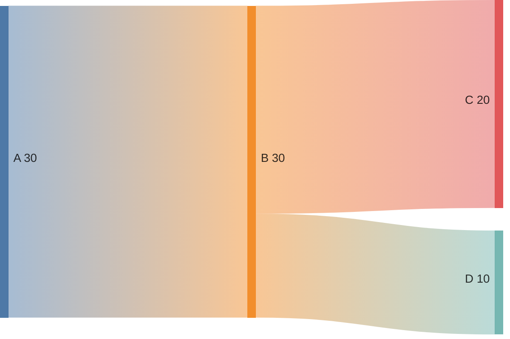

# Sankey diagram<!-- omit from toc -->

*Official Mermaid documentation: [Sankey diagram](https://mermaid.js.org/syntax/sankey.html).*

> [!NOTE]
> All Mermaid diagrams can be configured, by passing a `MermaidConfig` object to any of the methods in the `Mermaid` class. Read more on [Mermaid configuration](~/configuration.md).

## Simple sankey diagram

The following code sample shows how to create a simple Mermaid sankey diagram.

Use the `SankeyDiagram` method of the `Mermaid` class to create a state diagram.

Add flows with the `AddFlow` method, and empty lines with the `AddEmptyLine` method (empty lines are not rendered in the final diagram but can be used for better readability of the generated mermaid code).

Generate the diagram mermaid code with the `Build` method.

```csharp
var diagram = Mermaid
    .SankeyDiagram()
    .AddFlow("A", "B", 30)
    .AddEmptyLine()
    .AddFlow("B", "C", 20)
    .AddFlow("B", "D", 10)
    .Build();
```

The code above generates the following Mermaid code:

```text
sankey
A,B,30

B,C,20
B,D,10
```

That renders as:



[⬆ Back to top](#sankey-diagram)
