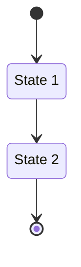
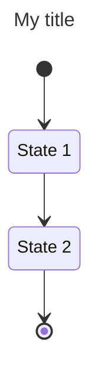
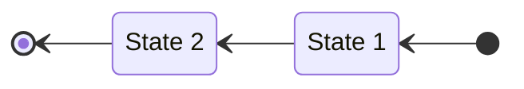
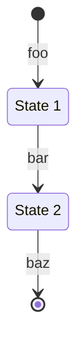
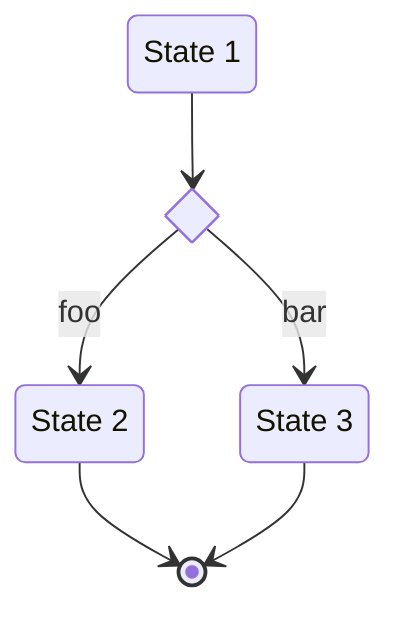
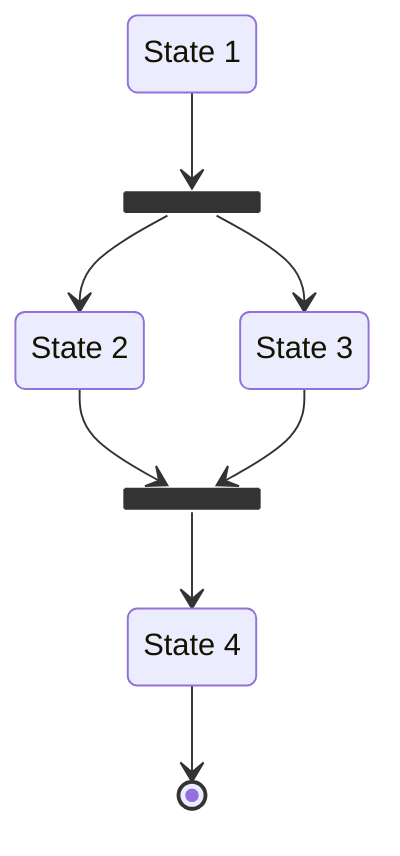
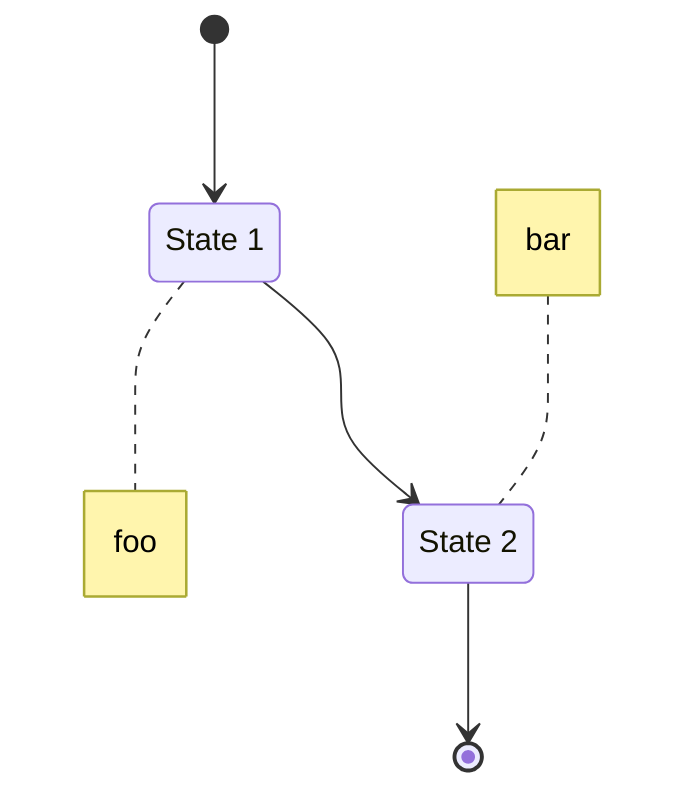
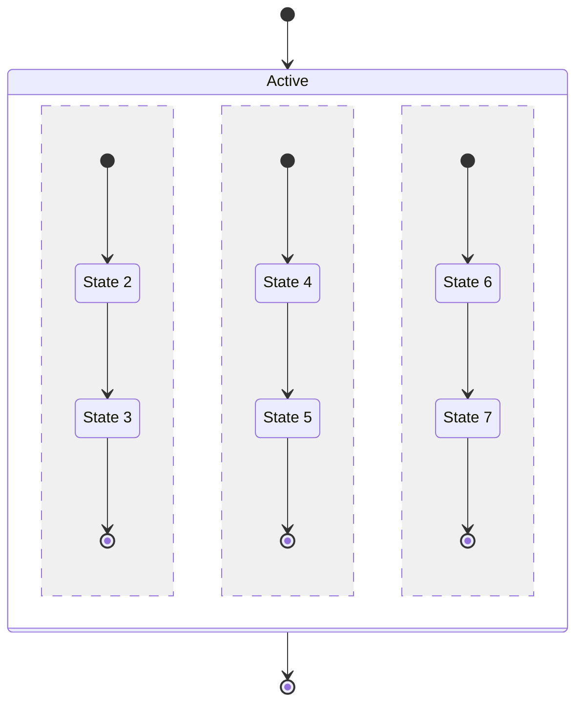
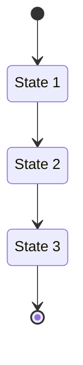

# State diagram<!-- omit from toc -->

*Official Mermaid documentation: [State diagram](https://mermaid.js.org/syntax/stateDiagram.html).*

> [!NOTE]
> All Mermaid diagrams can be configured, by passing a `MermaidConfig` object to any of the methods in the `Mermaid` class. Read more on [Mermaid configuration](~/configuration.md).

## Simple state diagram

The following code sample shows how to create a simple Mermaid state diagram.

Use the `StateDiagram` method of the `Mermaid` class to create a state diagram.

Add states with the `AddState` method, and transitions with the `AddTransitionFromStart`, `AddTransitionFromEnd`, and `AddStateTransition` methods.

Generate the diagram mermaid code with the `Build` method.

```csharp
var diagram = Mermaid
    .StateDiagram()
    .AddState("State 1", out var s1)
    .AddState("State 2", out var s2)
    .AddTransitionFromStart(s1)
    .AddStateTransition(s1, s2)
    .AddTransitionToEnd(s2)
    .Build();
```

The code above generates the following Mermaid code:

```text
stateDiagram-v2
    s1 : State 1
    s2 : State 2
    [*] --> s1
    s1 --> s2
    s2 --> [*]
```

That renders as:



[⬆ Back to top](#state-diagram)

## Title

The title of the state diagram can be set by passing a `title` parameter to the `StateDiagram` method.

Example:

```csharp
var diagram = Mermaid
    .StateDiagram("My title")
    .AddState("State 1", out var s1)
    .AddState("State 2", out var s2)
    .AddTransitionFromStart(s1)
    .AddStateTransition(s1, s2)
    .AddTransitionToEnd(s2)
    .Build();
```

The code above generates the following Mermaid code:

```text
---
title: My title
---
stateDiagram-v2
    s1 : State 1
    s2 : State 2
    [*] --> s1
    s1 --> s2
    s2 --> [*]
```

That renders as:



[⬆ Back to top](#state-diagram)

## Direction

The direction of the state diagram can be set by passing a `direction` parameter to the `StateDiagram` method.

It can be one of the following values:

- `TopToBottom`
- `BottomToTop`
- `LeftToRight`
- `RightToLeft`

Example:

```csharp
var diagram = Mermaid
    .StateDiagram(direction: StateDiagramDirection.RightToLeft)
    .AddState("State 1", out var s1)
    .AddState("State 2", out var s2)
    .AddTransitionFromStart(s1)
    .AddStateTransition(s1, s2)
    .AddTransitionToEnd(s2)
    .Build();
```

The code above generates the following Mermaid code:

```text
stateDiagram-v2
    direction RL
    s1 : State 1
    s2 : State 2
    [*] --> s1
    s1 --> s2
    s2 --> [*]
```

That renders as:



[⬆ Back to top](#state-diagram)

## Transition descriptions

The transitions between states can have descriptions. Use the `description` parameter of the `AddTransitionFromStart`, `AddStateTransition` and `AddTransitionToEnd` methods.

Example:

```csharp
var diagram = Mermaid
    .StateDiagram()
    .AddState("State 1", out var s1)
    .AddState("State 2", out var s2)
    .AddTransitionFromStart(s1, "foo")
    .AddStateTransition(s1, s2, "bar")
    .AddTransitionToEnd(s2, "baz")
    .Build();
```

The code above generates the following Mermaid code:

```text
stateDiagram-v2
    s1 : State 1
    s2 : State 2
    [*] --> s1 : foo
    s1 --> s2 : bar
    s2 --> [*] : baz
```

That renders as:



[⬆ Back to top](#state-diagram)

## Choice states

Choice states can be added with the `AddChoiceState` method.

Example:

```csharp
var diagram = Mermaid
    .StateDiagram()
    .AddState("State 1", out var s1)
    .AddChoiceState(out var c1)
    .AddState("State 2", out var s2)
    .AddState("State 3", out var s3)
    .AddStateTransition(s1, c1)
    .AddStateTransition(c1, s2, "foo")
    .AddStateTransition(c1, s3, "bar")
    .AddTransitionToEnd(s2)
    .AddTransitionToEnd(s3)
    .Build();
```

The code above generates the following Mermaid code:

```text
stateDiagram-v2
    s1 : State 1
    state s2 <<choice>>
    s3 : State 2
    s4 : State 3
    s1 --> s2
    s2 --> s3 : foo
    s2 --> s4 : bar
    s3 --> [*]
    s4 --> [*]
```

That renders as:



[⬆ Back to top](#state-diagram)

## Fork and join states

Fork and join states can be added with the `AddForkState` and `AddJoinState` methods.

Example:

```csharp
var diagram = Mermaid
    .StateDiagram()
    .AddState("State 1", out var s1)
    .AddForkState(out var f1)
    .AddState("State 2", out var s2)
    .AddState("State 3", out var s3)
    .AddJoinState(out var j1)
    .AddState("State 4", out var s4)
    .AddStateTransition(s1, f1)
    .AddStateTransition(f1, s2)
    .AddStateTransition(f1, s3)
    .AddStateTransition(s2, j1)
    .AddStateTransition(s3, j1)
    .AddStateTransition(j1, s4)
    .AddTransitionToEnd(s4)
    .Build();
```

The code above generates the following Mermaid code:

```text
stateDiagram-v2
    s1 : State 1
    state s2 <<fork>>
    s3 : State 2
    s4 : State 3
    state s5 <<join>>
    s6 : State 4
    s1 --> s2
    s2 --> s3
    s2 --> s4
    s3 --> s5
    s4 --> s5
    s5 --> s6
    s6 --> [*]
```

That renders as:



[⬆ Back to top](#state-diagram)

## Notes

Notes can be added to states with the `AddNote` method.

Example:

```csharp
var diagram = Mermaid
    .StateDiagram()
    .AddState("State 1", out var s1)
    .AddState("State 2", out var s2)
    .AddNote(s1, NotePosition.Right, "foo")
    .AddNote(s2, NotePosition.Left, "bar")
    .AddTransitionFromStart(s1)
    .AddStateTransition(s1, s2)
    .AddTransitionToEnd(s2)
    .Build();
```

The code above generates the following Mermaid code:

```text
stateDiagram-v2
    s1 : State 1
    s2 : State 2
    note right of s1
        foo
    end note
    note left of s2
        bar
    end note
    [*] --> s1
    s1 --> s2
    s2 --> [*]
```

That renders as:



[⬆ Back to top](#state-diagram)

## Concurrency

A graph can be divided into concurrent subgraphs with the `AddConcurrency` method.

Example:

```csharp
var diagram = Mermaid
    .StateDiagram()
    .AddConcurrency("Active", out var c1,
        builder1 => builder1
        .AddState("State 2", out var s2)
        .AddState("State 3", out var s3)
        .AddTransitionFromStart(s2)
        .AddStateTransition(s2, s3)
        .AddTransitionToEnd(s3),
        builder2 => builder2
        .AddState("State 4", out var s4)
        .AddState("State 5", out var s5)
        .AddTransitionFromStart(s4)
        .AddStateTransition(s4, s5)
        .AddTransitionToEnd(s5),
        builder3 => builder3
        .AddState("State 6", out var s6)
        .AddState("State 7", out var s7)
        .AddTransitionFromStart(s6)
        .AddStateTransition(s6, s7)
        .AddTransitionToEnd(s7))
    .AddTransitionFromStart(c1)
    .AddTransitionToEnd(c1)
    .Build();
```

The code above generates the following Mermaid code:

```text
stateDiagram-v2
    state "Active" as s1 {
        s2 : State 2
        s3 : State 3
        [*] --> s2
        s2 --> s3
        s3 --> [*]
        --
        s8 : State 4
        s9 : State 5
        [*] --> s8
        s8 --> s9
        s9 --> [*]
        --
        s14 : State 6
        s15 : State 7
        [*] --> s14
        s14 --> s15
        s15 --> [*]
    }
    [*] --> s1
    s1 --> [*]
```

That renders as:



[⬆ Back to top](#state-diagram)

## Custom styling

States can be styled by using the `StyleWithRawCss` method, when using raw CSS, or the `StyleWithCssClass` method, when using a CSS class. CSS classes can be applied to multiple states at once.

Example:

```csharp
var diagram = Mermaid
    .StateDiagram()
    .AddState("State 1", out var s1)
    .AddState("State 2", out var s2)
    .AddState("State 3", out var s3)
    .StyleWithRawCss(s1, "fill:#f00,color:white,font-weight:bold,stroke-width:2px,stroke:yellow")
    .StyleWithCssClass("foo", s2, s3)
    .AddTransitionFromStart(s1)
    .AddStateTransition(s1, s2)
    .AddStateTransition(s2, s3)
    .AddTransitionToEnd(s3)
    .Build();
```

The code above generates the following Mermaid code:

```text
stateDiagram-v2
    s1 : State 1
    s2 : State 2
    s3 : State 3
    classDef s1 fill:#f00,color:white,font-weight:bold,stroke-width:2px,stroke:yellow
    class s2,s3 foo
    [*] --> s1
    s1 --> s2
    s2 --> s3
    s3 --> [*]
```

That renders as:



[⬆ Back to top](#state-diagram)
