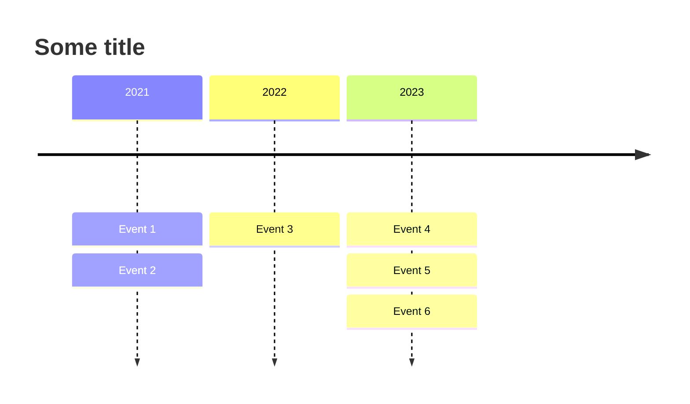
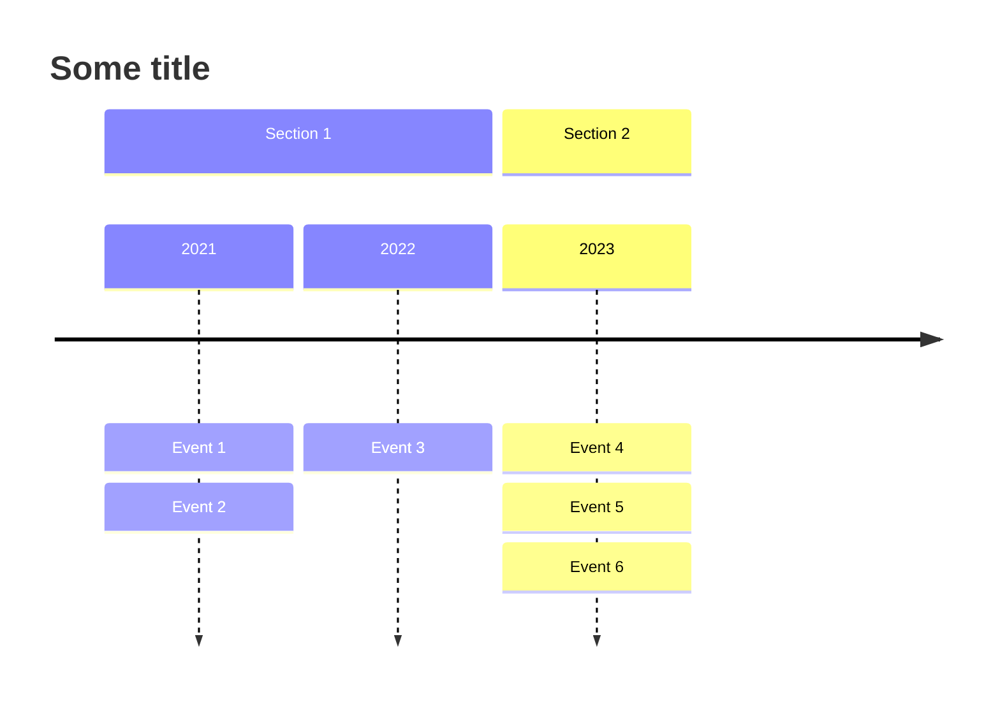

# Timeline diagram<!-- omit from toc -->

*Official Mermaid documentation: [Timeline](https://mermaid.js.org/syntax/timeline.html).*

> [!NOTE]
> All Mermaid diagrams can be configured, by passing a `MermaidConfig` object to any of the methods in the `Mermaid` class. Read more on [Mermaid configuration](~/configuration.md).

## Simple timeline

The following code sample shows how to create a simple Mermaid timeline.

Use the `TimelineDiagram` method of the `Mermaid` class to create a timeline.

Add events with the `AddEvent` method.

Generate the diagram mermaid code with the `Build` method.

```csharp
string diagram = Mermaid
    .TimelineDiagram()
    .AddEvents("2021", "Event 1", "Event 2")
    .AddEvents("2022", "Event 3")
    .AddEvents("2023", "Event 4", "Event 5", "Event 6")
    .Build();
```

The code above generates the following Mermaid code:

```text
timeline
    2021 : Event 1 : Event 2
    2022 : Event 3
    2023 : Event 4 : Event 5 : Event 6
```

That renders as:



[⬆ Back to top](#timeline-diagram)

## Title

The title of the timeline can be set by passing a `title` parameter to the `TimelineDiagram` method.

Example:

```csharp
string diagram = Mermaid
    .TimelineDiagram("Some title")
    .AddEvents("2021", "Event 1", "Event 2")
    .AddEvents("2022", "Event 3")
    .AddEvents("2023", "Event 4", "Event 5", "Event 6")
    .Build();
```

The code above generates the following Mermaid code:

```text
timeline
    title Some title
    2021 : Event 1 : Event 2
    2022 : Event 3
    2023 : Event 4 : Event 5 : Event 6
```

That renders as:


[⬆ Back to top](#timeline-diagram)

## Sections

Sections can be added to the timeline by using the `AddSection` method.

> [!NOTE]
> When adding sections, all events added before the first section are ignored.

Example:

```csharp
string diagram = Mermaid
    .TimelineDiagram("Some title")
    .AddSection("Section 1")
    .AddEvents("2021", "Event 1", "Event 2")
    .AddEvents("2022", "Event 3")
    .AddSection("Section 2")
    .AddEvents("2023", "Event 4", "Event 5", "Event 6")
    .Build();
```

The code above generates the following Mermaid code:

```text
timeline
    title Some title
    section Section 1
        2021 : Event 1 : Event 2
        2022 : Event 3
    section Section 2
        2023 : Event 4 : Event 5 : Event 6
```

That renders as:



[⬆ Back to top](#timeline-diagram)