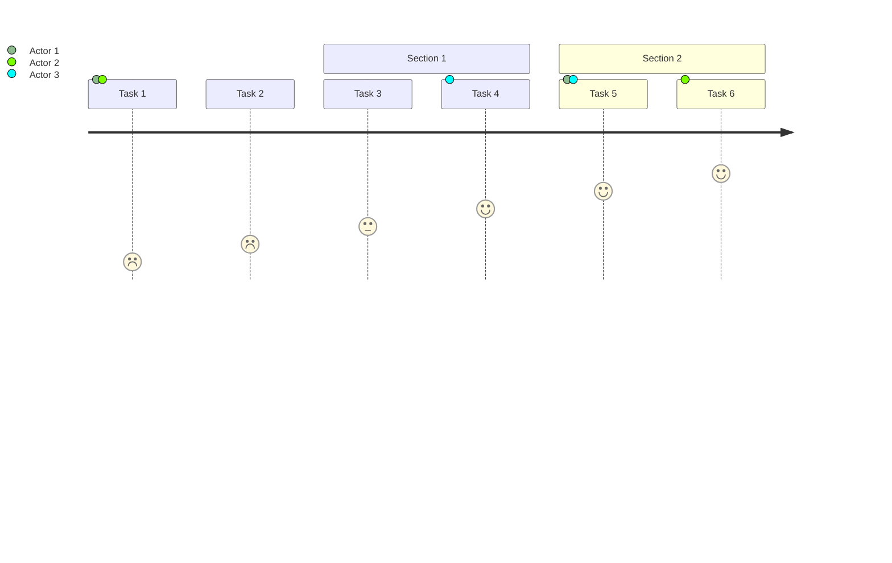
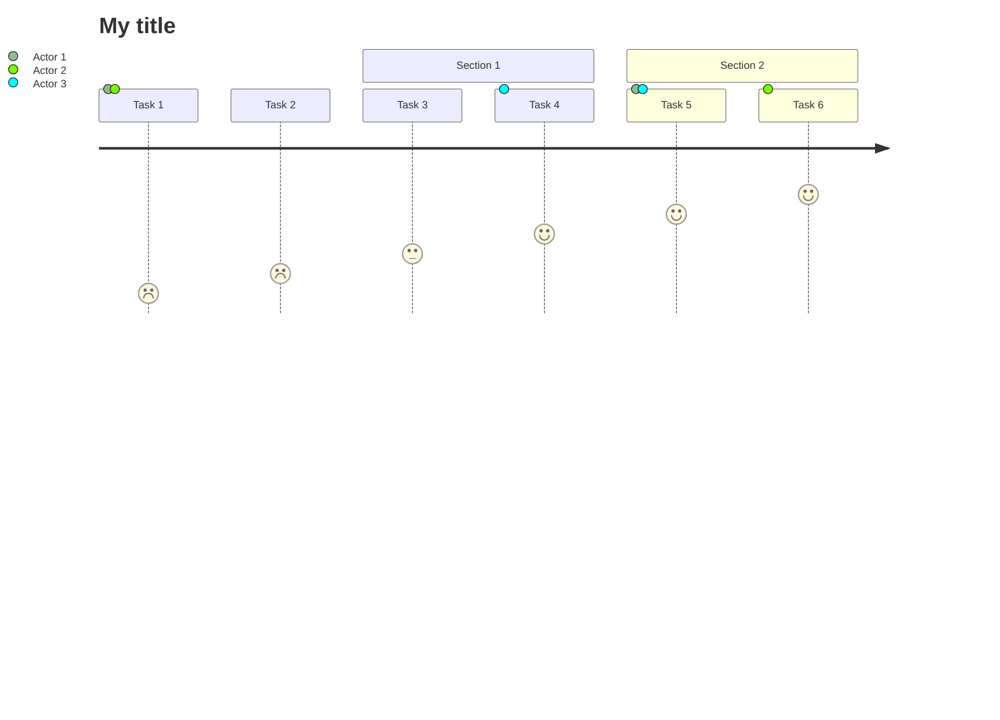

# User journey diagram<!-- omit from toc -->

*Official Mermaid documentation: [User journey](https://mermaid.js.org/syntax/userJourney.html).*

## Simple user journey diagram

The following code sample shows how to create a simple Mermaid user journey diagram.

Use the `UserJourneyDiagram` method to create a user journey diagram.

Add tasks with the `AddTask` method, and sections with the `AddSection` method.

Generate the diagram mermaid code with the `Build` method.

```csharp
var diagram = Mermaid
    .UserJourneyDiagram()
    .AddTask("Task 1", 1, "Actor 1", "Actor 2")
    .AddTask("Task 2", 2)
    .AddSection("Section 1")
    .AddTask("Task 3", 3)
    .AddTask("Task 4", 4, "Actor 3")
    .AddSection("Section 2")
    .AddTask("Task 5", 5, "Actor 1", "Actor 3")
    .AddTask("Task 6", 6, "Actor 2")
    .Build();
```

The code above generates the following Mermaid code:

```text
journey
    Task 1: 1: Actor 1, Actor 2
    Task 2: 2
    section Section 1
        Task 3: 3
        Task 4: 4: Actor 3
    section Section 2
        Task 5: 5: Actor 1, Actor 3
        Task 6: 6: Actor 2
```

That renders as:



[⬆ Back to top](#user-journey-diagram)

## Title

The title of the user journey diagram can be set by passing a `title` parameter to the `UserJourneyDiagram` method.

Example:

```csharp
var diagram = Mermaid
    .UserJourneyDiagram("My title")
    .AddTask("Task 1", 1, "Actor 1", "Actor 2")
    .AddTask("Task 2", 2)
    .AddSection("Section 1")
    .AddTask("Task 3", 3)
    .AddTask("Task 4", 4, "Actor 3")
    .AddSection("Section 2")
    .AddTask("Task 5", 5, "Actor 1", "Actor 3")
    .AddTask("Task 6", 6, "Actor 2")
    .Build();
```

The code above generates the following Mermaid code:

```text
journey
    title My title
    Task 1: 1: Actor 1, Actor 2
    Task 2: 2
    section Section 1
        Task 3: 3
        Task 4: 4: Actor 3
    section Section 2
        Task 5: 5: Actor 1, Actor 3
        Task 6: 6: Actor 2
```

That renders as:



[⬆ Back to top](#user-journey-diagram)