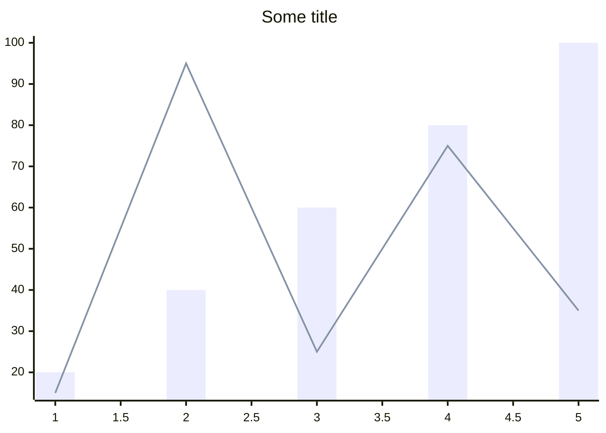
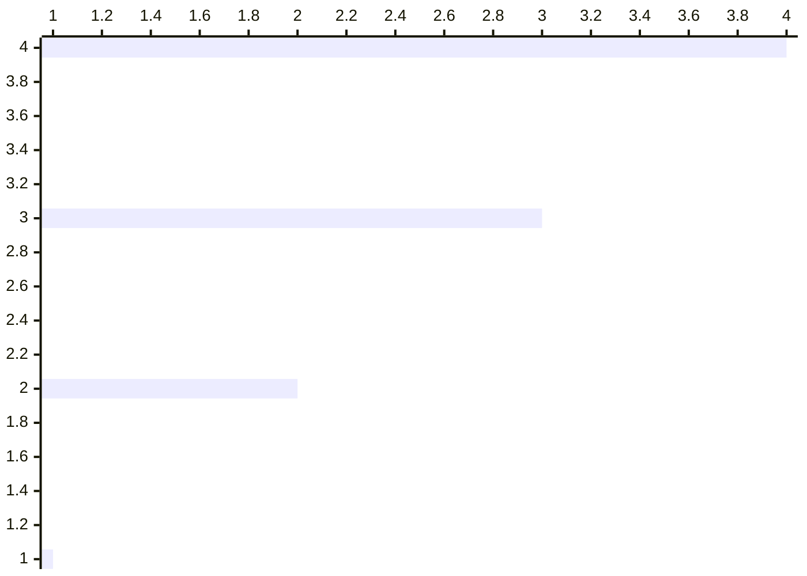
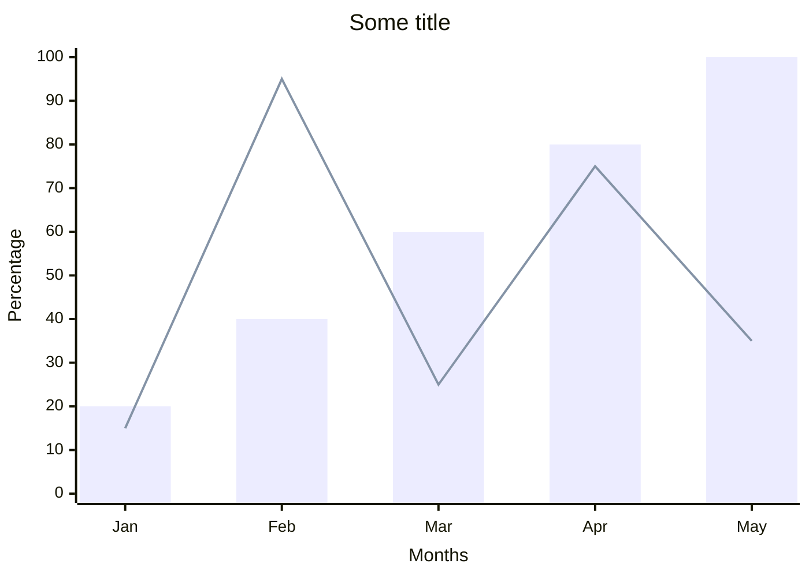

# XY Chart<!-- omit from toc -->

*Official Mermaid documentation: [XY chart](https://mermaid.js.org/syntax/xyChart.html).*

> [!NOTE]
> All Mermaid diagrams can be configured, by passing a `MermaidConfig` object to any of the methods in the `Mermaid` class. Read more on [Mermaid configuration](~/configuration.md).

## Simple XY chart

The following code sample shows how to create a simple Mermaid XY chart.

Use the `XYChart` method of the `Mermaid` class to create a XY chart, passing an optional `title` argument.

Add series with the `AddBarSeries` or `AddLineSeries` methods.

Generate the diagram mermaid code with the `Build` method.

```csharp
string diagram = Mermaid
    .XYChart("Some title")
    .AddBarSeries([20, 40, 60, 80, 100])
    .AddLineSeries([15, 95, 25, 75, 35])
    .Build();
```

The code above generates the following Mermaid code:

```text
---
title: Some title
---
xychart
bar [20, 40, 60, 80, 100]
line [15, 95, 25, 75, 35]
```

That renders as:



[⬆ Back to top](#xy-chart)

## Orientation

By default, the XY chart is rendered in a vertical orientation. To render the chart in a horizontal orientation, use the `oritentation` parameter of the `XYChart` method:

```csharp
string diagram = Mermaid
    .XYChart(orientation: XYChartOrientation.Horizontal)
    .AddBarSeries([1, 2, 3, 4])
    .Build();
```

The code above generates the following Mermaid code:

```text
xychart horizontal
bar [1, 2, 3, 4]
```

That renders as:



[⬆ Back to top](#xy-chart)

## Axes specifications

The X axis can be specified as either categorical or numeric, using the `WithCategoricalXAxis` or `WithNumericXAxis` methods.

The Y axis can be specified only as numeric, using the `WithNumericYAxis` method.

Both axes can be given only a title, using the `WithTitledXAxis` or `WithTitledYAxis` methods.


```csharp
string diagram = Mermaid
    .XYChart("Some title")
    .WithCategoricalXAxis(["Jan", "Feb", "Mar", "Apr", "May"], "Months")
    .WithNumericYAxis(0, 100, "Percentage")
    .AddBarSeries([20, 40, 60, 80, 100])
    .AddLineSeries([15, 95, 25, 75, 35])
    .Build();
```

The code above generates the following Mermaid code:

```text
---
title: Some title
---
xychart
x-axis "Months" ["Jan", "Feb", "Mar", "Apr", "May"]
y-axis "Percentage" 0 --> 100
bar [20, 40, 60, 80, 100]
line [15, 95, 25, 75, 35]
```

That renders as:



[⬆ Back to top](#xy-chart)