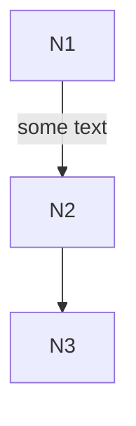
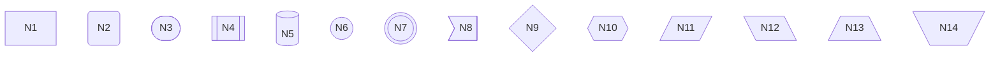
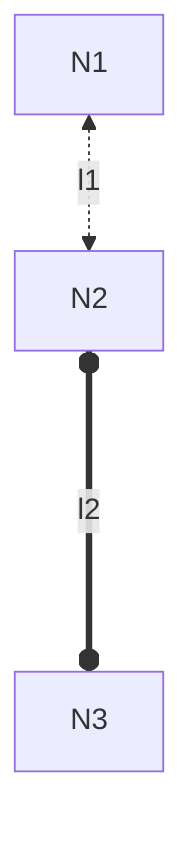
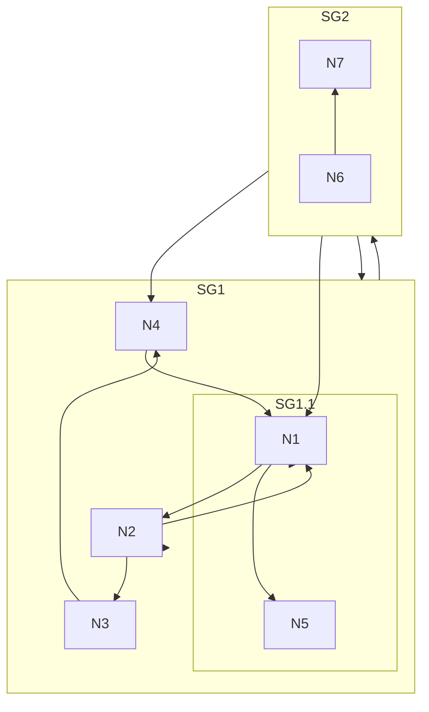
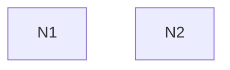

# Flowchart<!-- omit from toc -->

*Official Mermaid documentation: [Flowchart](https://mermaid.js.org/syntax/flowchart.html).*

- [Simple flowchart](#simple-flowchart)
- [Orientation](#orientation)
- [Node shape](#node-shape)
- [Links](#links)
- [Subgraphs](#subgraphs)
- [Interaction](#interaction)

## Simple flowchart

The following code sample shows how to create a simple Mermaid flowchart.

Use the `Flowchart` method of the `Mermaid` class to create a flowchart.

Add nodes with the `AddNode` method, and link them with the `AddLink` method.

Generate the diagram mermaid code with the `Build` method.

```csharp
string diagram = Mermaid
    .Flowchart()
    .AddNode("N1", out var n1)
    .AddNode("N2", out var n2)
    .AddNode("N3", out var n3)
    .AddLink(n1, n2, "some text")
    .AddLink(n2, n3)
    .Build();
```

The code above generates the following Mermaid code:

```text
flowchart TB
    id1["N1"]
    id2["N2"]
    id3["N3"]
    id1 -->|"some text"| id2
    id2 --> id3
```

That renders as:



[⬆ Back to top](#flowchart)

## Orientation

The orientation of the flowchart can be set by passing an `orientation` parameter to the `Flowchart` method. 

It can be one of the following values:

- `TopToBottom` (default)
- `BottomToTop`
- `LeftToRight`
- `RightToLeft`

```csharp
Mermaid.Flowchart(FlowchartOrientation.BottomToTop)
```

[⬆ Back to top](#flowchart)

## Node shape

The shape of the nodes can be set by passing a `shape` parameter to the `AddNode` method.

<!-- List values from enum:
public enum NodeShape
{
    Rectangle,
    RoundEdges,
    Stadium,
    Subroutine,
    Cylindrical,
    Circle,
    DoubleCircle,
    Asymmetric,
    Rhombus,
    Hexagon,
    Parallelogram,
    ParallelogramAlt,
    Trapezoid,
    TrapezoidAlt
}
 -->

It can be one of the following values:

- `Rectangle` (default)
- `RoundEdges`
- `Stadium`
- `Subroutine`
- `Cylindrical`
- `Circle`
- `DoubleCircle`
- `Asymmetric`
- `Rhombus`
- `Hexagon`
- `Parallelogram`
- `ParallelogramAlt`
- `Trapezoid`
- `TrapezoidAlt`

Example:

```csharp
string diagram = Mermaid
    .Flowchart()
    .AddNode("N1", out _, NodeShape.Rectangle)
    .AddNode("N2", out _, NodeShape.RoundEdges)
    .AddNode("N3", out _, NodeShape.Stadium)
    .AddNode("N4", out _, NodeShape.Subroutine)
    .AddNode("N5", out _, NodeShape.Cylindrical)
    .AddNode("N6", out _, NodeShape.Circle)
    .AddNode("N7", out _, NodeShape.DoubleCircle)
    .AddNode("N8", out _, NodeShape.Asymmetric)
    .AddNode("N9", out _, NodeShape.Rhombus)
    .AddNode("N10", out _, NodeShape.Hexagon)
    .AddNode("N11", out _, NodeShape.Parallelogram)
    .AddNode("N12", out _, NodeShape.ParallelogramAlt)
    .AddNode("N13", out _, NodeShape.Trapezoid)
    .AddNode("N14", out _, NodeShape.TrapezoidAlt)
    .Build();
```

The code above generates the following Mermaid code:

```text
flowchart TB
    id1["N1"]
    id2("N2")
    id3(["N3"])
    id4[["N4"]]
    id5[("N5")]
    id6(("N6"))
    id7((("N7")))
    id8>"N8"]
    id9{"N9"}
    id10{{"N10"}}
    id11[/"N11"/]
    id12[\"N12"\]
    id13[/"N13"\]
    id14[\"N14"/]
```

That renders as:



[⬆ Back to top](#flowchart)

## Links

Links between nodes can have a label, using the `text` parameter of the `AddLink` method.

Their line style and ending can be set by using the `lineStyle` and `ending` parameters.

They can be set as multidirectional by using the `multidirectional` parameter.

Thay can be added extra length by using the `extraLength` parameter.

The `lineStyle` parameter can be one of the following values:

- `Solid` (default)
- `Dotted`
- `Thick`
- `Invisible`

The `ending` parameter can be one of the following values:

- `Arrow` (default)
- `Circle`
- `Cross`
- `Open`

Example:

```csharp
string diagram = Mermaid
    .Flowchart()
    .AddNode("N1", out var n1)
    .AddNode("N2", out var n2)
    .AddNode("N3", out var n3)
    .AddLink(n1, n2, "l1", LinkLineStyle.Dotted, LinkEnding.Arrow, true)
    .AddLink(n2, n3, "l2", LinkLineStyle.Thick, LinkEnding.Circle, true, 2)
    .Build();
```

The code above generates the following Mermaid code:

```text
flowchart TB
    id1["N1"]
    id2["N2"]
    id3["N3"]
    id1 <-.->|"l1"| id2
    id2 o====o|"l2"| id3
```

That renders as:



[⬆ Back to top](#flowchart)

## Subgraphs

Subgraphs can be created by using the `AddSubgraph` method.

Example:

```csharp
string diagram = Mermaid
    .Flowchart()
    .AddNode("N1", out var n1)
    .AddNode("N2", out var n2)
    .AddNode("N3", out var n3)
    .AddNode("N4", out var n4)
    .AddNode("N5", out var n5)
    .AddLink(n1, n2)
    .AddSubgraph("SG1", out var sg1, builder => builder
        .AddLink(n2, n3)
        .AddLink(n3, n4)
        .AddSubgraph("SG1.1", out var sg11, builder => builder
            .AddLink(n1, n5)))
    .AddLink(n4, n1)
    .AddSubgraph("SG2", out var sg2, builder => builder
        .AddNode("N6", out var n6)
        .AddNode("N7", out var n7)
        .AddLink(n6, n7), FlowchartOrientation.BottomToTop)
    .AddLink(n1, sg1)
    .AddLink(sg2, n4)
    .AddLink(sg1, sg2)
    .AddLinkChain([n2, sg2], [n1, sg1])
    .Build();
```

The code above generates the following Mermaid code:

```text
flowchart TB
    id1["N1"]
    id2["N2"]
    id3["N3"]
    id4["N4"]
    id5["N5"]
    id1 --> id2
    subgraph sub7 [SG1]
    id2 --> id3
    id3 --> id4
    subgraph sub10 [SG1.1]
    id1 --> id5
    end
    end
    id4 --> id1
    subgraph sub15 [SG2]
    direction BT
    id16["N6"]
    id17["N7"]
    id16 --> id17
    end
    id1 --> sub7
    sub15 --> id4
    sub7 --> sub15
    id2 & sub15 --> id1 & sub7
```

That renders as:



[⬆ Back to top](#flowchart)

## Interaction

Nodes can have an hyperlink or a javascript callback attached to them, by either using the `AddHyperlink` or `AddCallback` methods.

Example:

```csharp
string diagram = Mermaid
    .Flowchart()
    .AddNode("N1", out var n1)
    .AddNode("N2", out var n2)
    .AddHyperlink(n1, "https://example.com", "tooltip 1", HyperlinkTarget.Blank)
    .AddCallback(n2, "callback", "tooltip 2")
    .Build();
```

The code above generates the following Mermaid code:

```text
flowchart TB
    id1["N1"]
    click id1 "https://example.com" "tooltip 1" _blank
    id2["N2"]
    click id2 callback "tooltip 2"
```

That renders as:



[⬆ Back to top](#flowchart)


