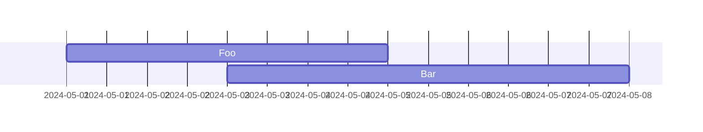
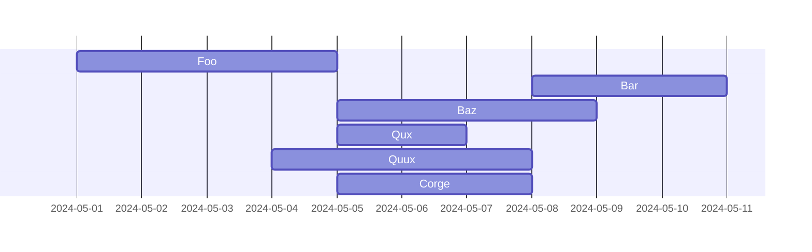
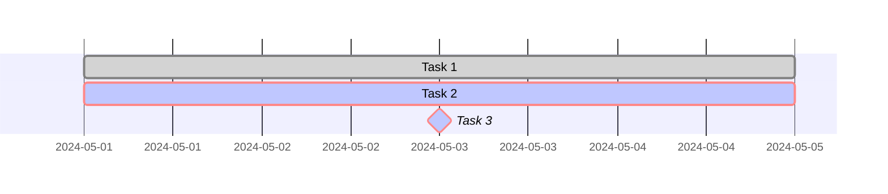
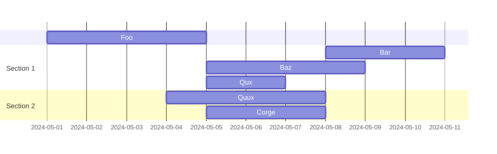
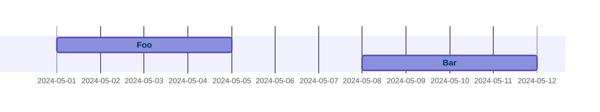
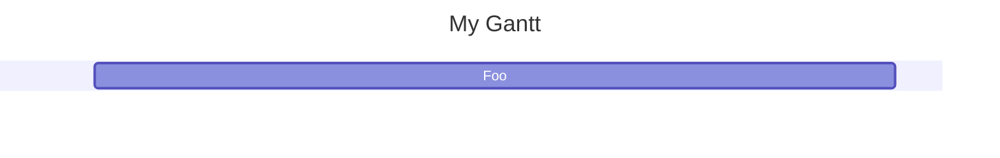

# Gantt diagram<!-- omit from toc -->

*Official Mermaid documentation: [Gantt diagrams](https://mermaid.js.org/syntax/gantt.html).*

- [Simple diagram](#simple-diagram)
- [Task bounds](#task-bounds)
- [Task tags](#task-tags)
- [Sections](#sections)
- [Interaction](#interaction)
- [Customization](#customization)

## Simple diagram

The following code sample shows how to create a simple Mermaid Gantt diagram.

Use the `GanttDiagram` method of the `Mermaid` class to create a Gantt diagram.

Add tasks with the `AddTask` method.

Generate the diagram mermaid code with the `Build` method.

```csharp
string diagram = Mermaid
    .GanttDiagram()
    .AddTask("Foo", DateTimeOffset.Parse("2024-05-01"), DateTimeOffset.Parse("2024-05-05"), out _)
    .AddTask("Bar", DateTimeOffset.Parse("2024-05-03"), DateTimeOffset.Parse("2024-05-08"), out _)
    .Build();
```

The code above generates the following Mermaid code:

```text
gantt
    dateFormat YYYY-MM-DD
    Foo: task1, 2024-05-01, 2024-05-05
    Bar: task2, 2024-05-03, 2024-05-08
```

That renders as:



[⬆ Back to top](#gantt-diagram)

## Task bounds

Tasks can be bounded several ways:

- With a start and end date.
- With a start date and duration.
- With the end date of a previous task and an end date.
- With the end date of a previous task and a duration.
- With the end date of a previous task and the start date of a next task.

Example:

```csharp
string diagram = Mermaid
    .GanttDiagram()
    .AddTask("Foo", DateTimeOffset.Parse("2024-05-01"), DateTimeOffset.Parse("2024-05-05"), out var t1)
    .AddTask("Bar", DateTimeOffset.Parse("2024-05-08"), TimeSpan.FromDays(3), out var t2)
    .AddTask("Baz", t1, DateTimeOffset.Parse("2024-05-09"), out var t3)
    .AddTask("Qux", t1, TimeSpan.FromDays(2), out var t4)
    .AddTask("Quux", DateTimeOffset.Parse("2024-05-04"), t2, out var t5)
    .AddTask("Corge", t1, t2, out var t6)
    .Build();
```

The code above generates the following Mermaid code:

```text
gantt
    dateFormat YYYY-MM-DD
    Foo: task1, 2024-05-01, 2024-05-05
    Bar: task2, 2024-05-08, 3d
    Baz: task3, after task1, 2024-05-09
    Qux: task4, after task1, 2d
    Quux: task5, 2024-05-04, until task2
    Corge: task6, after task1, until task2
```

That renders as:



[⬆ Back to top](#gantt-diagram)

## Task tags

Optional tags can be added to tasks by using the `tags` parameter of the `AddTask` method.

Tags can be any combination of the following values:

- `Active`
- `Done`
- `Critical`
- `Milestone`

Example:

```csharp
string diagram = Mermaid
    .GanttDiagram()
    .AddTask("Task 1", DateTimeOffset.Parse("2024-05-01"), DateTimeOffset.Parse("2024-05-05"), out var t2, TaskTags.Done)
    .AddTask("Task 2", DateTimeOffset.Parse("2024-05-01"), DateTimeOffset.Parse("2024-05-05"), out var t6, TaskTags.Active | TaskTags.Critical)
    .AddTask("Task 3", DateTimeOffset.Parse("2024-05-01"), DateTimeOffset.Parse("2024-05-05"), out var t15, TaskTags.Active | TaskTags.Done | TaskTags.Critical | TaskTags.Milestone)
    .Build();
```

The code above generates the following Mermaid code:

```text
gantt
    dateFormat YYYY-MM-DD
    Task 1: done, task1, 2024-05-01, 2024-05-05
    Task 2: active, crit, task2, 2024-05-01, 2024-05-05
    Task 3: active, done, crit, milestone, task3, 2024-05-01, 2024-05-05
```

That renders as:



[⬆ Back to top](#gantt-diagram)

## Sections

Sections can be added to the diagram with the `AddSection` method. All tasks following a section will be placed in that section, until another section is added. Tasks before the first section will be placed in the default section.

Example:

```csharp
string diagram = Mermaid
    .GanttDiagram()
    .AddTask("Foo", DateTimeOffset.Parse("2024-05-01"), DateTimeOffset.Parse("2024-05-05"), out var t1)
    .AddSection("Section 1")
    .AddTask("Bar", DateTimeOffset.Parse("2024-05-08"), TimeSpan.FromDays(3), out var t2)
    .AddTask("Baz", t1, DateTimeOffset.Parse("2024-05-09"), out var t3)
    .AddTask("Qux", t1, TimeSpan.FromDays(2), out var t4)
    .AddSection("Section 2")
    .AddTask("Quux", DateTimeOffset.Parse("2024-05-04"), t2, out var t5)
    .AddTask("Corge", t1, t2, out var t6)
    .Build();
```

The code above generates the following Mermaid code:

```text
gantt
    dateFormat YYYY-MM-DD
    Foo: task1, 2024-05-01, 2024-05-05
    section Section 1
        Bar: task2, 2024-05-08, 3d
        Baz: task3, after task1, 2024-05-09
        Qux: task4, after task1, 2d
    section Section 2
        Quux: task5, 2024-05-04, until task2
        Corge: task6, after task1, until task2
```

That renders as:



[⬆ Back to top](#gantt-diagram)

## Interaction

Tasks can have an hyperlink or a javascript callback attached to them, by either using the `AddHyperlink` or `AddCallback` methods.

Example:

```csharp
string diagram = Mermaid
    .GanttDiagram()
    .AddTask("Foo", DateTimeOffset.Parse("2024-05-01"), DateTimeOffset.Parse("2024-05-05"), out var t1)
    .AddTask("Bar", DateTimeOffset.Parse("2024-05-08"), DateTimeOffset.Parse("2024-05-12"), out var t2)
    .AddHyperlink(t1, "https://example.com")
    .AddCallback(t2, "myFunction")
    .Build();
```

The code above generates the following Mermaid code:

```text
gantt
    dateFormat YYYY-MM-DD
    Foo: task1, 2024-05-01, 2024-05-05
    click task1 href "https://example.com"
    Bar: task2, 2024-05-08, 2024-05-12
    click task2 call myFunction()
```

That renders as:



[⬆ Back to top](#gantt-diagram)

## Customization

The Gantt diagram by passing optional parameters to the `GanttDiagram` method. The following parameters can be customized:

<!-- public static GanttDiagramBuilder GanttDiagram(
    string? title = null,
    bool compactMode = false,
    bool hideTodayMarker = false,
    string dateFormat = "YYYY-MM-DD",
    string? axisFormat = null,
    string? tickInterval = null,
    string? weekIntervalStartDay = null) -->

- `title`: The title of the diagram.
- `compactMode`: Whether to use compact mode.
- `hideTodayMarker`: Whether to hide the today marker.
- `dateFormat`: The date format. See format [here](https://day.js.org/docs/en/parse/string-format/).
- `axisFormat`: The axis format. See format [here](https://github.com/d3/d3-time-format/tree/v4.0.0#locale_format).
- `tickInterval`: The tick interval. Must match `/^([1-9][0-9]*)(millisecond|second|minute|hour|day|week|month)$/;` (for example `1day`, `1week`).
- `weekIntervalStartDay`: The name of the start day of the week. Igored if `tickInterval` is not set to `week`.

Example:

```csharp
string diagram = Mermaid
    .GanttDiagram(
        title: "My Gantt",
        compactMode: true,
        hideTodayMarker: true,
        dateFormat: "DD-MM-YYYY",
        axisFormat: "%d-%m",
        tickInterval: "1week",
        weekIntervalStartDay: "monday")
    .AddTask("Foo", DateTimeOffset.Parse("2024-05-01"), DateTimeOffset.Parse("2024-05-05"), out var t1)
    .Build();
```

The code above generates the following Mermaid code:

```text
---
displayMode: compact
---
gantt
    title My Gantt
    dateFormat DD-MM-YYYY
    todayMarker off
    axisFormat %d-%m
    tickInterval 1week
    weekday monday
    Foo: task1, 01-05-2024, 05-05-2024
```

That renders as:



[⬆ Back to top](#gantt-diagram)
