# **FoggyBalrog.MermaidDotNet** Documentation

**FoggyBalrog.MermaidDotNet** is .NET library to generate Mermaid diagrams code.

> [!NOTE]  
> This documentation applies to the latest published version, excluding pre-releases.
> 
> [](https://www.nuget.org/packages/FoggyBalrog.MermaidDotNet)

See the source code on GitHub: [FoggyBalrog/MermaidDotNet](https://github.com/FoggyBalrog/MermaidDotNet).

## Add the library to your project

Install the [FoggyBalrog.MermaidDotNet NuGet package from nuget.org](https://www.nuget.org/packages/FoggyBalrog.MermaidDotNet), or download [the *nupkg* file from the latest release on GitHub](https://github.com/FoggyBalrog/MermaidDotNet/releases/latest).

## Compatibility

The library targets **.NET Standard 2.1**, that is notably compatible with .NET Core 3.0 and later, .NET 5.0 and later, and Mono 6.4 and later.

See details [on the package _frameworks_ tab on nuget.org](https://www.nuget.org/packages/FoggyBalrog.MermaidDotNet#supportedframeworks-body-tab) or [on Microsoft Learn](https://learn.microsoft.com/en-us/dotnet/standard/net-standard?tabs=net-standard-2-1#select-net-standard-version).

## Quick Start

### Flowchart

```csharp
string diagram = Mermaid
    .Flowchart()
    .AddNode("N1", out var n1)
    .AddNode("N2", out var n2)
    .AddNode("N3", out var n3)
    .AddLink(n1, n2, "some text")
    .AddLink(n2, n3)
    .Build();
```

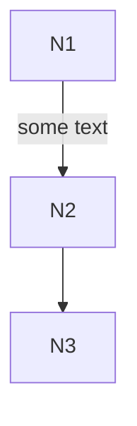

Read more on [flowchart](~/diagrams/flowchart.md).

### Sequence diagram

```csharp
string diagram = Mermaid
    .SequenceDiagram()
    .AddMember(Alice, out var a)
    .AddMember(Bob, out var b)
    .SendMessage(a, b, $"Hello {b.Name}!")
    .SendMessage(b, a, $"Hello {a.Name}!")
    .Build();
```

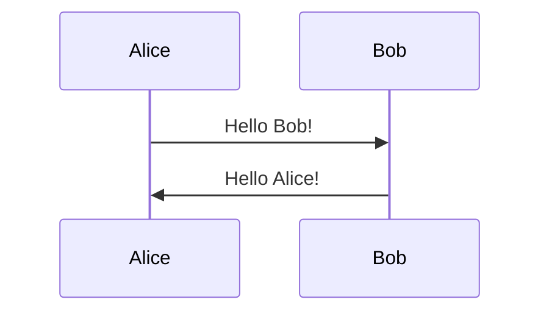

Read more on [sequence-diagram](~/diagrams/sequence-diagram.md).

### Class diagram

```csharp
var diagram = Mermaid
    .ClassDiagram()
    .AddClass("Animal", out var animal)
    .AddClass("Dog", out var dog)
    .AddProperty(animal, "int", "Age")
    .AddMethod(animal, null, "Breathe")
    .AddMethod(animal, "void", "Eat", parameters: 
    [
        ("Food", "food")
    ])
    .AddMethod(dog, "Sound", "Bark", parameters: 
    [
        ("int", "times"),
        ("int", "volume")
    ])
    .AddRelationship(animal, dog, RelationshipType.Inheritance, label: "A dog is an animal")
    .Build();
```

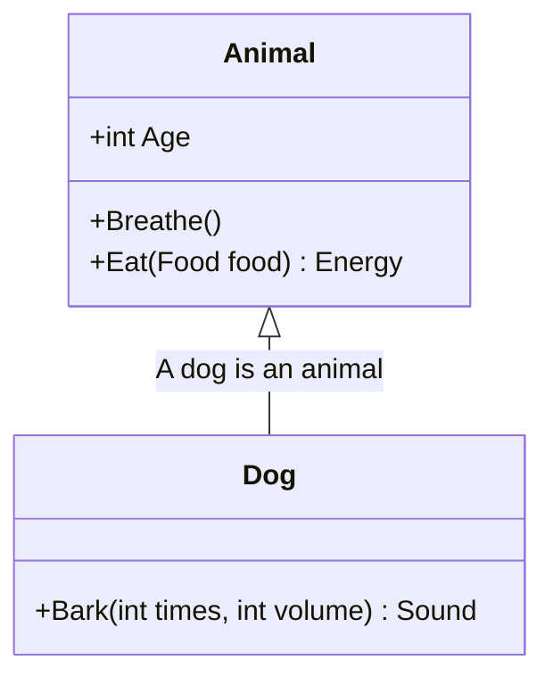

Read more on [class-diagram](~/diagrams/class-diagram.md).

### State diagram

```csharp
var diagram = Mermaid
    .StateDiagram()
    .AddState("State 1", out var s1)
    .AddState("State 2", out var s2)
    .AddTransitionFromStart(s1)
    .AddStateTransition(s1, s2)
    .AddTransitionToEnd(s2)
    .Build();
```

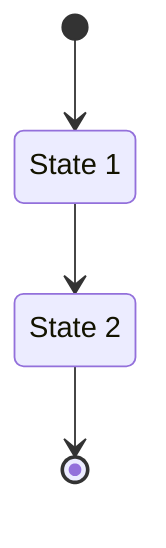

Read more on [state-diagram](~/diagrams/state-diagram.md).

### Entity relationship diagram

```csharp
string diagram = Mermaid
    .EntityRelationshipDiagram()
    .AddEntity("Customer", out var c)
    .AddEntity("Order", out var o)
    .AddEntity("Product", out var p)
    .AddRelationship(Cardinality.ExactlyOne, c, Cardinality.ZeroOrMore, o, "places")
    .AddRelationship(Cardinality.ExactlyOne, o, Cardinality.OneOrMore, p, "contains")
    .Build();
```

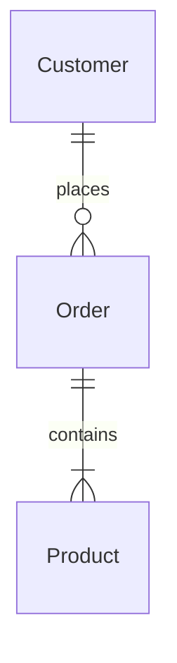

Read more on [entity-relationship-diagram](~/diagrams/entity-relationship-diagram.md).

### User journey diagram

```csharp
var diagram = Mermaid
    .UserJourneyDiagram()
    .AddTask("Task 1", 1, "Actor 1", "Actor 2")
    .AddTask("Task 2", 2)
    .AddSection("Section 1")
    .AddTask("Task 3", 3)
    .AddTask("Task 4", 4, "Actor 3")
    .AddSection("Section 2")
    .AddTask("Task 5", 5, "Actor 1", "Actor 3")
    .AddTask("Task 6", 6, "Actor 2")
    .Build();
```

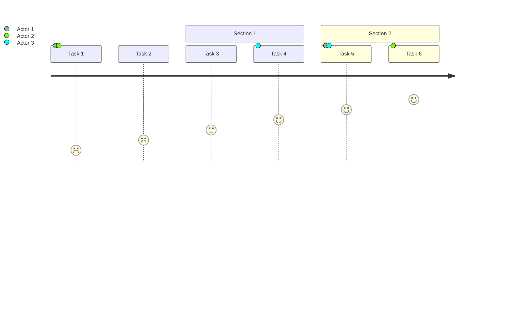

Read more on [user-journey-diagram](~/diagrams/user-journey-diagram.md).

### Gantt diagram

```csharp
string diagram = Mermaid
    .GanttDiagram()
    .AddTask("Foo", Date("2024-05-01"), Date("2024-05-05"), out _)
    .AddTask("Bar", Date("2024-05-08"), Date("2024-05-12"), out _)
    .Build();
```

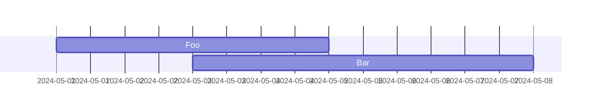

Read more on [gantt-diagram](~/diagrams/gantt-diagram.md).

### Git graph

```csharp
string graph = Mermaid
    .GitGraph()
    .Commit()
    .Branch("dev", out Branch dev)
    .Commit()
    .Checkout(dev)
    .Commit()
    .Commit()
    .CheckoutMain()
    .Commit()
    .Merge(dev)
    .Commit()
    .Build();
```

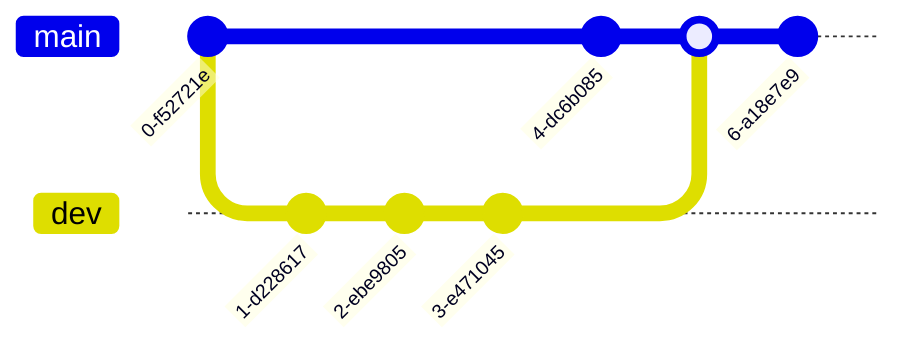

Read more on [git-graph](~/diagrams/git-graph.md).

### Mind Map

```csharp
var mindMap = Mermaid
    .MindMap("Root")
    .AddNode("Node 1", out var node1)
    .AddNode("Node 2", out var node2, node1)
    .AddNode("Node 3", out var node3, node1)
    .AddNode("Node 4", out var node4, node2)
    .AddNode("Node 5", out var node5, node2)
    .AddNode("Node 6", out var node6, node3)
    .AddNode("Node 7", out var node7, node3)
    .Build();
```

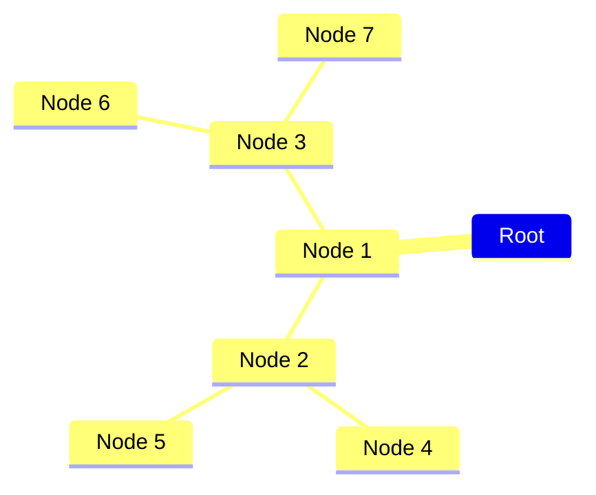

Read more on [mind-map](~/diagrams/mind-map.md).

### Pie chart

```csharp
var pieChart = Mermaid
    .PieChart()
    .AddDataSet("Label1", 42.7)
    .AddDataSet("Label2", 57.3)
    .Build();
```

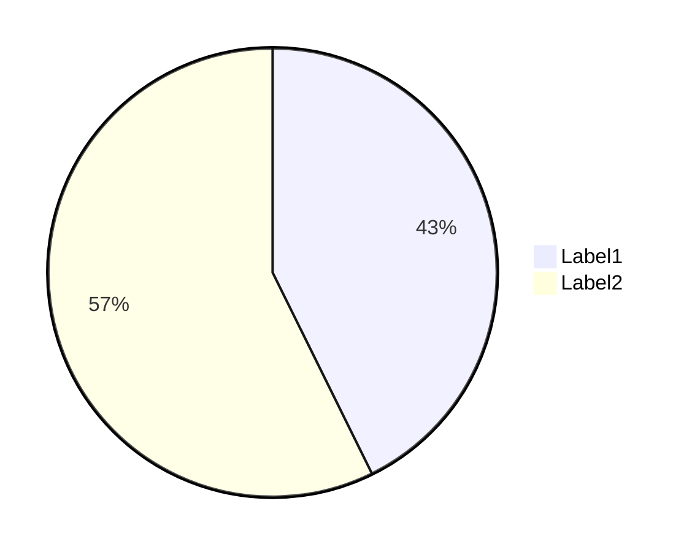

Read more on [pie-chart](~/diagrams/pie-chart.md).

### Quadrant chart

```csharp
var quadrantChart = Mermaid
    .QuadrantChart()
    .AddPoint("A", 0.1, 0.2)
    .AddPoint("B", 0.3, 0.4)
    .Build();
```

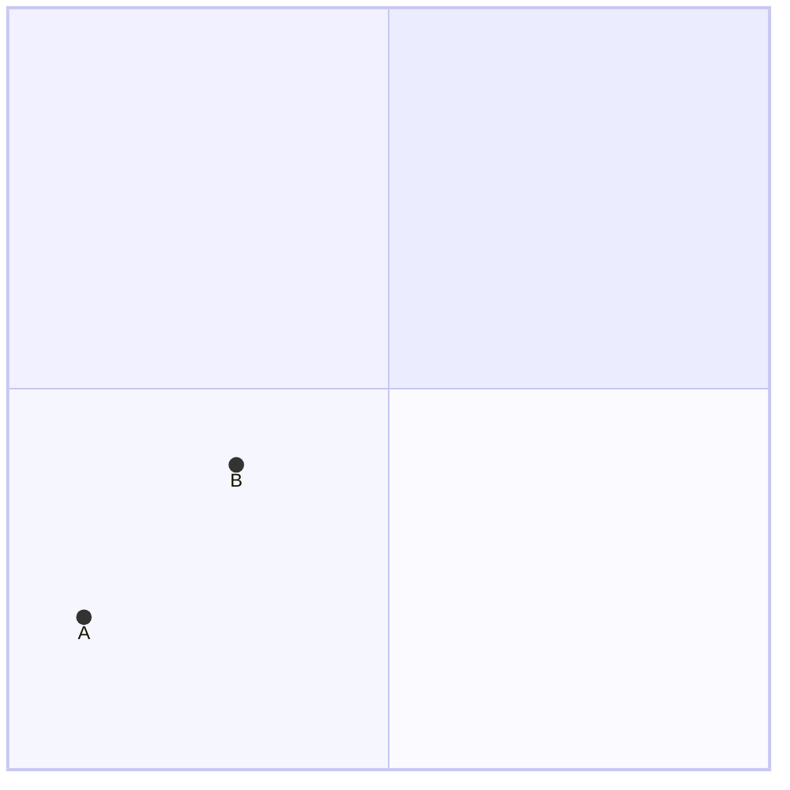

Read more on [quadrant-chart](~/diagrams/quadrant-chart.md).

### Requirement diagram

```csharp
string diagram = Mermaid
    .RequirementDiagram()
    .AddRequirement("Requirement 1", out var requirement1)
    .AddRequirement("Requirement 2", out var requirement2)
    .AddElement("Element 1", out var element1)
    .AddElement("Element 2", out var element2)
    .AddRelationship(element1, requirement1, RelationshipType.Satisfies)
    .AddRelationship(element2, requirement2, RelationshipType.Satisfies)
    .Build();
```

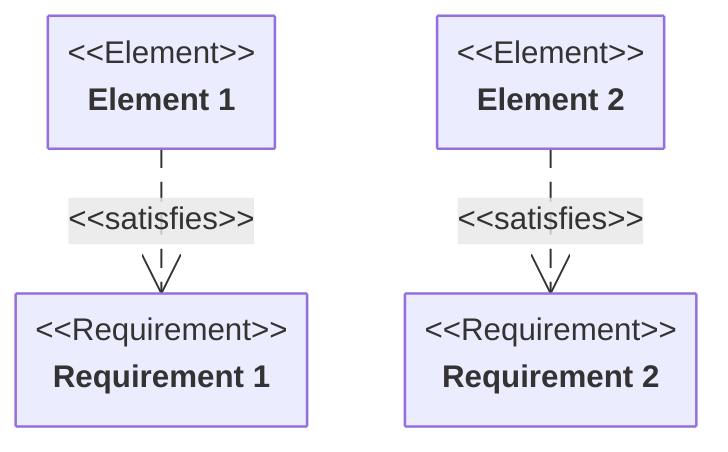

Read more on [requirement-diagram](~/diagrams/requirement-diagram.md).

### Timeline diagram

```csharp
string diagram = Mermaid
    .TimelineDiagram("Some title")
    .AddEvents("2021", "Event 1", "Event 2")
    .AddEvents("2022", "Event 3")
    .AddEvents("2023", "Event 4", "Event 5", "Event 6")
    .Build();
```

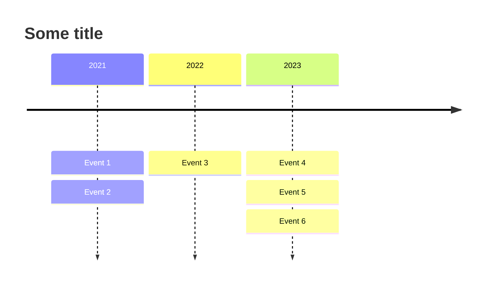

Read more on [timeline-diagram](~/diagrams/timeline-diagram.md).

## Unsafe mode

By default, the library uses safe mode, which means that it will throw an exception if the arguments passed to the methods are invalid.

You can disable this behavior by accessing the buiders through the `Unsafe` property in the `Mermaid` class.

Example:

```csharp
string diagram = Mermaid
    .Unsafe
    .Flowchart()
    .AddNode("N1", out var n1)
    .AddNode("N2", out var n2)
    .AddNode("N3", out var n3)
    .AddLink(n1, n2, "some text")
    .AddLink(n2, n3)
    .Build();
```

## License

This project is licensed under the MIT License. See the [LICENSE](https://github.com/FoggyBalrog/MermaidDotNet/blob/main/LICENSE) file for details.

## Credits

Mermaid icon created by [Smashicons on Flaticon](https://www.flaticon.com/authors/smashicons).