# Sequence Diagram<!-- omit from toc -->

*Official Mermaid documentation: [Sequence Diagram](https://mermaid.js.org/syntax/sequenceDiagram.html).*

- [Simple diagram](#simple-diagram)
- [Autonumbering](#autonumbering)
- [Arrow and line types](#arrow-and-line-types)
- [Member types](#member-types)
- [Member links](#member-links)
- [Member creation and destruction](#member-creation-and-destruction)
- [Boxes](#boxes)
- [Activation and deactivation](#activation-and-deactivation)
- [Notes](#notes)
- [Loops](#loops)
- [Alternative paths](#alternative-paths)
- [Parallel actions](#parallel-actions)
- [Critical regions](#critical-regions)
- [Breaks](#breaks)
- [Rectangles](#rectangles)
- [Comments](#comments)

## Simple diagram

The following code sample shows how to create a simple Mermaid sequence diagram.

Use the `SequenceDiagram` property of the `Mermaid` class to create a sequence diagram.

Add participants with the `AddParticipant` method, and send messages with the `SendMessage` method.

Generate the diagram mermaid code with the `Build` method.

```csharp
Mermaid
    .SequenceDiagram()
    .AddParticipant("Alice", out var a)
    .AddParticipant("Bob", out var b)
    .SendMessage(a, b, $"Hello {b.Name}!")
    .SendMessage(b, a, $"Hello {a.Name}!")
    .Build();
```

The code above generates the following Mermaid code:

```text
sequenceDiagram
    participant Alice
    participant Bob
    Alice->>Bob: Hello Bob!
    Bob->>Alice: Hello Alice!
```

That renders as:

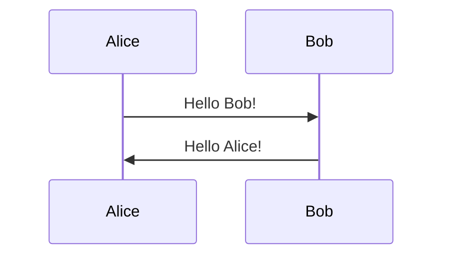

[⬆ Back to top](#sequence-diagram)

## Autonumbering

Autonumbering can be enabled (it is disabled by default).

Use the `WithAutoNumber` method to enable autonumbering.

Example:

```csharp
string diagram = Mermaid
    .SequenceDiagram()
    .WithAutoNumber()
    .AddMember("Alice", MemberType.Participant, out var m1)
    .AddMember("Bob", MemberType.Participant, out var m2)
    .SendMessage(m1, m2, $"Hello {m2.Name}!")
    .SendMessage(m2, m1, $"Hello {m1.Name}!")
    .Build();
```

The code above generates the following Mermaid code:

```text
sequenceDiagram
    autonumber
    participant Alice
    participant Bob
    Alice ->> Bob: Hello Bob!
    Bob ->> Alice: Hello Alice!
```

That renders as:

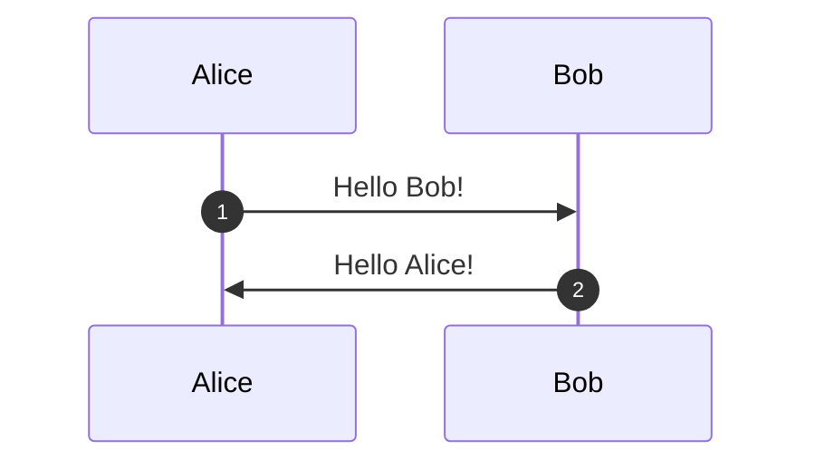

[⬆ Back to top](#sequence-diagram)

## Arrow and line types

Different arrow and line types can be used.

Use the `arrowType` and `lineType` optional parameters in the `SendMessage` method.

Arrow types (table):

| Arrow type | Mermaid code | Description       |
| ---------- | ------------ | ----------------- |
| None       | `>`          | No arrow          |
| Filled     | `>>`         | Filled arrow head |
| Open       | `)`          | Open arrow head   |
| Cross      | `x`          | Cross |

Line types (table):

| Line type | Mermaid code | Description |
| --------- | ------------ | ----------- |
| Solid     | `-`          | Solid line  |
| Dotted    | `--`         | Dotted line |

```csharp
string diagram = Mermaid
    .SequenceDiagram()
    .AddParticipant("Alice", out var a)
    .AddParticipant("Bob", out var b)
    .SendMessage(a, b, $"Hello {b.Name}!", lineType: LineType.Dotted, arrowType: ArrowType.Open)
    .Build();
```

The code above generates the following Mermaid code:

```text
sequenceDiagram
    participant Alice
    participant Bob
    Alice--)Bob: Hello Bob!
```

That renders as:

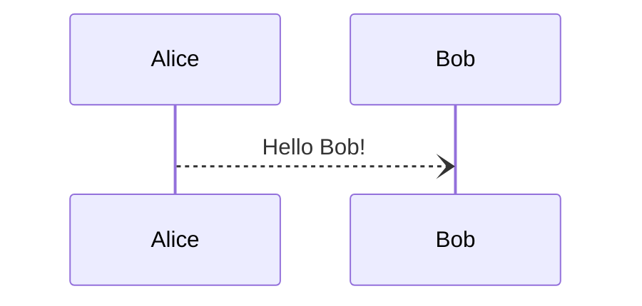

[⬆ Back to top](#sequence-diagram)

## Member types

Members can be of type `Participant` or `Actor`.

Either use the `AddMember` method with the right `MemberType` argument, or use the shortcut methods `AddParticipant` and `AddActor`.

```csharp
string diagram = Mermaid
    .SequenceDiagram()
    .AddMember("Alice", MemberType.Participant, out var a)
    .AddMember("Bob", MemberType.Actor, out var b)
    .AddParticipant("Charlie", out var c)
    .AddActor("David", out var d)
    .Build();
```

The code above generates the following Mermaid code:

```text
sequenceDiagram
    participant Alice
    actor Bob
    participant Charlie
    actor David
```

That renders as:

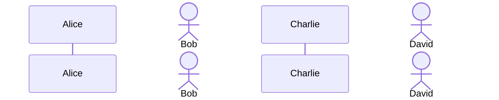

[⬆ Back to top](#sequence-diagram)

## Member links

Members can be linked to URLs.

Use the `AddLink` method as many times as needed to add links to members.

Example:

```csharp
string diagram = Mermaid
    .SequenceDiagram()
    .AddMember("Alice", MemberType.Participant, out var a)
    .AddMember("Bob", MemberType.Participant, out var b)
    .AddLink(a, "Dashboard", "https://dashboard.contoso.com/alice")
    .AddLink(a, "Wiki", "https://wiki.contoso.com/alice")
    .AddLink(b, "Dashboard", "https://dashboard.contoso.com/bob")
    .AddLink(b, "Wiki", "https://wiki.contoso.com/bob")
    .SendMessage(a, b, $"Hello {b.Name}!")
    .SendMessage(b, a, $"Hello {a.Name}!")
    .Build();
```

The code above generates the following Mermaid code:

```text
sequenceDiagram
    participant Alice
    participant Bob
    link Alice: Dashboard @ https://dashboard.contoso.com/alice
    link Alice: Wiki @ https://wiki.contoso.com/alice
    link Bob: Dashboard @ https://dashboard.contoso.com/bob
    link Bob: Wiki @ https://wiki.contoso.com/bob
    Alice ->> Bob: Hello Bob!
    Bob ->> Alice: Hello Alice!
```

That renders as:


NB: links should show up on a lenu when clicking on the member name. It may not render correctly in some markdown viewers like GitHub.

[⬆ Back to top](#sequence-diagram)

## Member creation and destruction

Members can be created and destroyed, using create and destroy messages.

Use the `SendCreateMessage` and `SendDestroyMessage` methods.

```csharp
string diagram = Mermaid
    .SequenceDiagram()
    .AddParticipant("Alice", out var a)
    .AddParticipant("Bob", out var b)
    .SendMessage(a, b, $"Hello {b.Name}, how are you?")
    .SendMessage(b, a, "Fine, thank you. And you?")
    .SendCreateMessage(a, "Carl", MemberType.Participant, out var c, "Hi Carl!")
    .SendCreateMessage(c, "Donald", MemberType.Actor, out _, "Hi!")
    .SendDestroyMessage(a, c, DestructionTarget.Recipient, "We are too many", arrowType: ArrowType.Cross)
    .SendDestroyMessage(b, a, DestructionTarget.Sender, "I agree")
    .Build();
```

The code above generates the following Mermaid code:

```text
sequenceDiagram
    participant Alice
    participant Bob
    Alice ->> Bob: Hello Bob, how are you?
    Bob ->> Alice: Fine, thank you. And you?
    create participant Carl
    Alice ->> Carl: Hi Carl!
    create actor Donald
    Carl ->> Donald: Hi!
    destroy Carl
    Alice -x Carl: We are too many
    destroy Bob
    Bob ->> Alice: I agree
```

That renders as:

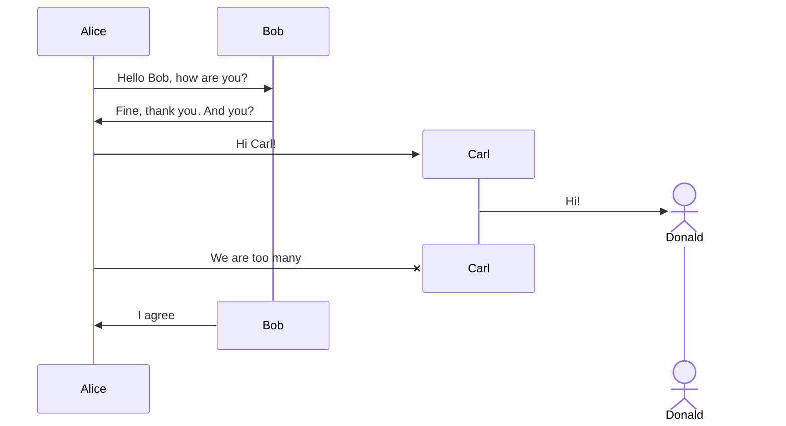

[⬆ Back to top](#sequence-diagram)

## Boxes

Members can be grouped in boxes.

Use the `AddBox` method to create a box, and the `AddParticipant` method with the box as argument to add a member to the box.

Example:

```csharp
string diagram = Mermaid
    .SequenceDiagram()
    .AddBox("Box1", out var box1, Color.Aquamarine)
    .AddBox("Box2", out var box2, Color.FromArgb(70, 55, 56, 57))
    .AddBox("Box3", out var box3)
    .AddParticipant("Alice", out var a, box1)
    .AddParticipant("Bob", out var b, box1)
    .AddParticipant("Charlie", out var c, box2)
    .AddParticipant("David", out var d, box3)
    .AddParticipant("Eve", out var e)
    .SendMessage(a, b, $"Hello {b.Name}!")
    .SendMessage(b, c, $"Hello {c.Name}!")
    .SendMessage(c, d, $"Hello {d.Name}!")
    .SendMessage(d, e, $"Hello {e.Name}!")
    .SendMessage(e, a, $"Hello {a.Name}!")
    .Build();
```

The code above generates the following Mermaid code:

```text
sequenceDiagram
    box Aquamarine Box1
    participant Alice
    participant Bob
    end
    box rgba(55, 56, 57, 0.27) Box2
    participant Charlie
    end
    box Transparent Box3
    participant David
    end
    participant Eve
    Alice ->> Bob: Hello Bob!
    Bob ->> Charlie: Hello Charlie!
    Charlie ->> David: Hello David!
    David ->> Eve: Hello Eve!
    Eve ->> Alice: Hello Alice!
```

That renders as:

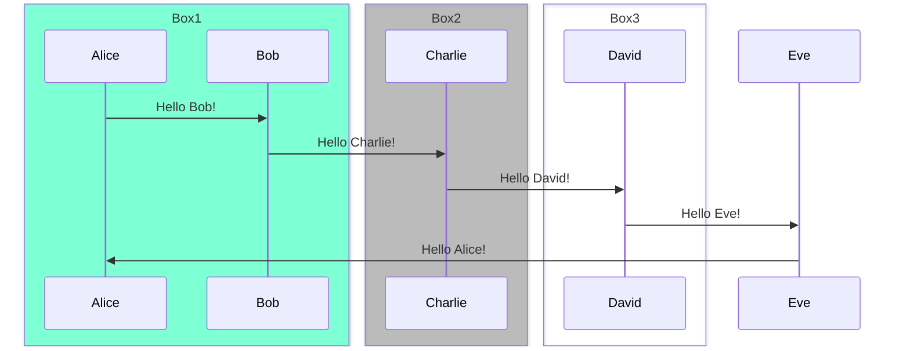

[⬆ Back to top](#sequence-diagram)

## Activation and deactivation

Members can be activated and deactivated.

Use the optional `activationType` parameter in the `SendMessage` method.

Example:

```csharp
string diagram = Mermaid
    .SequenceDiagram()
    .AddParticipant("Alice", out var a)
    .AddParticipant("John", out var j)
    .SendMessage(a, j, "Hello John, how are you?", activationType: ActivationType.Activate)
    .SendMessage(a, j, "John, can you hear me?", activationType: ActivationType.Activate)
    .SendMessage(j, a, "Hi Alice, I can hear you!", activationType: ActivationType.Deactivate)
    .SendMessage(j, a, "I feel great!", activationType: ActivationType.Deactivate)
    .Build();
```

The code above generates the following Mermaid code:

```text
sequenceDiagram
    participant Alice
    participant John
    Alice ->>+ John: Hello John, how are you?
    Alice ->>+ John: John, can you hear me?
    John ->>- Alice: Hi Alice, I can hear you!
    John ->>- Alice: I feel great!
```

That renders as:

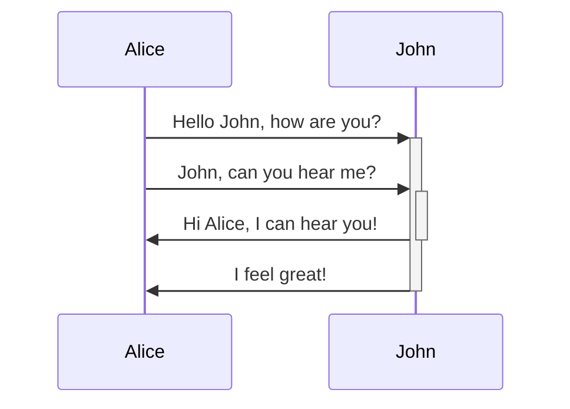

[⬆ Back to top](#sequence-diagram)

## Notes

Notes can be added to the diagram, either right or left of a member, or over two members:

Use the `AddNoteRightOf`, `AddNoteLeftOf` and `AddNoteOver` methods.


Example:

```csharp
string diagram = Mermaid
    .SequenceDiagram()
    .AddParticipant("Alice", out var a)
    .AddParticipant("Bob", out var b)
    .AddParticipant("Charlie", out var c)
    .AddNoteOver(a, b, "This is a note")
    .AddNoteRightOf(c, "This is another note")
    .SendMessage(a, b, $"Hello {b.Name}!")
    .AddNoteOver(a, c, "This is a note")
    .SendMessage(b, c, $"Hello {c.Name}!")
    .AddNoteLeftOf(b, "This is another note")
    .Build();
```

The code above generates the following Mermaid code:

```text
sequenceDiagram
    participant Alice
    participant Bob
    participant Charlie
    note over Alice, Bob: This is a note
    note right of Charlie: This is another note
    Alice ->> Bob: Hello Bob!
    note over Alice, Charlie: This is a note
    Bob ->> Charlie: Hello Charlie!
    note left of Bob: This is another note
```

That renders as:

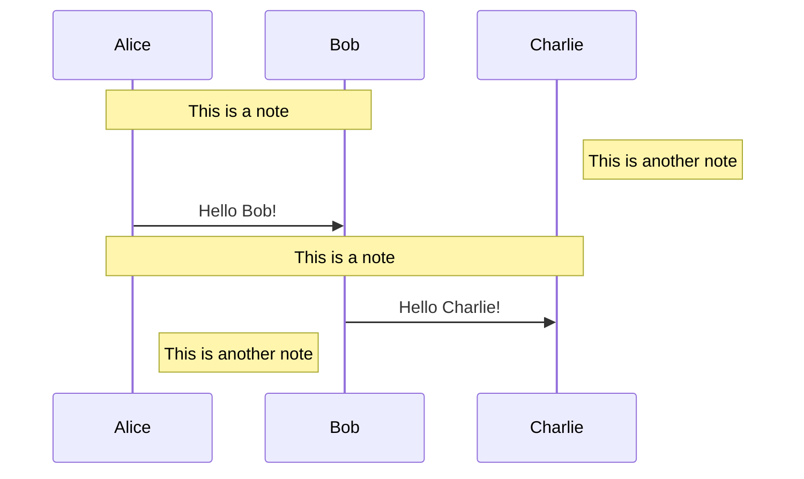

[⬆ Back to top](#sequence-diagram)

## Loops

Loops can be added to the diagram.

Use the `AddLoop` method to create a loop, and add any kind of diagram elements inside the loop using the builder from the lambda expression.

Example:

```csharp
string diagram = Mermaid
    .SequenceDiagram()
    .AddParticipant("Alice", out var a)
    .AddParticipant("Bob", out var b)
    .SendMessage(a, b, "Hello Bob!")
    .AddLoop("Every minute", builder => builder
        .SendMessage(b, a, "Hello Alice!")
        .SendMessage(b, a, "Can you hear me?"))
    .SendMessage(a, b, "Yes, I can hear you!")
    .Build();
```

The code above generates the following Mermaid code:

```text
sequenceDiagram
    participant Alice
    participant Bob
    Alice ->> Bob: Hello Bob!
    loop Every minute
        Bob ->> Alice: Hello Alice!
        Bob ->> Alice: Can you hear me?
    end
    Alice ->> Bob: Yes, I can hear you!
```

That renders as:

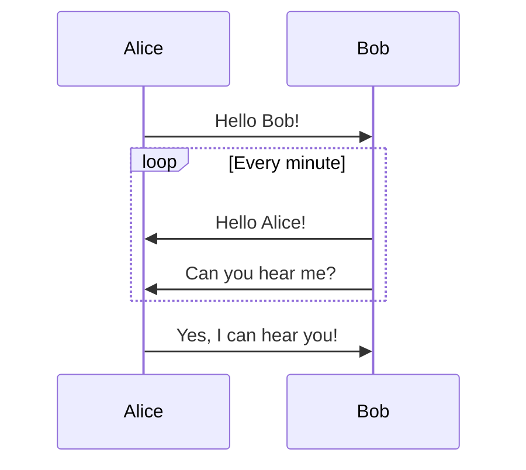

[⬆ Back to top](#sequence-diagram)

## Alternative paths

Alternative paths can be added to the diagram.

Use the `Alternatives` method to create alternative paths, and add any number of alternative paths. Each alternative path consists of a title and a lambda expression with the builder to add any kind of diagram elements inside the it.

Example:

```csharp
string diagram = Mermaid
    .SequenceDiagram()
    .AddParticipant("Alice", out var a)
    .AddParticipant("Bob", out var b)
    .SendMessage(a, b, "Hello Bob!")
    .Alternatives(
        ("Bob is happy", builder => builder
        .SendMessage(b, a, "Hello Alice!")
            .SendMessage(b, a, "Can you hear me?")
            .Alternatives(
                ("Alice is happy", builder => builder
                    .SendMessage(a, b, "Yes, I can hear you!")),
                ("Alice is sad", builder => builder
                    .SendMessage(a, b, "No, I can't hear you!")))),
        ("Bob is sad", builder => builder
            .SendMessage(b, a, "Hello Alice.")
            .Alternatives(
                ("Alice is happy", builder => builder
                    .SendMessage(a, b, "Sorry to hear that.")),
                ("Alice is sad", builder => builder
                    .SendMessage(a, b, "Me too.")))))
    .SendMessage(a, b, "Bye")
    .Build();
```

The code above generates the following Mermaid code:

```text
sequenceDiagram
    participant Alice
    participant Bob
    Alice ->> Bob: Hello Bob!
    alt Bob is happy
        Bob ->> Alice: Hello Alice!
        Bob ->> Alice: Can you hear me?
        alt Alice is happy
            Alice ->> Bob: Yes, I can hear you!
        else Alice is sad
            Alice ->> Bob: No, I can't hear you!
        end
    else Bob is sad
        Bob ->> Alice: Hello Alice.
        alt Alice is happy
            Alice ->> Bob: Sorry to hear that.
        else Alice is sad
            Alice ->> Bob: Me too.
        end
    end
    Alice ->> Bob: Bye
```

That renders as:

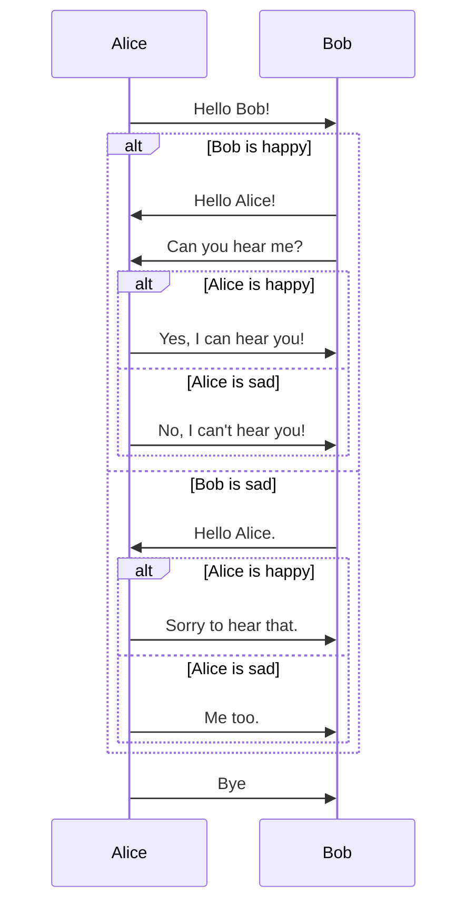

[⬆ Back to top](#sequence-diagram)

## Parallel actions

Parallel actions can be added to the diagram.

Use the `Parallels` method to create parallel actions, and add any number of parallel actions. Each parallel action consists of a title and a lambda expression with the builder to add any kind of diagram elements inside the it.

Example:

```csharp
string diagram = Mermaid
    .SequenceDiagram()
    .AddParticipant("Alice", out var a)
    .AddParticipant("Bob", out var b)
    .AddParticipant("Charlie", out var c)
    .AddParticipant("David", out var d)
    .AddParticipant("Eve", out var e)
    .Parallels(
        ("Alice to Bob", builder => builder
            .SendMessage(a, b, "Hello Bob!")
            .SendMessage(b, a, "Hello Alice!")),
        ("Eve to David", builder => builder
            .SendMessage(e, d, "Hello David!")
            .SendMessage(d, e, "Hello Eve!")),
        ("Bob to Eve", builder => builder
            .SendMessage(b, e, "Hello Eve!")
            .SendMessage(e, b, "Hello Bob!")),
        ("Alice to Charlie", builder => builder
            .SendMessage(a, c, "Hello Charlie!")
            .SendMessage(c, a, "Hello Alice!")
            .Parallels(
                ("Charlie to Bob", builder => builder
                    .SendMessage(c, b, "Talked to Alice")),
                ("Charlie to Eve", builder => builder
                    .SendMessage(c, e, "Talked to Alice")))))
    .Build();
```

The code above generates the following Mermaid code:

```text
sequenceDiagram
    participant Alice
    participant Bob
    participant Charlie
    participant David
    participant Eve
    par Alice to Bob
        Alice ->> Bob: Hello Bob!
        Bob ->> Alice: Hello Alice!
    and Eve to David
        Eve ->> David: Hello David!
        David ->> Eve: Hello Eve!
    and Bob to Eve
        Bob ->> Eve: Hello Eve!
        Eve ->> Bob: Hello Bob!
    and Alice to Charlie
        Alice ->> Charlie: Hello Charlie!
        Charlie ->> Alice: Hello Alice!
        par Charlie to Bob
            Charlie ->> Bob: Talked to Alice
        and Charlie to Eve
            Charlie ->> Eve: Talked to Alice
        end
    end
```

That renders as:

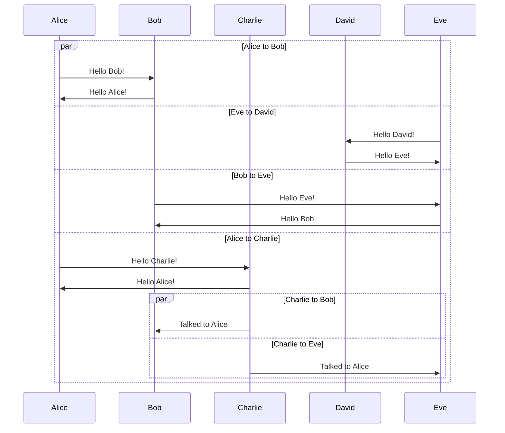

[⬆ Back to top](#sequence-diagram)

## Critical regions

Critical regions can be added to the diagram.

Use the `Critical` method to create a critical region, containing any number of diagram elements, and zero to many optional regions, also containing any number of diagram elements. Each region consists of a title and a lambda expression with the builder to add any kind of diagram elements inside the it.

Example:

```csharp
string diagram = Mermaid
    .SequenceDiagram()
    .AddParticipant("Service", out var s)
    .AddParticipant("DB 1", out var db1)
    .AddParticipant("DB 2", out var db2)
    .Critical("Connect to DB1", builder => builder
        .SendMessage(s, db1, "Connect", LineType.Dotted, ArrowType.None)
        .Critical("Connect to DB2", builder => builder
            .SendMessage(s, db2, "Connect", LineType.Dotted, ArrowType.None),
            ("Network error", builder => builder
                .SendMessage(s, db1, "Disconnect", LineType.Dotted, ArrowType.Cross)
                .SendMessage(s, s, "Log error", LineType.Dotted, ArrowType.None)),
            ("Network timeout", builder => builder
                .SendMessage(s, db1, "Disconnect", LineType.Dotted, ArrowType.Cross)
                .SendMessage(s, s, "Log timeout", LineType.Dotted, ArrowType.None))),
        ("Network error", builder => builder
                .SendMessage(s, s, "Log error", LineType.Dotted, ArrowType.None)),
            ("Network timeout", builder => builder
                .SendMessage(s, s, "Log timeout", LineType.Dotted, ArrowType.None)))
    .Build();
```

The code above generates the following Mermaid code:

```text
sequenceDiagram
    participant Service
    participant DB 1
    participant DB 2
    critical Connect to DB1
        Service --> DB 1: Connect
        critical Connect to DB2
            Service --> DB 2: Connect
        option Network error
            Service --x DB 1: Disconnect
            Service --> Service: Log error
        option Network timeout
            Service --x DB 1: Disconnect
            Service --> Service: Log timeout
        end
    option Network error
        Service --> Service: Log error
    option Network timeout
        Service --> Service: Log timeout
    end
```

That renders as:

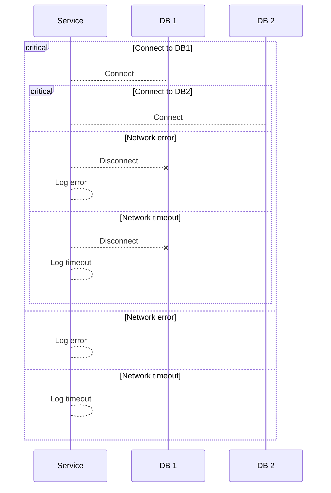

[⬆ Back to top](#sequence-diagram)

## Breaks

Breaks can be added to the diagram.

Use the `AddBreak` method to create a break, and add any kind of diagram elements inside the break using the builder from the lambda expression.

Example:

```csharp
string diagram = Mermaid
    .SequenceDiagram()
    .AddParticipant("Alice", out var a)
    .AddParticipant("Bob", out var b)
    .SendMessage(a, b, "Hello!")
    .Break("Something happens", builder => builder
        .SendMessage(a, b, "Bye!"))
    .Build();
```

The code above generates the following Mermaid code:

```text
sequenceDiagram
    participant Alice
    participant Bob
    Alice ->> Bob: Hello!
    break Something happens
        Alice ->> Bob: Bye!
    end
```

That renders as:

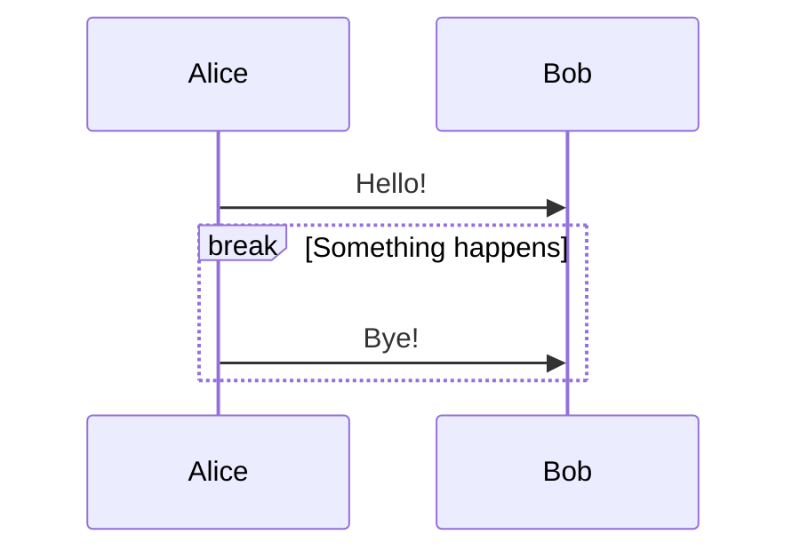

[⬆ Back to top](#sequence-diagram)

## Rectangles

Rectangles can be added to the diagram.

Use the `AddRectangle` method to create a rectangle, and add any kind of diagram elements inside the rectangle using the builder from the lambda expression.

Example:

```csharp
string diagram = Mermaid
    .SequenceDiagram()
    .AddParticipant("Alice", out var a)
    .AddParticipant("Bob", out var b)
    .AddRectangle(Color.AliceBlue, builder => builder
        .SendMessage(a, b, "Hello Bob!")
        .SendMessage(b, a, "Hello Alice!"))
    .AddRectangle(Color.DarkSeaGreen, builder => builder
        .SendMessage(a, b, "Can you hear me?")
        .SendMessage(b, a, "Yes, I can hear you."))
    .Build();
```

The code above generates the following Mermaid code:

```text
sequenceDiagram
    participant Alice
    participant Bob
    rect AliceBlue
        Alice ->> Bob: Hello Bob!
        Bob ->> Alice: Hello Alice!
    end
    rect DarkSeaGreen
        Alice ->> Bob: Can you hear me?
        Bob ->> Alice: Yes, I can hear you.
    end
```

That renders as:

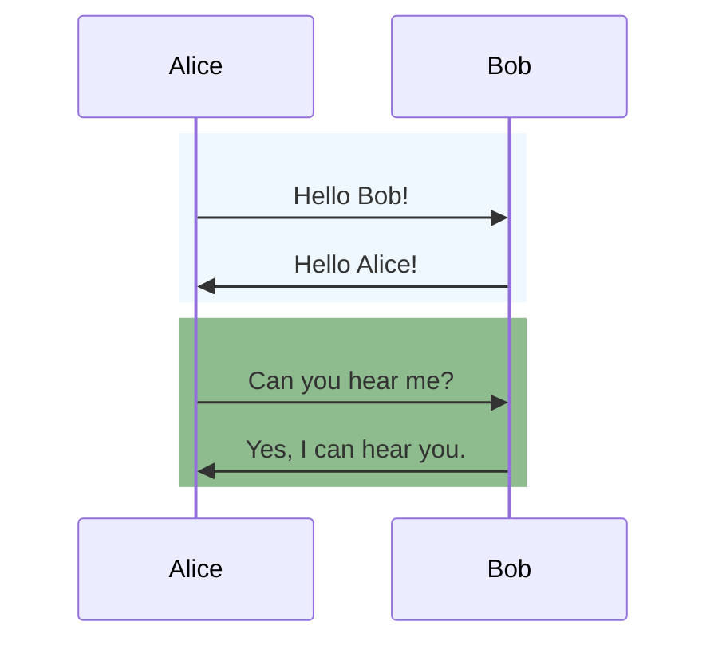

[⬆ Back to top](#sequence-diagram)

## Comments

Comments can be added. They are not rendered in the diagram, but can be used to add information to the code.

Use the `AddComment` method.

Example:

```csharp
string diagram = Mermaid
    .SequenceDiagram()
    .AddParticipant("Alice", out var a)
    .AddParticipant("Bob", out var b)
    .Comment("Alice is greeting Bob")
    .SendMessage(a, b, "Hello Bob!")
    .Comment("Bob is greeting Alice")
    .SendMessage(b, a, "Hello Alice!")
    .Build();
```

The code above generates the following Mermaid code:

```text
sequenceDiagram
    participant Alice
    participant Bob
    %% Alice is greeting Bob
    Alice ->> Bob: Hello Bob!
    %% Bob is greeting Alice
    Bob ->> Alice: Hello Alice!
```

That renders as:

